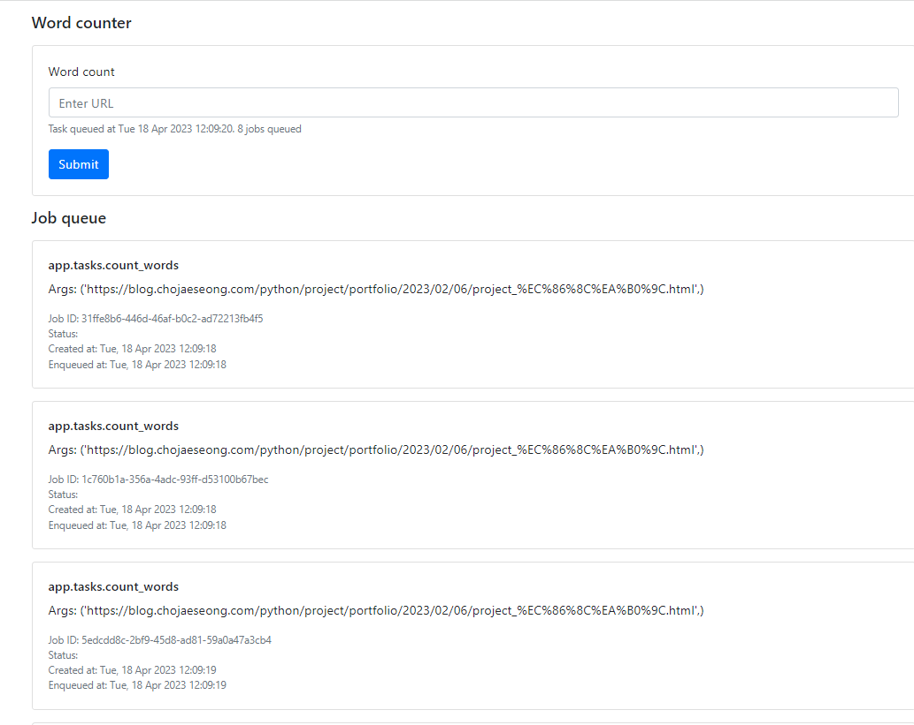

- 참고
  - 정리본: https://github.com/yo-sarawut/e-Library/blob/dbdf686e741b19f49c8fc096ebc31f4318514938/tutorial/python/webapp/flask/series_learning_flask/ep-21.md
  - 유튜브: https://www.youtube.com/watch?v=Mf1tVOMocYk&list=PLF2JzgCW6-YY_TZCmBrbOpgx5pSNBD0_L&index=22
### app 모듈화 및 세팅
1. app패키지 생성
2. init내부에 flask 객체 생성
3. app패키지 하위모듈 views.py, tasks.py생성
4. app객체를 갖다쓰는 하위모듈로서, app객체 생성보다 아래에서 import될 것임
    ```python
   from flask import Flask
   import redis
   from rq import Queue
   
   
   app = Flask(__name__)
   
   from app import views
   from app import tasks
   ```
   
5. root에 manage.py생성(실행 모듈)
   ```python
   from app import app
   
   if __name__ == '__main__':
       app.run()
   ``` 
   
6. 실행모듈을 환경변수로 입력
```shell
export FLASK_APP=manage.py
# docker-compose
    environment:
      - FLASK_APP=manage.py
```
7. views.py 에 route작성
   ```python
   from app import app
   
   # route 작성
   @app.route('/')
   def index():
       return "Hello world"
   ```
8. 연결 확인

9. redis 설정해주기
   - 하위모듈에서 사용할 것이므로, 하위모듈import보다 더 위에 생성
   ```python
   from flask import Flask
   import redis
   from rq import Queue
   
   
   app = Flask(__name__)
   # 하위모듈에서 사용할 것이므로, 하위모듈import보다 더 위에 생성
   r = redis.Redis(host='redis', port=6379) # docker상에서 service명으로 host를 사용
   q = Queue(connection=r)
   
   from app import views
   from app import tasks
   ```
10. 직전import되는 하위모듈 views에서 상위모듈객체 import해서 사용해서 route 작성
   ```python
   from app import app
   from app import r
   from app import queue
   
   # route 작성
   @app.route('/')
   def index():
       return "Hello world222"
   ```

### tasks.py 작성
1. 실제 request는 flask꺼가 아니라 urllib꺼 이용
2. lxml 사용하기 위해 설치
   - **설치 -> pip freeze -> 컨테이너의 python에 제공하기 위해 `app` + `app-worker` 서비스 둘다 docker-compose재빌드**
   ```shell
   pip install lxml
   
   pip freeze > requirements.txt
   # 서비스 image 삭제후 재빌드
   docker-compose build
   ```
   
3. p태그를 모두 모은 뒤, 공백split해서 단어들을 dict에 세고, 단어 종류의 갯수를 확인
   ```python
   # tasks.py
   from urllib import request
   from bs4 import BeautifulSoup
   import lxml
   
   import time
   
   
   def count_words(url):
       print(f'Count words at {url}')
       start = time.time()
   
       r = request.urlopen(url) # byte파일들 -> .read() 후 .decode() 필요
   
       soup = BeautifulSoup(r.read().decode(), "lxml")
   
       # 1) p태그를 찾아서 .text를 해온 뒤, 단어들처럼 공백으로 연결
       paragraphs = " ".join([p.text for p in soup.find_all("p")])
       # 2) dict에 단어 세기 -> 공백으로 모든 것을 쪼개서 단어로 세기
       word_count = dict()
       for i in paragraphs.split():
           if not i in word_count:
               word_count[i] = 1
           else:
               word_count[i] += 1
   
   
       end = time.time()
   
       time_elapsed = end - start
   
       print(word_count)
       print(f'Total words: {len(word_count)}')
       print(f'Time elapsed: {time_elapsed}')
   
       return len(word_count)
   ```
   

4. views.py는 동급이면서, 상위모듈객체 안쓰는 tasks.py를 상위모듈로부터 import해 사용
   ```python
   from app import app
   from app import r
   from app import queue
   from app.tasks import count_words
   @app.route('/add-task', methods=['GET', 'POST'])
   def add_task():
       return 
   ```
### app패키지 내부에 templates 폴더 생성 -> add_task.html
- app = Flask(__name__) 객체가 생성되는 패키지 내부에서 templates 생성
   

1. `add_task.html`
   - **`not post Form`을 submit해서 `querystring`으로 `url`을 submit할 것이다**
   - container > row > col 로 반응형으로 만들고
   - `/add-task` route로 `form`생성해서  날림
     - `url` input
     - `{{message}}`
     - submit button
   - `{{jobs}}`를 순회하며 card생성/없으면 p태그 생성 Job queue container
   ```html
   <!-- https://github.com/yo-sarawut/e-Library/blob/dbdf686e741b19f49c8fc096ebc31f4318514938/tutorial/python/webapp/flask/series_learning_flask/ep-21.md -->
   
   <!doctype html>
   <html lang="en">
   
   <head>
     <!-- Required meta tags -->
     <meta charset="utf-8">
     <meta name="viewport" content="width=device-width, initial-scale=1, shrink-to-fit=no">
   
     <!-- Bootstrap CSS -->
     <link rel="stylesheet" href="https://stackpath.bootstrapcdn.com/bootstrap/4.3.1/css/bootstrap.min.css" integrity="sha384-ggOyR0iXCbMQv3Xipma34MD+dH/1fQ784/j6cY/iJTQUOhcWr7x9JvoRxT2MZw1T" crossorigin="anonymous">
   
     <title>Job queue</title>
   </head>
   
   <body>
   
     <div class="container">
       <div class="row">
         <div class="col">
           <h5 class="mt-3">Word counter</h5>
           <div class="card mt-3">
             <div class="card-body">
               <form action="/add-task">
                 <div class="form-group">
                   <label>Word count</label>
                   <input type="text" class="form-control" name="url" placeholder="Enter URL" required>
                   
                   <small id="emailHelp" class="form-text text-muted">{{ message }}</small>
                   
                 </div>
                 <button type="submit" class="btn btn-primary">Submit</button>
               </form>
             </div>
           </div>
         </div>
       </div>
     </div>
   
     <div class="container">
       <div class="row">
         <div class="col">
           <h5 class="mt-3 mb-3">Job queue</h5>
           
           
           <div class="card mb-3">
             <div class="card-body">
               <h6>{{ job.func_name }}</h6>
               <p>Args: {{ job.args }}</p>
               <small class="text-muted d-block">Job ID: {{ job.id }}</small>
               <small class="text-muted d-block">Status: {{ job.status }}</small>
               <small class="text-muted d-block">Created at: {{ job.created_at.strftime('%a, %d %b %Y %H:%M:%S') }}</small>
               <small class="text-muted d-block">Enqueued at: {{ job.enqueued_at.strftime('%a, %d %b %Y %H:%M:%S') }}</small>
             </div>
           </div>
           
           
           <p>No jobs in the queue</p>
           
         </div>
       </div>
     </div>
   
   </body>
   
   </html>
   ```
   

### get form -> if request.args로 querystring을 받고, task를 사용한 view route 정의
- q.enqueue( func, args) 의 결과변수 job에 대해
   - job.status
   - job.func_name
   - job.args
   - job.kwargs
   - job.result
   - job.enqueued_at
   - job.started_at
   - job.ended_at
   - job.exc_info

   ```python
   @app.route('/add-task', methods=['GET', 'POST'])
   def add_task():
       # 1. q.jobs로 현재의 queue의 jobs를 가져올 수 있다. -> jinja에 사용한다
       # - viewㅇ선 job.args / job.id / job.status / job.created_at.strftime() / job.enqueued_at.strftime() 을 사용한다
       jobs = q.jobs
       # 2. 있을때만 채워지는 message는 None으로 초기화 -> if문에서 채우기 전략
       message = None
       # 3. get form이 날라오는 것은 request.method == 'POST'로 잡는게 아니라
       #    if request.args:로 잡는다
       if request.args:
           url = request.args.get('url')
   
           task = q.enqueue(count_words, url)
           # 넣어주고 난 뒤 의 queue속 jobs
           jobs = q.jobs
           # q 속 전체 task의 갯수?
           q_len = len(q)
           # message에는 넣은 Task에 대한 정보를 넣어준다.
           message = f'Task queued at {task.enqueued_at.strftime("%a %d %b %Y %H:%M:%S")}. {q_len} jobs queued'
   
       return render_template('add_task.html', message=message, jobs=jobs)
   ```
  
- **금방 테스트가 끝나므로, url을 submit한 상태에서 여러번 새로고침 두드려서 queue에 쌓이게 만들어 테스트**
   

- **task에 정의한 print는 `docker app-worker`의 터미널에서 보인다.**
   