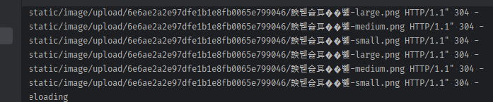

1. 기존 add-task route를 `word-counter` route로 변경
    - html도 변경
2. 참고
   - 정리본:https://github.com/yo-sarawut/e-Library/blob/dbdf686e741b19f49c8fc096ebc31f4318514938/tutorial/python/webapp/flask/series_learning_flask/ep-22.md
   - 유튜브: https://www.youtube.com/watch?v=YLj0F_BJOW8&list=PLF2JzgCW6-YY_TZCmBrbOpgx5pSNBD0_L&index=22


### Pillow설치 및 resize 세팅
1. pip install pillow -> pip freeze -> app관련 도커 2개 리빌드
   ```shell
   pip freeze > .\requirements.txt
   
   docker-compoose build --no-cache [app, app-worker]
   
   # app, app-worker 재실행
   ```
   

2. tasks.py의 PIL의 image모듈외 import해서 `create_image_set` 메서드를 정의한다
   ```python
   #### CREATE IMAGE SET ####
   from PIL import Image
   import time
   
   
   def create_image_set(image_dir, image_name):
       start = time.time()
   
       # 각 최소 px 사이즈를 미리 정해놓는다.
       size_map = dict(
           thumbnail=(35, 35),
           small=(540, 540),
           medium=(768, 768),
           large=(992, 992),
           xl=(1200, 1200),
           xxl=(1400, 1400),
       )
   
       # file -> image객체를 만든다.
       image = Image.open(os.path.join(image_dir, image_name))
   
       # 각 save 전 이름 뒤에 "-size"를 적어줘야하기 때문에 ext(확장자)이름을 미리 빼놓는다.
       # image_ext = image_name.split('.')[-1]
       image_name, image_ext = os.path.splitext(image_name)
   
       # 각 image객체를 사이즈별ㄹ .copy()부터 한 뒤, .thumbnail()메서드로 resize 후 .save()까지 한다.
       # thumbnail_image = image.copy()
       # thumbnail_image.thumbnail(size_map['thumbnail'], Image.LANCZOS)  # replace함수
       # thumbnail_image.save(f'{os.path.join(image_dir, image_name)}-thumbnail.{image_ext}',
       #                      optimize=True, quality=95)
   
       for size_name, size in size_map.items():
           copied_image = image.copy()
           copied_image.thumbnail(size, Image.LANCZOS)  # replace함수
           copied_image.save(f'{os.path.join(image_dir, image_name)}-{size_name}{image_ext}',
                                optimize=True, quality=95)
   
       end = time.time()
   
       time_elapsed = end - start
   
       print(f'Task complete in: {time_elapsed}')
   
       return True
   ```
   

### views에서 정의한 task사용하여 route 정의
1. 일단 route를 정의하기 전에 **파일 전송을 위해 필요한 `SECRET_KEY` 와 `UPLOAD_DIRECTORY`를 app config 정의해준다**
   - secret_key는 docker-compose 환경변수에 넣어서 받아올 수 있게 하고
   - **BASE_FOLDER -> UPLOAD_FOLDER는 static폴더를 쓴다면 내부에서 정해지므로 환경변수 없이 정의하자**

2. app/config.py 생성
   - BASE_FOLDER는 Path(__file__).resolve() == config.py에서 출발해서 .parent 1개만 올라가면 app모듈이다.
   - app모듈아래 `static/img/upload/`폴더를 `UPLOAD_FOLDER`fh 지정한다.
   ```python
   import os
   from pathlib import Path
   
   class Config:
       SECRET_KEY = os.getenv('SECRET_KEY') or 'secret_key'
   
       BASE_FOLDER = Path(__file__).resolve().parent # BASE_FOLDER:  /app/app
       UPLOAD_FOLDER = BASE_FOLDER.joinpath('/static/image/upload') # UPLOAD_FOLDER:  /static/img/upload
   
   ```
   - **upload폴더를 gitignore한다**
   ```gitignore
   venv
   app/static/image/upload/*
   ```

3. init.py에서 app에 config를 지정해준다.
   ```python
   from app.config import Config
   
   app = Flask(__name__)
   app.config.from_object(Config)
   ```
   
4. views.py에서 `upload-image` route 작성
   ```python
   @app.route('/upload-image', methods=['GET', 'POST'])
   def upload_image():
   
       view_url = None
   
       if request.method == 'POST':
           ...
   
       return render_template('upload_image.html', view_url=view_url)
   ```
   

5. upload_image.html 생성
   - `post action form`을 container > row > col 안에 만든다.
   - 파일을 같이 전송하는 경우 `enctype="multipart/form-data"`를 form태그에 추가한다.
   - **file type input를 `image` name으로 만들어서 -> backend에서는 `request.files['image']`로 받는다**
   - {{message}} <- flash
   - `{{view_url}}` <- **a링크에 걸릴 route주소 아래에서 구현 예정. `post를 통해 이미지가 업로드됬을 때, view_url이 채워져 링크가 보여짐`** 
   ```html
   <!doctype html>
   <html lang="en">
   
   <head>
       <!-- Required meta tags -->
       <meta charset="utf-8">
       <meta name="viewport" content="width=device-width, initial-scale=1, shrink-to-fit=no">
   
       <!-- Bootstrap CSS -->
       <link rel="stylesheet" href="https://stackpath.bootstrapcdn.com/bootstrap/4.3.1/css/bootstrap.min.css"
             integrity="sha384-ggOyR0iXCbMQv3Xipma34MD+dH/1fQ784/j6cY/iJTQUOhcWr7x9JvoRxT2MZw1T" crossorigin="anonymous">
   
       <title>Upload image</title>
   </head>
   
   <body>
   
   <div class="container">
       
       
       
       <div class="alert alert-{{ category }} alert-dismissible fade show mt-3" role="alert">
           {{ messages }}
           <button type="button" class="close" data-dismiss="alert" aria-label="Close">
               <span aria-hidden="true">&times;</span>
           </button>
       </div>
       
       
       
       <div class="row">
           <div class="col">
               <div class="mb-3 mt-3">
   
                   <h2 class="mb-3" style="font-weight: 300">Upload image</h2>
   
                   <form action="/upload-image" method="POST" enctype="multipart/form-data" class="mb-3">
                       <div class="form-group mb-3">
                           <div class="custom-file">
                               <input type="file" class="custom-file-input" name="image">
                               <label id="file_input_label" class="custom-file-label" for="image">Select file</label>
                               <small class="text-muted">Images should be 2560px x 1440px and not contain a dot in the
                                   filename</small>
                           </div>
                       </div>
   
                       <button type="submit" class="btn btn-primary">Upload</button>
                   </form>
   
                   
                   <a href="{{ view_url }}" class="mt-3">View image</a>
                   
   
               </div>
           </div>
       </div>
   </div>
   
   <!-- import bootstrap JS here -->
   
   </body>
   
   </html>
   ```
   

6. route 마저 작성
   - form - file input으로 넘어오는 것은 `request.files['name']`으로 받으면 된다.
   - `secrets.token_hex(16)`로 uuid대신 랜덤 16글자 폴더명을 만든다.
   - 여러 경로의 폴더를 이어서 만들 땐, os.makedirs( , exist_ok=True)로 한다
   - **local에 원본이미지를 저장해놓고 -> size별 생성을 queue를 통해 생성한다**
   - **업로드 성공시 flash와 함께, `파일을 보여질 route url변수 default None을 채워서 render`시킨다**
   ```python
   @app.route('/upload-image', methods=['GET', 'POST'])
   def upload_image():
   
       view_url = None
   
       if request.method == 'POST':
           # form이 넘어오면 처리한다.
           image = request.files['image']
           # 개별 디렉토리이름은 secrets 패키지로 익명으로 만든다.
           image_dir_name = secrets.token_hex(16)
   
           # 폴더 만들기 -> 여러 경로의 폴더를 이어서 만들 땐, os.makedirs( , exist_ok=True)로 한다
           image_dir_path = app.config['UPLOAD_FOLDER'].joinpath(image_dir_name)
           if not os.path.exists(image_dir_path):
               # os.mkdir(image_dir_path)
               os.makedirs(image_dir_path, exist_ok=True)
   
           # 파일객체(image)를 일단 local에 save한다.
           image.save(os.path.join(image_dir_path, image.filename))
   
           # queue에 폴더와 파일이름을 따로 넣어준다.
           q.enqueue(create_image_set, image_dir_path, image.filename)
   
           # queue에 넘겼으면, flash를 띄워서 마무리한다
           flash('Image uploaded and sent for resizing', 'success')
   
           # view_url에는 확장자를 뺀 이미지 name만 들어가게 해야한다.
           image_file_name, image_ext = os.path.splitext(image.filename)
           view_url = f'/image/{image_dir_name}/{image_file_name}'
   
       return render_template('upload_image.html', view_url=view_url)
   ```
   

### 업로드된 image의 view_url를 route의 path로 image_dir_name/image_file_name 끊어 받고 -> view_image.html 렌더해서 html에서 처리
1. route의 **`path`변수로 view_url에 적힌 경로를 끊어서 받는다.**
   - view_url: `/image/image_dir_name/image_file_name`
   - route: `/image/<image_dir_name>/<image_file_name>`
   - render: image_dir_name=image_dir_name, image_file_name=image_file_name
   - html: src="/static/image/upload/{{image_dir_name}}/{{image_file_name}}[-size].png"
   - 그리고 끊어받은 폴더명과 이미지를 route에서 처리하는게 아니라 html에 jinja 변수로 넘겨서 처리한다
   ```python
   @app.route('/image/<image_dir_name>/<image_file_name>')
   def view_image(image_dir_name, image_file_name):
       return render_template('view_image.html', image_dir_name=image_dir_name, image_file_name=image_file_name)
   ```
   

2. 끊어받은 `image_dir_name`과 `image_file_ename`으로 **picture태그 > 택1 source태그의 `srcset=`속성을 주고**
   - `media=`속성으로 각 img별 max-width를 지정해준다. 넘어가면 다음 것인듯?
   - 지정된 것 중 가장 큰 크기(xxl) 밑에 img태그로 원본도 끼워넣는다.
   ```html
   <!doctype html>
   <html lang="en">
   
   <head>
     <!-- Required meta tags -->
     <meta charset="utf-8">
     <meta name="viewport" content="width=device-width, initial-scale=1, shrink-to-fit=no">
   
     <!-- Bootstrap CSS -->
     <link rel="stylesheet" href="https://stackpath.bootstrapcdn.com/bootstrap/4.3.1/css/bootstrap.min.css" integrity="sha384-ggOyR0iXCbMQv3Xipma34MD+dH/1fQ784/j6cY/iJTQUOhcWr7x9JvoRxT2MZw1T" crossorigin="anonymous">
   
     <title>View image</title>
   </head>
   
   <body>
   
     <main>
   
       <div class="container mt-3">
         <div class="row">
           <div class="col">
   
             <picture>
               <!-- thumbnail -->
               <source class="img-fluid" srcset="/static/image/upload/{{image_dir_name}}/{{image_file_name}}-thumbnail.png" media="(max-width: 35px)">
               <!-- small -->
               <source class="img-fluid" srcset="/static/image/upload/{{image_dir_name}}/{{image_file_name}}-small.png" media="(max-width: 540px)">
               <!-- medium -->
               <source class="img-fluid" srcset="/static/image/upload/{{image_dir_name}}/{{image_file_name}}-medium.png" media="(max-width: 768px)">
               <!-- large -->
               <source class="img-fluid" srcset="/static/image/upload/{{image_dir_name}}/{{image_file_name}}-large.png" media="(max-width: 992px)">
               <!-- xl -->
               <source class="img-fluid" srcset="/static/image/upload/{{image_dir_name}}/{{image_file_name}}-xl.png" media="(max-width: 1200px)">
               <!-- xxl -->
               <source class="img-fluid" srcset="/static/image/upload/{{image_dir_name}}/{{image_file_name}}-xxl.png" media="(max-width: 1400px)">
               <!-- original -->
               
             </picture>
   
   <!--          <picture>-->
   <!--            <source srcset="example-thumbnail.png" media="(max-width: 150px)">-->
   <!--            <source srcset="example-540.png" media="(max-width: 540px)">-->
   <!--            <source srcset="example-768.png" media="(max-width: 768px)">-->
   <!--            <source srcset="example-1080.png" media="(max-width: 1080px)">-->
   <!--            <source srcset="example-1200.png" media="(max-width: 1200px)">-->
   <!--            -->
   <!--          </picture>-->
   
           </div>
         </div>
       </div>
   
     </main>
   
     <!-- Import bootstrap JS here -->
   
   </body>
   
   </html>
   ```
   

3. **이제 `/image-uploader`에 접속한 뒤 -> a태그를 눌러 `/image/폴더명/파일의이름만` route를 타고 들어가서**
   - **화면크기를 조절하면, 크기에 맞게 img를 요청하게 된다.**
   