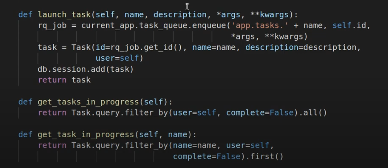

### REDIS .env 환경변수 -> docker-compose -> Config
- 어차피 redis_url은 도커상에서 돌아가기 때문에, .env -> docker-compose 환경변수 -> Config에서 받아쓰도록 하자
   - redis.Redis(host=, port=)대신 `redis.Redis.from_url()`로 객체를 생성할 수 있다.
   - redis docker에서는 REDIS_HOST / REDIS_PORT가 필요하기 때문에 분리해서 선언 -> Config
1. .env
   ```shell
   REDIS_HOST=redis
   REDIS_PORT=6379
   ```

2. docker-compose
   - **command에서는 `$환경변수명`으로 사용하면 된다.**
   ```dockerfile
     app:
       env_file:
         - .env
       environment:
         - REDIS_HOST=${REDIS_HOST}
         - REDIS_PORT=${REDIS_PORT}
         
     app-worker:
       env_file:
         - .env
       environment:
         - REDIS_HOST=${REDIS_HOST}
         - REDIS_PORT=${REDIS_PORT}
       command: bash -c "
         rq worker -u 'redis://$REDIS_HOST:$REDIS_PORT'
         "
         
     redis:
       env_file:
         - .env
       environment:
         - REDIS_HOST=${REDIS_HOST}
         - REDIS_PORT=${REDIS_PORT}
   ```
   ```shell
   docker-compose build --no-cache      
   ```
   
3. 이제 app의 Config class에서 REDIS_HOST, PORT를 받아서 `REDIS_URL`로 받기
    ```python
    class Config:
        REDIS_URL = f"redis://{os.getenv('REDIS_HOST')}:{os.getenv('REDIS_PORT')}" # redis://redis:6379
    ```
4. **이제 각종 Redis정보를 사용할 때, Config.REDIS_URL로 변경한다**
    - init.py
    ```python
    # r = redis.Redis(host='redis', port=6379)  # docker상에서 service명으로 host를 사용
    r = redis.Redis.from_url(Config.REDIS_URL)
    ```

### example long task 작성 후 flask shell에서 확인하기
1. 초를 입력받아, 0초부터 출력 + sleep걸어주는 task 작성
    ```python
    # tasks.py
    def example(seconds):
        print('Starting task')
        for i in range(seconds):
            print(i)
            time.sleep(1)
        print('Task completed')
    ```

### app docker -> terminal -> `flask shell`에서 task 작동확인하기
1. init.py의 맨아래에 app객체에 `@app.shell_context_processor`데코를 이용해서 shell에서 import될 것들을 미리 정의한다
   - 여기서는 redis -> rq의 Queue의 객체인 `q`를 dict안에 담아준다.
   ```python
   # init.py
   @app.shell_context_processor
   def make_shell_context():
       return dict(
           q=q,
       )
   ```
- **참고, 직접 flask shell에서 Redis(host=, port=) -> rq.Queue(connection=)로 만들어도 되지만, `Queue객체를 만들 땐, 첫번째 인자로 name을 주면 -> rq worker 가동시 name을 인자로 주어야만 작동`한다**
   - 즉, docker-compose에서 app-worker의 command를 `rq worker test-queue -u redis://redis:6379`로 queue이름을 명시해야한다
      - worker 작동시 `queue이름`을 안주면 -> `*** Listening on default...`
      - worker 작동시 `queue이름`을 입력시 -> `*** Listening on test-queue...`
   - **enqueue시 직접 task메서드를 import하지 말고 `string으로 app상위모듈.하위모듈(tasks.py).메서드명(example)`로 등록할 수 있어서 더 편하다**
   ```python
   from redis import Redis
   from rq import Queue
   r = Redis.from_url('redis://redis:6379')
   q = Queue('test-queue', connection=r)
   
   job = q.enqueue('app.tasks.example', 5)
   ```
2. **services -> Docker -> app도커의 terminal을 선택하고 `flask shell`로 접속하여 q에 enqueue하여 worker를 확인한다**
   ```python
   flask shell
   q
   # Queue('default')
   job = q.enqueue('app.tasks.example', 5)
   ```
   ```shell
   09:13:43 default: app.tasks.example(5) (c14b911d-fd47-4719-884c-d1d7604d9259)
   2023-04-19T09:13:43.794582467Z Starting task
   2023-04-19T09:13:43.794954237Z 0
   2023-04-19T09:13:44.795701646Z 1
   2023-04-19T09:13:45.796772796Z 2
   2023-04-19T09:13:46.797866775Z 3
   2023-04-19T09:13:47.798968515Z 4
   2023-04-19T09:13:48.800080439Z Task completed
   2023-04-19T09:13:48.802076358Z 09:13:48 default: Job OK (c14b911d-fd47-4719-884c-d1d7604d9259)
   2023-04-19T09:13:48.802582528Z 09:13:48 Result is kept for 500 seconds
   ```
   
3. 응답변수 job에서 `.get_id()`로 task id를 받을 수 있다.
   ```python
   job.get_id()
   # 'c14b911d-fd47-4719-884c-d1d7604d9259'
   ```
   
4. `.is_finished`로 해당 enqueue job의 끝났는지 여부를 확인할 수 있다.
   ```python
   job.is_finished
   True
   job = q.enqueue('app.tasks.example', 5)
   job.is_finished
   False
   ```
5. 변수명을 rq의 `queue`로 변경하자.
   ```python
   # init.py
   queue = Queue(connection=r)
   ```
   

### task메서드에 rq.get_current_job메서드를 사용해서 정의하면, queue에서 돌때의 정보를 가공할 수 있다.
1. 내부에 직접 meta dictionary에 progress로 정보를 구간마다 입력해주고, 저장한다. 다 끝나면 100으로 입력
   ```python
   def example(seconds):
       # task method는 내부에서 rq의 get_current_job()메서드를 이용하여 정의하면 queue에서 작동한다.
       job = get_current_job()
       
       print('Starting task')
       for i in range(seconds):
           # 1초마다 현재 job의 meta정보(dict)에 progress 정보를 직접 입력한다
           # - 입력한 정보는 connection에 시리얼라이즈 해서 저장해줘야한다.
           job.meta['progress'] = 100.0 * i / seconds
           job.save_meta()
           
           print(i)
           time.sleep(1)
           
       # job이 끝나는 시점에는 100으로 입력해준다.(현재 0초부터시작하므로)
       job.meta['progress'] = 100
       job.save_meta()
       print('Task completed')
   ```

2. **실시간으로 확인하려면 enqueue후  `job.meta` dict를 `job.refresh()` 때리면서 확인한다**
   - flask shell을 재시작하고 확인한다.
   - **`첫 job부터 refresh()해야 처리된 정보가 meta에 기입`된다.**
   ```python
   job = queue.enqueue('app.tasks.example', 23)
   job.meta
   # {}
   job.refresh()
   job.meta
   # {'progress': 52.17391304347826}
   job.meta
   # {'progress': 52.17391304347826}
   job.refresh()
   job.meta
   # {'progress': 78.26086956521739}
   job.is_finished
   True
   job.meta
   # {'progress': 78.26086956521739}
   job.refresh()
   job.meta
   # {'progress': 100}
   ```
   

### DB세팅하고 models에 Task 모델 만들기
- 17분(Task) , 14분(User)

1. `sqlalchemy` 설치 후, init.py에서 설정해주기
   - pip freeze > build --no-cache로 다시 > 컨테이너 재실행
   ```shell
   pip freeze > requirements.txt
   
   docker-compose build --no-cache app app-worker
   ```
2. init.py에 `engine`/ `session`/ `Base` 및 query속성 제공을 선언한다.
   ```python
   from sqlalchemy import create_engine
   from sqlalchemy.ext.declarative import declarative_base
   from sqlalchemy.orm import scoped_session, sessionmaker
   engine = create_engine("sqlite:///db.sqlite")
   session = scoped_session(sessionmaker(autocommit=False, autoflush=False, bind=engine))
   Base = declarative_base()
   Base.query = session.query_property()
   
   app = Flask(__name__)
   app.config.from_object(Config)
   ```
   
3. models.py를 만들고, 상위모듈인 init(`.`)의 `Base와` `session을` import해온다
   - **Base를 이용해 BaseModel을 미리 만들어놓고, 기본 CRUD를 session으로 정의하자.**
   - **각 crud에서는 구체적인 error없이 raise만 호출하면, 외부 views.py에서 해당 에러를 받을 수 있게 한다**
   ```python
   from datetime import datetime
   
   from . import session, Base
   import sqlalchemy as db
   
   
   class BaseModel(Base):
       __abstract__ = True
   
       created_at = db.Column(db.DateTime, nullable=True, default=datetime.now)
       updated_at = db.Column(db.DateTime, nullable=True, default=datetime.now, onupdate=datetime.now)
   
       @classmethod
       def get_list(cls):
           try:
               items = cls.query.all()
               session.close()
           except Exception:
               session.rollback()
               raise
           return items
   
       def save(self):
           try:
               session.add(self)
               session.commit()
           except Exception:
               session.rollback()
               raise
   
       def update(self, **kwargs):
           try:
               for key, value in kwargs.items():
                   setattr(self, key, value)
               session.commit()
           except Exception:
               session.rollback()
               raise
   
       def delete(self):
           try:
               session.delete(self)
               session.commit()
           except Exception:
               session.rollback()
               raise
   ```


4. init입장에선 나의 객체(session, Base)를 쓰는 하위모듈이므로 `from .models` 하위모듈을 import할 땐 객체선언보다는 아래 ~ 사용직전에 import하는 하위모듈로 취급한다.
   - **model을 import해놓고 메모리에 띄워놓은 이유해 `create_all()`을 호출한다(`alembic 적용 전`)**
   ```python
   # init.py
   engine = create_engine("sqlite:///db.sqlite")
   session = scoped_session(sessionmaker(autocommit=False, autoflush=False, bind=engine))
   Base = declarative_base()
   Base.query = session.query_property()
   
   from .models import *
   Base.metadata.create_all(bind=engine)
   ```
   
5. BaseModel을 상속하여 Task를 정의한다
   - id가 Integer가 아니라 task id는 String(36)이다.
   - **name은 `db에서 task를 찾올 때 주 검색 대상`이니 index를 준다**
   - 완료여부는 False를 default값으로 준다
   ```python
   class Task(BaseModel):
       __tablename__ = 'tasks'
       
       id = db.Column(db.String(36), primary_key=True)
       name = db.Column(db.String(128), index=True)
       description = db.Column(db.String(128))
       complete = db.Column(db.Boolean, default=False)
   ```
   - **Model이 정의되면 db.sqlite가 init에 의해 자동 생성된다.**


### Task DB 데이터의 id로 -> rq에서 task를 검색해주는 self 메서드 구현 -> progress를 뽑아오는 메서드 구현
1. 차후 `name`으로 찾은 task객체의 id == task의 id로서 rq의 job을 불러오는 메서드를 작성한다
   - `rq.job.Job`클래스의 `.fetch( task_id, connection=)`으로 특정 job을 가져온다
   - connection=에 redis객체가 필요로 하니, init의 `r`객체도 가져온다
     - 상위모듈의 r객체보다 더 아래에서 .models를 import해 사용되도록 위치 수정해야한다. 
         - ImportError: cannot import name 'r' from partially initialized module 'app' (most likely due to a circular import) (/app/app/__init__.py)
         - **r객체 선언을 from .models import * 보다 위로 옮긴다**
      ```python
      # r = redis.Redis(host='redis', port=6379)  # docker상에서 service명으로 host를 사용
      r = redis.Redis.from_url(Config.REDIS_URL)
      
      from .models import *
      Base.metadata.create_all(bind=engine)
      ```
   - fetch시 에러가 난다면, try/except로 잡아서 None을 반환한다
     - rc fetch의 결과에러가 방식이 달라져서 실패시 None을 반환한다고 한다.
   ```python
   class Task(BaseModel):
       __tablename__ = 'tasks'
   
       id = db.Column(db.String(36), primary_key=True)
       name = db.Column(db.String(128), index=True)
       description = db.Column(db.String(128))
       complete = db.Column(db.Boolean, default=False)
   
       def get_rq_job(self):
           try:
               rq_job = rq.job.Job.fetch(self.id, connection=r)
           # except (redis.exceptions.RedisError, rq.exceptions.NoSuchJobError):
           except redis.exceptions.RedisError:
               return None
           return rq_job
   ```
   
2. rq_job을 얻었으면, job.meta.get('progress', 0)으로 job의 progress를 얻어온다
   - 만약, job이 존재하는데, progress가 없으면 0을 반환한다
   - 만약, job이 존재하지 않는다면, 이미 완료된 것으로 간주하고 progress를 100을 반환한다
   ```python
    def get_progress(self):
     job = self.get_rq_job()
     return job.meta.get('progress', 0) if job is not None \
         else 100 
   ```


### 특정 유저가, tasks.py의 [특정method name + method인자] + [db용 desc]으로  [task 데이터 생성 + enqueue] -> User없이 route를 통해 생성


1. method_name, method_args, description을 route로 입력받아 Task 모델데이터 생성 + task enqueue를 동시에 한다
   - **enqueue를 먼저 해야, 데이터에 넣어야할 job의 task_id를 가져올 수 있다**
   ```python
   @app.route('/launch-task/<name>/<args>/<description>')
   def launch_task(name, args, description):
       # 1) 특정 task를 인자를 넣어 enqueue한다
       # -> enqueue해야 fetch로 받아올 job의 id를 받아온다.
       rq_job = queue.enqueue('app.tasks.' + name, args)
       # 2) 해당 task를 설명을 넣어 db데이터를 생성한다
       #
       task = Task(id=rq_job.get_id(), name=name, description=description)
       task.save()
       return 'launch_task'
   ```

2. **특정name의 task중 진행중인 task 데이터 반환**
   ```python
   @app.route('/task/<name>')
   def get_task(name):
       task = Task.query.filter_by(name=name, complete=False).first()
       print(task)
       return 'get_task'
   ```
3. **끝나지 않은 전체 Task들의 데이터  가져오기**
   ```python
   @app.route('/tasks-in-progress')
   def tasks_in_progress():
       tasks = Task.query.filter_by(complete=False).all()
       print(tasks)
       return 'tasks_in_progress'
   ```