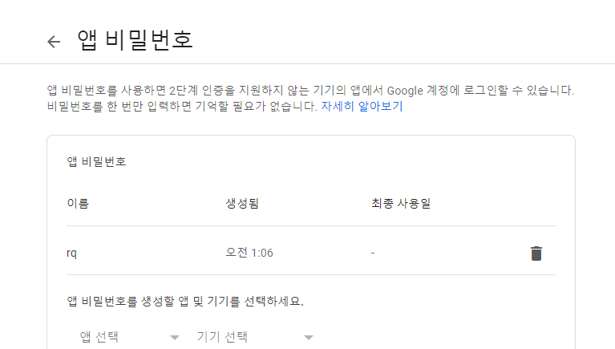
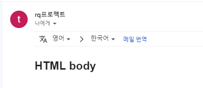

1. flask-mail 설치
   - pip-freeze > docker-compose build --no-cache app app-worker > 컨테이너 삭제후 실행
   
2. init에서 app초기화
    ```python
    from flask_mail import Mail
    app = Flask(__name__)
    app.config.from_object(Config)
    
    mail = Mail(app)
    ```
   
3. .env에 필요환경변수 설정 -> docker compose에도 설정 -> Config에 기입
   - **password가 포함되므로 .env를 .gitgnore에 포함시키고, .env.dev를 예시로 두기**
   - MAIL_USE_TLS는 메일 서버와의 통신에 TLS (Transport Layer Security) 프로토콜을 사용할지 여부를 지정
   ```dotenv
   MAIL_SERVER=smtp.googlemail.com
   MAIL_PORT=587
   MAIL_USE_TLS=1
   MAIL_USERNAME=xxxx@gmail.com
   MAIL_PASSWORD=yyy
   ```
   ```dockerfile
    app:
      environment:
          - MAIL_SERVER=${MAIL_SERVER}
          - MAIL_PORT=${MAIL_PORT}
          - MAIL_USE_TLS=${MAIL_USE_TLS}
          - MAIL_USERNAME=${MAIL_USERNAME}
          - MAIL_PASSWORD=${MAIL_PASSWORD}
   ```
4. flask shell에서 테스트 전, **보안 > 구글 2단계 인증(폰) 후 > 앱 패스워드 생성(rq)**
   - **22년 05월부터 더이상 username + password 로그인이 [불가능](https://stackoverflow.com/questions/16512592/login-credentials-not-working-with-gmail-smtp)함.**
   
5. flask shell에서 테스트
    - flask shell은 `app`객체를 바로 쓸 수 있다.
    - sender는 표기되는 이름이다.
    ```shell
    from flask_mail import Message
    from app import mail
    msg = Message('test subject', sender='rq프로젝트', recipients=['tingstyle1@gmail.com'])
    msg.body = 'text body'
    msg.html = '<h1>HTML body</h1>'
    mail.send(msg)
    # reply: b'235 2.7.0 Accepted\r\n'   
    ```
    

### send_mail wrapper 및 mail template 정의해서 kwargs변수와 같이 렌더링
6. 테스트한 코드로 send_mail wrapper를 만들기 -> app/`email.py` 생성
   - send_mail은 task이외에도 쓰일 수 있어서 따로 모듈로 만들어놓고, tasks.py에서는 wrapper로 또 덮어서 사용한다.
     - 회원가입시 인증 메일
     - 계정인증 메일
     - 비번 리셋 메일
     - 이메일 변경 메일 
   - 비동기로 표시하면, queue 대신 Thread()를 만들어서 1차 비동기로 작동하게 해준다.
   - 메일보내기(Message객체)에 필요한 5가지 인자들을 모두 받고, **추가로 첨부파일여부, sync동기여부를 받는다.**
     - sender는 고정이라서 kwargs로 만든다.
     - text_body와 html_body는 templates에 .txt, .html로 같이 저장할 것이므로 1개의 인자 template으로 받는다.
     - **template의 txt라도, {{ 변수 }}로 채워놓고, render_template( , 변수=변수)로 렌러딩한 것을 msg에 입력시킬 수 있다.**
     - **이 때, 밖에서 키워드로 render_template변수를 던져줄 것이므로 메서드에서 `**kwargs`를 받고 , render_template에서도 `**kwargs`를 던져주는 전략**

    ```python
    from threading import Thread
    
    from flask import render_template
    from flask_mail import Message
    from . import mail, app
    
    
    def send_mail(title, recipients, template_name,
                  sender='rq프로젝트', attachments=None, sync=False, **kwargs):
        # 1) Message객체 생성
        msg = Message(title, sender=sender, recipients=recipients)
        # msg.body, msg.html = text_body, html_body
        msg.body = render_template(template_name + '.txt', **kwargs)
        msg.html = render_template(template_name + '.html', **kwargs)
    
        # 2) 첨부파일이 있으면, 순회하면서 msg.attach()에 넣어준다.
        if attachments:
            for attachment in attachments:
                msg.attach(*attachment)
    
        # 3) 동기로 하고 싶을때만, 바로 발송한다.
        if sync:
            mail.send(msg)
        # 4) 보통 비동기로 호출되는데, queue가 없다고 가정하고 Thread()로 호출해준다.
        else:
            # Thread(target=mail.send, args=(msg, )).start()
            # Thread는 app_context를 안타고 있는 상황이므로, 따로 메서드를 빼서, app_context내에서 실행되어야한다
            # -> 실행안되는 상태에선 current_app을 사용 못하므로, app객체를 init(.)에서 가져와야한다.
            Thread(target=send_async_mail, args=(msg,)).start()
    
   def send_async_mail(msg):
        with app.app_context():
            mail.send(msg)
    ```
   

7. templates/email/에 template_name.txt, template_name.html을 생성하고, 렌더링될 변수 사용해주기
    - ~~유저들에게 특정 video가 올라왔다고 보낼 것~~
    - 특정 task가 등록되었다고 보낼 것 -> task변수만 주어진다.
    - [양식 참고](https://blog.miguelgrinberg.com/post/the-flask-mega-tutorial-part-x-email-support)
    - `new_task`를 template_name으로서 `.txt`, `.html`을 생성한다
    ```html
    # new_task.txt
    {{ task.description }} 할 일이 등록되었습니다.
    
    {{ url_for('main.get_task', name=task.name, _external=True) }}
    
    특정 Task의 진행도를 확인해주세요.
    
    Sincerely,
    
    The rq 프로젝트
    ```
    ```html
    <p>{{ task.description }} 할 일이 등록되었습니다.</p>
    <p>
        <a href="{{ url_for('main.get_task', name=task.name, _external=True) }}">
            여기
        </a>에서 특정 Task의 진행도를 확인해주세요.
    </p>
    <p>Sincerely,</p>
    
    <p>The rq 프로젝트</p>
    ```
   
8. flash shell에서 테스트를 위한 준비
    - Task를 shell에 자동import시킨다.
    ```python
    @app.shell_context_processor
    def make_shell_context():
        return dict(
            queue=queue,
            Task=Task,
        )
    ```

### 테스트 전에, SERVER_NAME 환경변수 <- host와 port가 필요함.
- **없으면 `url_for(, _external=True)`에러가 난다.**

1. .env -> docker-compose -> Config
    ```shell
    APP_HOST=0.0.0.0
    APP_PORT=8000
    ```
    - `SERVER_NAME` flask변수가 설정되어야 `url_for(, _external=True)`가 정상 작동된다.
        - SERVER_NAME=localhost:8000 형태로 지정한다  
    ```dockerfile
    app:
    env_file:
      - .env
    environment:
      - FLASK_DEBUG=1
      - FLASK_APP=manage.py
      - FLASK_RUN_HOST=${APP_HOST}
      - FLASK_RUN_PORT=${APP_PORT}
      - SERVER_NAME=${APP_HOST}:${APP_PORT}
    ```
    ```python
    class Config:
        SERVER_NAME = os.getenv('SERVER_NAME')
    ```
### flask shell에서 동기로 테스트
- 원래는 launch_task하면서, Task 데이터가 생성되어 있어야하고
- send_mail에서 사용되는 new_task 템플릿에 전해줘야할 변수 `task`를 render_template에 뽑아쓸 수 잇게 Task()객체만 만들어서 인자로 전해줘, template에서 {{task}}가 사용될 수 있게 한다
- 내부에서는 Thread로 비동기로 실행되긴 한다...
  - rq를 이용하면 없애줘야하나?
```shell
from app.email import send_mail

send_mail(title='제목', recipients=['tingstyle1@gmail.com'], template_name='email/new_task', task=Task(id='abc', name='new_task', description='뉴테스크설명'))
```

