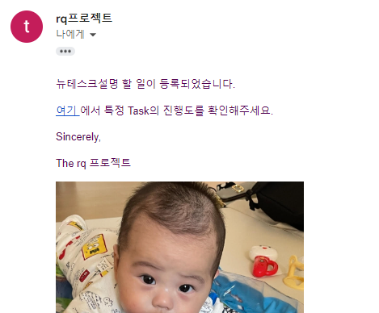
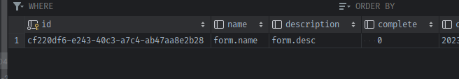
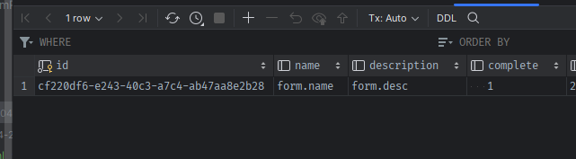

### tasks.py에 meta에 progress삽입 + Task데이터에 progress 동시 삽입 메서드 작성


1. 일단 각 task 메서드 내부에서 `작성자에 의한  progress를 주입`할 수 있어야한다
    ```python
    # tasks.py
    def _set_task_progress(progress):
        job = get_current_job()
        # 1) 현재의 잡이 존재할때만, progress를 매긴다.
        if job:
            job.meta['progress'] = progress
            job.save_meta()
    
            ## Task에는 progress가 100일때, complete를 true로 줘야한다
            task = Task.query.get(job.get_id())
            if progress >= 100:
                task.update(complete=True)
    ```
   
### send_mail에 이미지 data 첨부기능 추가

1. **task에서 그림첨부를 progress로 취급하기 위해, open f.read를 외부인자로 취급하고, `attach_img_data=`를 인자로 추가로 받는다.**
   - **`attach_img_data=`인자로 첨부되는 이미지의 f.read()값을 받는다.**
   - **Message객체에 image.png라는 파일이름을 disposition=`inline`으로 추가하여 첨부파일에는 포함되지 않게한다. 또한 headers=에 `[['Content-ID', '<image>']]`를 주면, html-img태그에 src=`"cid:image"`로 태그 첨부가 가능해진다.** msg의 .html에 추가한다
   ```python
   def send_mail(subject, recipients, template_name,
                 sender='rq프로젝트', attach_img_data=None, attachments=None, sync=False, **kwargs):
       # 1) Message객체 생성
       msg = Message(subject=subject, sender=sender, recipients=recipients)
       # msg.body, msg.html = text_body, html_body
       msg.body = render_template(template_name + '.txt', **kwargs)
       msg.html = render_template(template_name + '.html', **kwargs)
   
       # 2) 이미지 inline 첨부 및 img태그로 변환
       if attach_img_data:
           msg.attach(
               filename="image.png",
               content_type="image/png",
               data=attach_img_data,
               disposition='inline',
               headers=[['Content-ID', '<image>']]
           )
           msg.html += '<p></p>'
       # ...
   ```
2. flask shell에서 테스트
   - static/image/email폴더를 만들고 png파일을 넣어준다
   - 
   - static 경로를 잡아주기 위해 BASE_FOLDER에 .joinpath로 연결하여 open하고 f.read()로 img_data를 읽고, send_mail의 attach_img_data=인자에 추가해준다.
   ```python
   from app.email import send_mail
   from app.config import Config
   
   with open(Config.BASE_FOLDER.joinpath('static/image/email/rq_project.png'), 'rb') as f:
        img_data = f.read()
   
   send_mail(subject='제목', recipients=['tingstyle1@gmail.com'], template_name='email/new_task', task=Task(id='abc', name='new_task', description='뉴테스크설명'), attach_img_data=img_data)
   ```
   


### long task를 정의하여, img_data 잡을 시 progress 삽입하기
- 참고 [flask+celery](https://blog.miguelgrinberg.com/post/using-celery-with-flask)
1. send_xxx_mail task메서드를 만든다.
   - 외부에서 email내용에 대한 데이터를 받아오고
   - xxx에 해당하는 첨부이미지를 내부에서 작성해준다.
   - **이 때, app객체의 `.open_resource()`를 이용해서 with open하면 static폴더부터 출발할 수 있어서, BASE_FOLDER 등의 상수가 안필요해진다.**
   ```python
   def send_new_task_mail(email_data):
       """
       email_data는 dict로  attach_img_data와 sync=True만, 각 task마다 직접 지정해주기
       {
           'subject' : '', # 제목
           'recipients' : [], # 받을사람 list
           'template_name' : 'static/template/xxxx', # 메일에 보낼 템플릿 지정
           '템플릿에 쓸 변수' : 데이터, # 템플릿 {{ }} 필요한 변수 ex> 'task': Task(id='123', name='123', description='123'),
           'attachments' : [('posts.json', 'application/json',
                                 json.dumps({'posts': data}, indent=4))], # 첨부파일 지정
       }
       """
       # 첨부될 이미지 지정만 task에서 한다. 그외에는 email_data에 정의되어 있다.
       with app.open_resource(f'static/image/email/rq_project.jpg', 'rb') as f:
           attach_img_data = f.read()
   
       send_mail(**email_data, attach_img_data=attach_img_data, sync=True)
   ```
2. send_mail을 task메서드로 정의하며 내부에서 각 부위에 맞게 progress를 `_set_task_progress`입력시켜줘야한다
   - 첫 시작은 `try:로 시작하여 0`으로,   
   - 예외도 발생할 수 있으니, `finally에` 100을 넣어준다.
   - 이미지를 가져왔으면 50%로 progress를 일단 준다.
   ```python
   def send_new_task_mail(email_data):
       # try progress를 0으로 시작하고, finally에 100으로 지정한다.
       # -> 1) 현재의 job을 읽어서 meta에 progress를 넣고
       # -> 2) job_id에 해당하는 Task데이터를 가져와, 100이 넘으면 task.complete를 true로 바꿔준다. 
       try:
           _set_task_progress(0)
           
           # 첨부될 이미지 지정만 task에서 한다. 그외에는 email_data에 정의되어 있다.
           with app.open_resource(f'static/image/email/rq_project.jpg', 'rb') as f:
               attach_img_data = f.read()
       
           send_mail(**email_data, attach_img_data=attach_img_data, sync=True)
       except:
           raise 
       finally:
           _set_task_progress(100)
   ```
   
3. **Flask-mail을 쓴다면 `app.app_context().push()`가 들어가서 초기화부분을 사용해야하고, `url_for(,_external=True)`로 인해 docker-compose에 SERVER_NAME환경변수가 갖추어져있어야한다.**
   ```python
   def send_new_task_mail(email_data):
       app.app_context().push()
       try:
           _set_task_progress(0)
   
           # 첨부될 이미지 지정만 task에서 한다. 그외에는 email_data에 정의되어 있다.
           with app.open_resource(f'static/image/email/rq_project.png', 'rb') as f:
               attach_img_data = f.read()
   
           _set_task_progress(50)
   
           send_mail(**email_data, attach_img_data=attach_img_data, sync=True)
           
           _set_task_progress(80)
       except:
           raise
       finally:
           _set_task_progress(100)
   ```

### test route를 만들어 form데이터 대신, dict로 email_data={}를 생성해서 받아 task처리
1. **문제는, `enqueue 이후 -> job_id로 Task생성`인데, enqueue시 render_template에 사용될 task.name, task.description의 `task변수`가 필요하므로 id를 제외하고 Task객체를 만들어 먼저 넣어준다.**
   ```python
   @app.route('/send-new-task-mail')
   def send_new_task_mail():
       # queue에 넣어야 id가 발급되는데, enqueue시 Task의 정보가 필요함.
       task = Task(name='form.name', description='form.desc')
   
       # form으로 넘어올 임시 데이터
       email_data = {
           'subject': f'[Task]{task.name} 이 등록되었습니다.',  # 제목
           'recipients': ['tingstyle1@gmail.com'],  # 받을사람 list
           'template_name': 'email/new_task',  # 메일에 보낼 템플릿 지정
           'task': task, # 템플릿 사용 변수
       }
   
       # 1) queue에 넣고
       rq_job = queue.enqueue('app.tasks.' + 'send_new_task_mail', email_data)
       # 2) job_id로 task를 만든다.
       task.id = rq_job.get_id()
       task.save()
   
       return "success"
   ```
   
2. /send-new-task-mail로 접속해서 
   1. enqueue하고, Task데이터가 생성되었다가 
   2. 완료되면 complete true가 되는지 확인한다.
   
   


### Send mail Task도 페이지로 만들기
1. 화면에서는 메일받을 `recipient`, `template`을 session에 캐싱해서 쓴다
   - 한번 메일 보냈으면 session에서 꺼내서 GET render_template시 사용하게 한다
   - post후 redirect를 여기로 다시 해주면, GET화면에서 캐싱써서 그대로 보여주게 된다.
   ```python
   @app.route('/send-mail', methods=['GET', 'POST'])
   def send_mail():
       # session을 통해 캐슁된 데이터가 있으면, GET화면에서 같이 가지고 간다.
       cache = {
           'recipient': session.get('recipient', ''),
           'template': session.get('template', ''),
       }
   
       if request.method == 'POST':
           # POST로 form입력을 받으면, 꺼낼 때 session에 caching도 동시에 한다
           recipient = session['recipient'] = request.form['recipient']
           template = session['template'] = request.form['template']
   
           attachments = request.files['attachment']
           if attachments:
               ...
   
   
           flash(f'{recipient}에게 {template}템플릿 메일을 전송하였습니다.')
           # redirect를 해줘야, 다시 GET의 상황에서 캐슁 된다.
           return redirect(url_for('send_mail'))
   
       return render_template('send_mail.html', **cache)
   ```
2. 템플릿에 따라 다른 templates/email/xxx.txt, xxx.html을 사용하게 되므로 종류에 맞게 만들어준다.

3. task를 send_new_task_mail 말고 send_async_mail  새로 작성한다
   - 내용은 동일

4. **템플릿 종류에 따라 다른 인자 email_data로 send_asyn_mail를 enqueue하지만, Task생성은 name이 send_email로 동일하다**
   ```python
   @app.route('/send-mail', methods=['GET', 'POST'])
   def send_mail():
       # session을 통해 캐슁된 데이터가 있으면, GET화면에서 같이 가지고 간다.
       cache = {
           'recipient': session.get('recipient', ''),
           'template_name': session.get('template_name', ''),
       }
   
       if request.method == 'POST':
           # POST로 form입력을 받으면, 꺼낼 때 session에 caching도 동시에 한다
           recipient = session['recipient'] = request.form['recipient']
           template_name = session['template_name'] = request.form['template_name']
   
           email_data = dict()
           email_data['recipients'] = [recipient]
           email_data['template_name'] = template_name
           file = request.files['attachment']
           if file:
               # 첨부파일은 attachments의 tuple list로 보내야한다.
               email_data['attachments'] = [(file.filename, file.mimetype, file.read())]
   
           ### TEMPLATE 종류에 따라 다르게 호출
           if template_name == 'email/tasks':
               email_data['subject'] = 'rq프로젝트 완료된 최근 5개 Tasks 정보입니다.'
               # 템플릿별 필요변수
               email_data['tasks'] = Task.query.order_by(desc(Task.updated_at)).limit(5).all()
           elif template_name == 'email/welcome':
               email_data['subject'] = '안녕하세요 rq프로젝트 서비스 소개입니다.'
               # 템플릿별 필요변수
           elif template_name == 'email/tasks_in_progress':
               email_data['subject'] = 'rq프로젝트 진행 중인 Tasks 정보입니다.'
               # 템플릿별 필요변수
               email_data['tasks'] = Task.query.filter_by(complete=False).all()
   
           #### enqueue + Task데이터 저장
           try:
               rq_job = queue.enqueue('app.tasks.' + 'send_async_mail', email_data)
               task = Task(id=rq_job.get_id(), name='send_mail', description=f'{template_name}으로 메일 전송')
               task.save()
   
               flash(f'[{recipient}]에게 [{template_name} ]템플릿 메일을 전송하였습니다.', 'succes')
           except:
               flash(f'[{recipient}]에게 [{template_name} ]템플릿 메일을 전송을 실패하였습니다', 'danger')
   
           return redirect(url_for('send_mail'))
   
       return render_template('send_mail.html', **cache)
   ``` 


5. template/email/send_mail.html
   ```hmtl
   <!doctype html>
   <html lang="en">
   
   <head>
       <!-- Required meta tags -->
       <meta charset="utf-8">
       <meta name="viewport" content="width=device-width, initial-scale=1, shrink-to-fit=no">
   
       <!-- Bootstrap CSS -->
       <link rel="stylesheet" href="https://stackpath.bootstrapcdn.com/bootstrap/4.3.1/css/bootstrap.min.css"
             integrity="sha384-ggOyR0iXCbMQv3Xipma34MD+dH/1fQ784/j6cY/iJTQUOhcWr7x9JvoRxT2MZw1T" crossorigin="anonymous">
   
       <title>Send Mail</title>
   </head>
   
   <body>
   
   <div class="container">
       
       
       
       <div class="alert alert-{{ category }} alert-dismissible fade show mt-3" role="alert">
           {{ message }}
           <button type="button" class="close" data-dismiss="alert" aria-label="Close">
               <span aria-hidden="true">&times;</span>
           </button>
       </div>
       
       
       
       <div class="row">
           <div class="col">
               <h5 class="mt-3">Send Mail</h5>
               <div class="card mt-3">
                   <div class="card-body">
                       <form action="/send-mail" method="POST" enctype="multipart/form-data" class="mb-3">
                           <div class="form-group mb-3">
                               <label for="recipient">받는 사람:</label>
                               <input type="email" class="form-control" placeholder="Enter email" id="recipient"
                                      name="recipient" value="{{recipient}}">
                           </div>
                           <div class="form-group mb-3">
                               <label for="template_name">템플릿:</label>
                               <select name="template_name" class="custom-select" id="template_name" >
                                   <option selected value="email/tasks">최근 완료 5개 Tasks</option>
                                   <option selected value="email/tasks_in_progress">진행 중인 Tasks</option>
                                   <option selected value="email/welcome">환영인사</option>
                               </select>
                           </div>
                           <div class="form-group mb-3">
                               <div class="custom-file">
                                   <input type="file" class="custom-file-input" name="attachment" id="attachment">
                                   <label id="file_input_label" class="custom-file-label" for="attachment">첨부파일</label>
                                   <small class="text-muted">첨부파일이 있는 경우만 선택해주세요.</small>
                               </div>
                           </div>
                           <button type="submit" class="btn btn-primary">Send</button>
                       </form>
                   </div>
               </div>
           </div>
       </div>
   </div>
   
   
   <!-- import bootstrap JS here -->
   
   </body>
   
   </html>
   ```