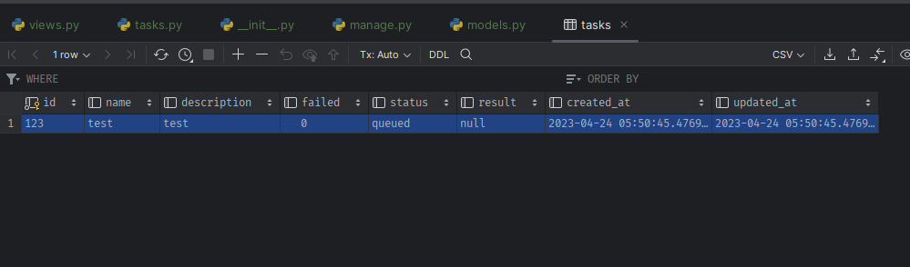
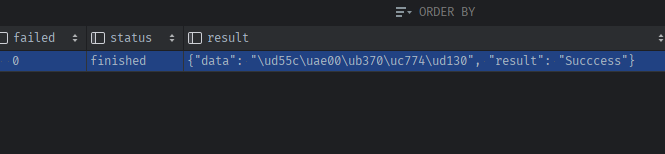

### 참고 깃허브
- `rq-test` django지만, task의 결과를 저장 + long_task구분 + scheduledTask구분 하는 모델: 
  - blog: https://spapas.github.io/2015/01/27/async-tasks-with-django-rq/#models-py
- `OK` flask인데, TypeDecorator로 Text칼럼을 매핑해서 Json필드 + @compile로 미지원필드 대체
  - https://github.com/okpy/ok/blob/master/server/models.py
  - Job 모델 + 내부list Enum사용
  - **job처리를 데코레이터로 + transaction도**
- `busy-beaver` task에 내부클래스로 상태enum(결과저장은x)
  - https://github.com/busy-beaver-dev/busy-beaver/blob/5e3543f41f189fbe4a50d64e3d6734dc765579b4/busy_beaver/common/models.py#L30
- `xcessiv` rest ML모델 결과저장 + Text to Json필드 사용 + mutable적용하여 dict처럼 사용
  - https://github.com/reiinakano/xcessiv/blob/master/xcessiv/models.py

### Json필드 대신 Text
- `일부 데이터베이스에서는 Json 타입을 지원하지 않기 때문`입니다.
  - 예를 들어, MySQL 5.6 버전 이전에는 Json 타입을 지원하지 않습니다. 따라서 Json 타입을 사용하면 이전 버전의 MySQL에서는 작동하지 않습니다. 반면에 Text 타입을 사용하면 모든 데이터베이스에서 동작하므로 이식성이 좋습니다.
- 또한 Json 타입을 사용하면 대규모 JSON 데이터를 저장하기에는 충분하지 않을 수 있습니다. 이 경우에는 `Text 타입을 사용하여 대용량` JSON 데이터를 저장할 수 있습니다.
- 마지막으로, Json 타입은 일반적으로 Text 타입보다 성능이 더 떨어집니다. 
  - `Json 타입은 검색 및 쿼리 작업에 적합`하지만, 대규모 데이터를 저장하기 위한 용도로는 Text 타입이 더 적합합니다.


### Task의 모델 수정하기
#### [ok] Task의 status 종류 및 fail 칼럼 반영(ok)
1. `ok`모델에서 `status/result_kind`을 받아들여 동적으로 종류가 늘어날 수 있게 할 것이다.
   - 상수항을 list + Enum을 사용해 status 뿐만 아니라 result_kind 종류도 사용하게 하며
     - result_kind에 따라 다르게 처리되도록 한다
   - **result가 json을 저장하는 것이 아니므로, 상태값만 차용**
   - [jobs/init.py](https://github1s.com/okpy/ok/blob/master/server/jobs/__init__.py)
   - [models.py](https://github1s.com/okpy/ok/blob/master/server/models.py)


2. complete칼럼을 삭제하고, status칼럼(list+enum) + failed칼럼을 반영한다
   ```python
    class Task(BaseModel):
        __tablename__ = 'tasks'
    
        statuses = ['queued', 'running', 'finished']
    
    
        id = db.Column(db.String(36), primary_key=True)
        name = db.Column(db.String(128), index=True)
        description = db.Column(db.String(128))
    
        # complete = db.Column(db.Boolean, default=False)
        failed = db.Column(db.Boolean, default=False)
        status = db.Column(db.Enum(*statuses, name='status'), default='queued')
    ```
   
3. filter에서 사용되던 complete=False 대신 status.in_(['queued', 'running'])으로 변경해서 필터링해준다
    ```python
    def _set_task_progress(progress):
        # ...
        if progress >= 100:
            task.update(status='finished')
    ```

    ```python
    # email_data['tasks'] = Task.query.filter_by(complete=False).all()
    email_data['tasks'] = Task.query.filter(
        Task.status.in_(['queued', 'running'])
        ).all()
    ```
    ```python
    # email_data['tasks'] = Task.query.order_by(desc(Task.updated_at)).limit(5).all()
    email_data['tasks'] = Task.query.filter(
                    Task.status == 'finished'
                ).order_by(desc(Task.updated_at)).limit(5).all()
    ```
4. sqlite파일을 삭제하고, 앱을 재실행하면 init.py에서 create_all()로 재생성 된다.

#### [xcessiv + ok] Task의 result칼럼 반영
- https://github1s.com/reiinakano/xcessiv/blob/master/xcessiv/models.py
- https://github1s.com/okpy/ok/blob/master/server/models.py
- https://github1s.com/spapas/django-test-rq/blob/master/tasks/models.py#L11
- result칼럼에 Text칼럼에 json을 dump해서 집어넣는 `JsonEncodedDict`타입을 새로 만들고, `mutable`을 이용해서 dict처럼 쓸 수 있게 한다
  - ok에서는 encode('utf-8')도 붙인다. 이것도 차용한다.

#### [ok + django-test-rq] enqueue + task데이터 생성을 데코레이터로 일괄처리되게 하기
- 기존에는 views.py의 각 route마다 직접 queue.enqueue() + Task().save()를 직접해줬다
    ```python
    #### enqueue + Task데이터 저장
    try:
        rq_job = queue.enqueue('app.tasks.' + 'send_async_mail', email_data)
        task = Task(id=rq_job.get_id(), name='send_mail', description=f'{template_name}으로 메일 전송')
        task.save()
    
        flash(f'[{recipient}]에게 [{template_name} ]템플릿 메일을 전송하였습니다.', 'succes')
    except:
        flash(f'[{recipient}]에게 [{template_name} ]템플릿 메일을 전송을 실패하였습니다', 'danger')
    ```

1. Text를 구현하는 Json 컬럼타입을 만든다.
   - mutable을 이용해서 dictionary처럼 쓰이게 한다.
    ```python
    class Json(types.TypeDecorator):
        """Enables JSON storage by encoding and decoding on the fly."""
        impl = types.Text
    
        def process_bind_param(self, value, dialect):
            # Python -> SQL
            return json.dumps(value, sort_keys=True).encode('utf-8')
    
        def process_result_value(self, value, dialect):
            # SQL -> Python
            return json.loads(value.decode('utf-8'))
    
    
    mutable.MutableDict.associate_with(Json)
    ```
   
2. django-test-rq의 result칼럼을 보면, nullabe=True이다.
    ```python
    class Task(BaseModel):
        __tablename__ = 'tasks'
    
        statuses = ['queued', 'running', 'finished']
    
        id = db.Column(db.String(36), primary_key=True)
        name = db.Column(db.String(128), index=True)
        description = db.Column(db.String(128))
    
        # complete = db.Column(db.Boolean, default=False)
        failed = db.Column(db.Boolean, default=False)
        status = db.Column(db.Enum(*statuses, name='status'), default='queued')
    
        result = db.Column(Json, nullable=True)
     ```
   

3. sqlite파일을 지우고 docker app 재시작

4. docker - terminal - flask shell에서 테스트
    - default값이 있는 failed / status / result를 제외하고 생성 
    ```python
    task = Task(id='123', name='test', description='test')
    task.save()
    ```
    
    - status와 `result를 dict`로 삽입
        - 한글데이터는 utf-8코딩후 \ud55c처럼 나온다
    ```python
    task.status = 'finished'
    task.result = {'result': 'Succcess', 'data': '한글데이터'}
    
    from app import session
    session.commit()
    ```
    

    - 결과 load하면 한글이 정상적으로 뜬다.
    ```python
    t = Task.query.filter(Task.status == 'finished').first()
    t.result
    # {'data': '한글데이터', 'result': 'Succcess'}
    ```