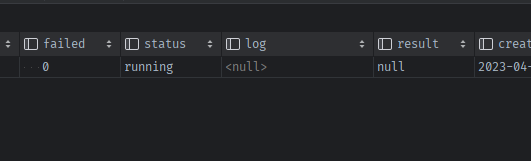

### 참고 깃허브
- `rq-test` django지만, task의 결과를 저장 + long_task구분 + scheduledTask구분 하는 모델: 
  - blog: https://spapas.github.io/2015/01/27/async-tasks-with-django-rq/#models-py
- `OK` flask인데, TypeDecorator로 Text칼럼을 매핑해서 Json필드 + @compile로 미지원필드 대체
  - https://github.com/okpy/ok/blob/master/server/models.py
  - Job 모델 + 내부list Enum사용
  - **job처리를 데코레이터로 + transaction도**
- `busy-beaver` task에 내부클래스로 상태enum(결과저장은x)
  - https://github.com/busy-beaver-dev/busy-beaver/blob/5e3543f41f189fbe4a50d64e3d6734dc765579b4/busy_beaver/common/models.py#L30
- `xcessiv` rest ML모델 결과저장 + Text to Json필드 사용 + mutable적용하여 dict처럼 사용
  - https://github.com/reiinakano/xcessiv/blob/master/xcessiv/models.py

### [ok + beavor]tasks.py를  패키지로 변환하기
1. `app/tasks패키지 + init`을 만들면, 기존 app/tasks.py의 task메서드들이 `app.tasks.xxx`로 인식되지 않게 된다.
    - from app.tasks의 기준이 `app/tasks.py`에서 `app/tasks/__init__.py`로 바뀌기 때문이다.
    ```shell
    Traceback (most recent call last):
    2023-04-24T09:31:41.761245714Z   File "/usr/local/lib/python3.9/site-packages/flask/cli.py", line 218, in locate_app
    2023-04-24T09:31:41.761247314Z     __import__(module_name)
    2023-04-24T09:31:41.761248724Z   File "/app/manage.py", line 1, in <module>
    2023-04-24T09:31:41.761250594Z     from app import app
    2023-04-24T09:31:41.761252044Z   File "/app/app/__init__.py", line 32, in <module>
    2023-04-24T09:31:41.761253684Z     from app import views
    2023-04-24T09:31:41.761255074Z   File "/app/app/views.py", line 10, in <module>
    2023-04-24T09:31:41.761256494Z     from app.tasks import count_words, create_image_set
    2023-04-24T09:31:41.761258174Z ImportError: cannot import name 'count_words' from 'app.tasks' (/app/app/tasks/__init__.py)
    ```

2. 각각의 task메서드들을 xxx.py로 만들고, init에서 `from .xxx import method`로 쩜임포트해서 그대로 연결되게 한다.
    - 각 task의 공통메서드들을 init.py(상위모듈)에 두면 안된다. init.py는 하위모듈들을 .import할 것이기 때문에, 만약 상위모듈에 공통메서드를 두고 하위모듈이 가져다 쓰면, 정의(선언)보다 아래에서 import 해야하는데, 복잡해진다
    - 공통모듈을 commons.py를 만들어 정의하자
      - 일단 `_set_task_progress`만 공통이다.
      - **beavor에 따라 set progress코드가 조금 바뀜.**
        - 추후 [retry도 참고해서 적용](https://github1s.com/busy-beaver-dev/busy-beaver/blob/5e3543f41f189fbe4a50d64e3d6734dc765579b4/busy_beaver/toolbox/rq.py)해주기
    - `mail_sender.py` / `word_counter.py` / `upload_image.py`를 만들어 commons.py를 이용해 정의한다.
   1. `tasks/commons.py`
   ```python
    from rq import get_current_job
    
    from app.models import Task
    
    
    def set_task_progress(progress):
        job = get_current_job()
        if job:
            job.meta['progress'] = progress
            job.save_meta()
    
    
            if progress >= 100:
                task = Task.query.get(job.get_id())
                if task:
                    task.update(status='finished')
    
    ```
    2. tasks.py의 메서드들을 각 모듈로 옮긴다.
       - return에 result dict를 넣어준다. Task.result 에 저장할 수 있도록
       - send_mail모듈도 다 같이 넣어준다.
       - 이 때 Thread로 async치던 것의 이름을 바꿔준다.

3. `app/tasks/__init__.py`에 기존 task모듈들을 .import해서 기존 from app.tasks import task메서드들이 인식되게 한다
    ```python
    from .word_counter import count_words
    from .image_uploader import create_image_set
    from .mail_sender import send_async_mail
    ```
   

4. test


### [ok] wrapper + 데코레이터를 이용해서 DB처리 자동으로
#### 기존에는 views route에서 직접 enqueue + Task생성
```python
@app.route('/send-new-task-mail')
def send_new_task_mail():
    # queue에 넣어야 id가 발급되는데, enqueue시 Task의 정보가 필요함.
    task = Task(name='form.name', description='form.desc')

    # ... 
    # 1) queue에 넣고
    rq_job = queue.enqueue('app.tasks.' + 'send_new_task_mail', email_data)
    # 2) job_id로 task를 만든다.
    task.id = rq_job.get_id()
    task.save()

    return "success"
```
#### Task부터 생성하고 enqueue시 job_id를 직접 task_id로 배정 + log칼럼 추가
- ok에서는 Task를 먼저 생성 -> enqueue_call(`job_id=task_id`)를 배정하더라
- **이렇게 해야, enqueue에러시 생성된 Task db에  Task.faield에 표시할 수 있게 된다.**
    
1. Task의 pk를 Integer로 변경 -> sqlite삭제후 재시작하여 db생성
   ```python
   class Task(BaseModel):
   __tablename__ = 'tasks'
      
   statuses = ['queued', 'running', 'finished']
      
   # id = db.Column(db.String(36), primary_key=True)
   id = db.Column(db.Integer, primary_key=True)
   ```
2. **Task부터 생성되면, enqueue에러시 `log`를 입력할 수 있다.**
   ```python
   class Task(BaseModel):
       __tablename__ = 'tasks'
       # ...
       # complete = db.Column(db.Boolean, default=False)
       failed = db.Column(db.Boolean, default=False)
       status = db.Column(db.Enum(*statuses, name='status'), default='queued')
      
       log = db.Column(db.Text)
   ```
#### enqueue_wrapper메서드를 만들어, enqueue + Task데이터 생성을 일괄처리 되게 한다
1. enqueue_wrapper는 `view에서 직접 import 후 호출`해서 task들을 넣어줘야하니 `__init__.py`에 정의해준다.
   - `enqueue시` 필요한 정보는 `task메서드` + `task메서드 인자`를 넣어줘야한다
     - task메서드는 import해오면 되고
     - task메서드인자는 각각 다르니 `*args`, `**kwargs`로 받아준다.
   - `Task데이터 생성시` 필요한 정보는 **id 자동배정, name -> func.__name__으로 대체 외  `description=`만 받으면 된다.**
     - **task메서드 인자 `*args, **kwargs 사이`에 필요한 키워드인자를 넣어서 정의해준다.**
        ```python
        rq_job = queue.enqueue('app.tasks.' + 'send_async_mail', email_data)
        task = Task(id=rq_job.get_id(), name='send_mail', description=f'{template_name}으로 메일 전송')
        task.save()
        ```
   - **queue.enqueue() 대신 `queue.enqueue_call()`을 이용한다?**
   - **enqueue시 발생하는 에러를 RedisError + 나머지에러로 구분하여 `Task.log`에 넣어주게 한다**
      - 에러가 발생하면, `failed=True`  + `status='finished'` + `log=`를 넣어준다
   - **확인 결과, 여기서는 enqueue시 발생할 수 있는 Redis에러만 잡고 `task내부 Error는 못잡는다`**
   ```python
   def enqueue_task(
           task_func,  # Task메서드용 1
           *args,  # Task메서드용 2
           description=None,  # DB + task용
           timeout=300,  # enqueue용
           **kwargs,  # Task메서드용 3
       ):
       if not description:
           raise ValueError('Description required to start background job')
   
       # 1) Task부터 생성하고, queue의 job_id를 Task.id로 배정하여, enqueue실패시도 반영되게 한다
       # -> 들어온 task_func의 .__name__을 name으로 저장한다
       task = Task(name=task_func.__name__, description=description)
       task.save()  # save후에는 자동으로  id가 배정되어있다.
       
       # 2) enqueue대신 enqueue_call()을 사용하여 예약을 더 부드럽게 한다.
       # -> time_out 도 제공함
       try:
           queue.enqueue_call(
               func=task_func,
               args=args,
               kwargs=kwargs,  # task method용
               job_id=str(task.id),  # enqueue용
               timeout=timeout
           )
       #### enqueue시 try/except는 Redis에러만 잡고, task메서드 내부에러는 못잡는다.
       except RedisError as e:
           # 3) enqueue가 실패하면 Task의 failed 칼럼을 True / status를 finished로 채워준다
           task.update(
               failed=True,
               status='finished',
               log=f'Could not connect to Redis: ' + str(e)
           )
       # 4) 현재 task 데이터를 반환해준다.
       return task
    ``` 

2. docker-terminal-flask shell에서 test하기
    ```python
    from app.tasks import enqueue_task, send_async_mail
    enqueue_task(send_async_mail, {'subject':'123','recipients':['tingstyle1@gmail.com'], 'template_name':'email/welcome'}, description='환영인사')
    ```
    - **성공하는 경우, failed=False / log=None 상태다**
        
    
3. **일시적 네트워크 에러 고려하여, 5초간격 3번 시도하다가 실패하기**
    ```python
    try:
        queue.enqueue_call(
            func=task_func, # task메서드
            args=args, # task메서드 인자1
            kwargs=kwargs, # task메서드 인자2
            job_id=str(task.id),  # enqueue(job)용
            timeout=timeout,
            retry=Retry(max=3, interval=5) # 일시적 네트워크 장애 오류 최대 3번 도전
        )
    #### enqueue시 try/except는 Redis에러만 잡고, task메서드 내부에러는 못잡는다.
    except RedisError as e:
    ```
   
4. **최대시도 실패하면 Exception 잡도록 임시 처리**
    ```python
        #### enqueue시 try/except는 (Redis에러, 최대시도에러) 만 잡고, task메서드 내부에러는 못잡는다.
        except RedisError as e:
            # 3) enqueue가 실패하면 Task의 failed 칼럼을 True / status를 finished로 채워준다
            task.update(
                failed=True,
                status='finished',
                log=f'Could not connect to Redis: ' + str(e)
            )
        except Exception as e:
            # 4) enqueue가 Retry실패 등으로 Redis외 에러가 발생해도 DB에 기록
            task.update(
                failed=True,
                status='finished',
                log=f'Error: ' + str(e)
            )
    ```
   
5. **공식문서에 `Retry(interval=)`을 사용한 순간부터 실행명령어에 `--with-scheduler`를 붙여서 작동시켜라고 나와있다.**
    > Note:If you use `interval` argument with `Retry`, don't forget to run your workers using the `--with-scheduler` argument.
    - **docker-compose의 실행커맨드를 수정한다.**
    ```dockerfile
    command: bash -c "
      rq worker -u 'redis://$REDIS_HOST:$REDIS_PORT' --with-scheduler
      "
    ```


#### Task메서드 내부에러 발생시도 task데이터 failed/status/log반영하도록 except문 작성하기
1. **`send_async_mail Task메서드 내부` send_mail에서 인자가 잘못들어온 경우 에러를 발생하도록 코드를 추가한다**
    ```python
    def send_async_mail(email_data):
        app.app_context().push()
        try:
            set_task_progress(0)
            with app.open_resource(f'static/image/email/rq_project.png', 'rb') as f:
                attach_img_data = f.read()
            set_task_progress(50)
    
            send_mail(**email_data, attach_img_data=attach_img_data, sync=True)
            set_task_progress(80)
    
            result = {'result': 'success'}
            return result
        except Exception as e:
            task = Task.query.get(get_current_job().get_id())
            task.update(
                failed=True,
                status='finished',
                log=f'Failed for: ' + str(e)
            )
        finally:
            set_task_progress(100)
    ```
4. 다시 한번 test에서 template_name= 인자를 주지 않는 에러를 발생시켜서 task의 log에 찍히나 확인한다
    ```python
    from app.tasks import enqueue_task, send_async_mail
    # template_name 인자 생략 -> send_mail의 포지셔널 인자라서 TypeError발생할 것임.
    enqueue_task(send_async_mail, {'subject':'123','recipients':['tingstyle1@gmail.com'], }, description='환영인사')
    ```
    
    - failed 1 / log에는 TypeError는 안찍히고 에러내용이 찍힌다.


#### 데코레이터를 만들어 [enqueue이후] DB running처리/ Error시 DB처리 / Task성공시 DB처리 반영되게 하기
- task메서드 내부에 진입했다는 말은 `Task Db에 running`인 상태로 시작해야한다.
- log에 찍히려면 task메서드 내부에서 `except + DB업뎃`을 해줘야 했다.
- **추가로 성공시 result도 `DB에 result저장`까지 해줘야한다**
- 모든 task메서드가 해야할 내용이므로 데코레이터로 작성해서 처리되게 한다
    - **모든 tasks패키지의 하위모듈이 다 써야하므로 `commons.py`에서 데코레이터 정의후 -> 각 모듈들이 import해서 사용한다**

1. commons.py에 `background_task`데코레이터를 정의한다.
    - 진입시 task데이터 가져와 enqueue -> `running` 상태 변경
    - try) 수행 성공시 result를 받아 `finished`상태 / `result` 입력
    - except) 수행 실패시 `finished` 상태 / result대신 `log`기입 / `failed=True` 데이터 처리
    ```python
    # commons.py
    ## DB처리 + 예외처리까지 하는 데코레이터
    def background_task(f):
        @wraps(f)
        def task_handler(*args, **kwargs):
            #### TAKS 실행시 '생성후 enqueue상태` -> `running`상태
            # 1-1) Task실행시, 해당id로 Task Db데이터부터 가져온다.
            task = Task.query.get(get_current_job().get_id())
            # 1-2) task가 실행되면, Task DB에서 running상태로 업데이트한다
            task.update(status='running')
            # 1-3) 필요시 logger 생성
    
            #### TASK메서드 수행 in try/except
            # 2-1) 실패시 TASK DB데이터에 exception기록
            # => task내부 try/except는 삭제
            try:
                result = f(*args, **kwargs)
                
                #### TASK 정상수행 완료시 result를 TASK DB에 입력
                # - dict타입아니면, result key에 담아서 입력
                if not isinstance(result, dict):
                    result = dict(result=result)
                    
                task.update(
                    status='finished',
                    result=result
                )
                
            except Exception as e:
                task.update(
                    failed=True,
                    status='finished',
                    log=f'Failed for: ' + str(e)
                )
    
        return task_handler
    ```

2. **기존 task메서드에서 try/except 삭제 후 `@background_task`데코레이터 달기**
    ```python
    @background_task
    def send_async_mail(email_data):
        app.app_context().push()
        ## -> 데코레이터로 이동
        # try:
        set_task_progress(0)
        with app.open_resource(f'static/image/email/rq_project.png', 'rb') as f:
            attach_img_data = f.read()
        set_task_progress(50)
    
        send_mail(**email_data, attach_img_data=attach_img_data, sync=True)
        set_task_progress(80)
    
        result = {'result': 'success'}
        return result
    
        # except Exception as e:
        #     task = Task.query.get(get_current_job().get_id())
        #     task.update(
        #         failed=True,
        #         status='finished',
        #         log=f'Failed for: ' + str(e)
        #     )
        # finally:
        #     set_task_progress(100)
    ```
   
3. test
    - mail전송이 완료되고 finished + result가 담기는지 확인한다.
    ```python
    from app.tasks import enqueue_task, send_async_mail
    enqueue_task(send_async_mail, {'subject':'123','recipients':['tingstyle1@gmail.com'], 'template_name':'email/welcome'}, description='환영인사')
    ```
    - 호출 시
        
    - 메일 전송 완료시: result가 담긴다.
        
    ```python
    from app.tasks import enqueue_task, send_async_mail
    enqueue_task(send_async_mail, {'subject':'123','recipients':['tingstyle1@gmail.com'],}, description='환영인사')
    ```
    - 에러 유발시(template_name 인자 빼고 호출) 메일 전송 실패시: log가 담긴다
        


#### set_task_progress의 0과 100은 background_task로 옮기기
1. 100프로 채울시 finished상태로 바꾸는 것은, task성공시 수행하므로 삭제한다
    ```python
    def set_task_progress(progress):
        job = get_current_job()
        if job:
            job.meta['progress'] = progress
            job.save_meta()
    
            # if progress >= 100:
            #     task = Task.query.get(job.get_id())
            #     if task:
            #         task.update(status='finished')
    
    ```
   
2. finally로 성공이든 실패든 100이 들어가게 해준다
    ```python
    def background_task(f):
        @wraps(f)
        def task_handler(*args, **kwargs):
            #### TAKS 실행시 '생성후 enqueue상태` -> `running`상태
            task = Task.query.get(get_current_job().get_id())
            task.update(status='running')
            set_task_progress(0)
    
            #### TASK메서드 수행 in try/except
            # 2-1) 실패시 TASK DB데이터에 exception기록
            # => task내부 try/except는 삭제
            try:
                result = f(*args, **kwargs)
    
                #### TASK 정상수행 완료시 result를 TASK DB에 입력
                # - dict타입아니면, result key에 담아서 입력
                if not isinstance(result, dict):
                    result = dict(result=result)
    
                task.update(
                    status='finished',
                    result=result
                )
    
            except Exception as e:
                task.update(
                    failed=True,
                    status='finished',
                    log=f'Failed for: ' + str(e)
                )
            finally:
                set_task_progress(100)
    
        return task_handler
    ```
   
3. task메서드에서는 필요시 0~100사이의 값을 주긴 준다
    ```python
    @background_task
    def send_async_mail(email_data):
        app.app_context().push()
        with app.open_resource(f'static/image/email/rq_project.png', 'rb') as f:
            attach_img_data = f.read()
        
        set_task_progress(50)
        
        send_mail(**email_data, attach_img_data=attach_img_data, sync=True)
        result = {'result': 'success'}
        return result
     ```
   

#### (일시적 네트워크장애)최대 3번까지 5초간격으로 시도해보고 실패하면 예외발생하도록, enqueue_call()의 retry=Retry(retry_callback=)) 콜랙메서드 작성하기
