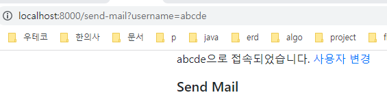

### Session을 이용해 브라우저 username적용
1. views.py에 `@app.before_request`를 통해 session에 username없으면 박아주기
   - **쿼리스트링에 username을 지정하면 해당username으로 임시로그인**
   - session은 jinja template에서 {{session.username}}을 안넘겨줘도 사용할 수 있다.
   ```python
    @app.before_request
    def before_request():
        # 2. 쿼리스트링에 지정된 username이 있다면, 그녀석으로 username사용
        if request.args.get('username'):
            session['username'] = request.args.get('username')
    
        # 1. session에 username이 없을 경우, 랜덤하게 만들어서 박아주기
        # -> session에 넣으면 따로 객체를 안넘겨줘도 template에서 {{session.username}}을 사용할 수 있다.
        if not session.get('username'):
            username = ''.join(random.choice(string.ascii_uppercase + string.digits) for _ in range(6))
            session['username'] = username
    
    ```
   
2. send_mail.html에서만 임시로 session유저 적용하기
    ```html
    {{session.username}}으로 접속되었습니다.  <a href="{{ url_for('change_username') }}">사용자 변경</a>
    ```
   

3. **logout시켜도 redirect시 랜덤username이 박이므로 `change_username`라우트 만들어 변경가능하게 하기**
    ```python
    @app.route('/change_username')
    def change_username():
        # 세션에서 username 값을 삭제합니다.
        session.pop('username', None)
    
        # 로그아웃 후에는 홈페이지로 리디렉션합니다.
        # -> 리다이렉션으로 before_request가 다시 호출 -> username 새로 생성된다.
        return redirect(url_for('send_mail'))
    
    ```
   
4. 특정username으로 로그인하고 싶으면 `?username=xxxx`의 쿼리스트링 붙여서 호출하기
    - `http://localhost:8000/send-mail?username=abcde`
    
    


### Message 모델 짜기
- 참고:https://blog.miguelgrinberg.com/post/the-flask-mega-tutorial-part-xxi-user-notifications

1. Message 모델을 작성하되, sender_id, recipient_id (FK)들 대신 **`reicipient_username`으로 대체한다**
2. 