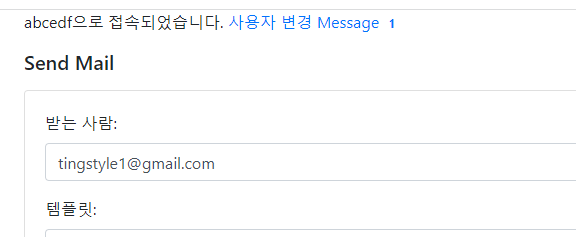

### Session을 이용해 브라우저 username적용
1. views.py에 `@app.before_request`를 통해 session에 username없으면 박아주기
   - **쿼리스트링에 username을 지정하면 해당username으로 임시로그인**
   - session은 jinja template에서 {{session.username}}을 안넘겨줘도 사용할 수 있다.
   ```python
    @app.before_request
    def before_request():
        # 2. 쿼리스트링에 지정된 username이 있다면, 그녀석으로 username사용
        if request.args.get('username'):
            session['username'] = request.args.get('username')
    
        # 1. session에 username이 없을 경우, 랜덤하게 만들어서 박아주기
        # -> session에 넣으면 따로 객체를 안넘겨줘도 template에서 {{session.username}}을 사용할 수 있다.
        if not session.get('username'):
            username = ''.join(random.choice(string.ascii_uppercase + string.digits) for _ in range(6))
            session['username'] = username
    
    ```
   
2. send_mail.html에서만 임시로 session유저 적용하기
    ```html
    {{session.username}}으로 접속되었습니다.  <a href="{{ url_for('change_username') }}">사용자 변경</a>
    ```
   

3. **logout시켜도 redirect시 랜덤username이 박이므로 `change_username`라우트 만들어 변경가능하게 하기**
    ```python
    @app.route('/change_username')
    def change_username():
        # 세션에서 username 값을 삭제합니다.
        session.pop('username', None)
    
        # 로그아웃 후에는 홈페이지로 리디렉션합니다.
        # -> 리다이렉션으로 before_request가 다시 호출 -> username 새로 생성된다.
        return redirect(url_for('send_mail'))
    
    ```
   
4. 특정username으로 로그인하고 싶으면 `?username=xxxx`의 쿼리스트링 붙여서 호출하기
    - `http://localhost:8000/send-mail?username=abcde`
    
    


### Message 모델 및 새 메세지 갯수 조회
- 참고:https://blog.miguelgrinberg.com/post/the-flask-mega-tutorial-part-xxi-user-notifications

1. Message 모델을 작성하되, sender_id, recipient_id (FK)들 대신 **`reicipient=username`으로 대체한다**
   ```python
   class Message(BaseModel):
       __tablename__ = 'messages'
       id = db.Column(db.Integer, primary_key=True)
       # sender_id = db.Column(db.Integer, db.ForeignKey('user.id'))
       recipient = db.Column(db.String(6), index=True)
       body = db.Column(db.String(140))
   
       # timestamp = db.Column(db.DateTime, index=True, default=datetime.utcnow)
   
       def __repr__(self):
           return '<Message {}>'.format(self.body)
   ```
   
2. **user모델이 없기 때문에, Message모델에서 `session`을 받아, 내부의 username + `last_message_read_time`을 통해 새로운 메세지 갯수를 읽는 cls 메서드를 만든다.**
   - last_message_read_time은 **필터링에 사용될 것인데, 첫 접속시 None으로 값이 없을 것이기 때문에, or datetime으로 기본값을 줘야한다**
   - 메세지 생성이, 마지막본 시간(last_message_read_time)보다 더 이후 == 더 큰 값일 때의 메세지들을 필터링한다
   ```python
   @classmethod
   def new_messages_of(cls, _session):
       recipient = _session.get('username')
       # datetime시 None이면 안되서 기본값도 준다.
       last_message_read_time = _session.get('last_message_read_time') \
                                or datetime(1900, 1, 1)
          return cls.query.filter_by(recipient=recipient)\
           .filter(cls.created_at > last_message_read_time)\
           .count()
   ```
   

3. **접속 route와 다름없는 `@app.before_request`에서 session에 username외 `new_messages` 새 메세지 갯수도 담아준다.**
   - session에 담아놓으면, view에서 찍을 수 있게 된다.
   ```python
   @app.before_request
   def before_request():
       # 2. 쿼리스트링에 지정된 username이 있다면, 그녀석으로 username사용
       if request.args.get('username'):
           session['username'] = request.args.get('username')
   
       # 1. session에 username이 없을 경우, 랜덤하게 만들어서 박아주기
       # -> session에 넣으면 따로 객체를 안넘겨줘도 template에서 {{session.username}}을 사용할 수 있다.
       if not session.get('username'):
           username = ''.join(random.choice(string.ascii_uppercase + string.digits) for _ in range(6))
           session['username'] = username
       
       # 3. 해당 username의 새 메세지의 갯수
       session['new_messages'] = Message.new_messages_of(session)
   ```
   

4. view(send_mail)에서 message를 볼수 잇는 route와 new_message갯수를 session.new_message로 찍어준다.
   - messages 라우트는 임시로 개설해둔다.
   ```html
    {{session.username}}으로 접속되었습니다. <a href="{{ url_for('change_username') }}">사용자 변경</a>
    <a href="{{ url_for('messages') }}">
        Message

        <span class="badge">{{ session.new_messages }}</span>

    </a>
   ```
   
5. **datagrip이 아닌 flask shell에서 test username에 대해 메세지를 생성한다**
   - 직접 datetime을 넣으면 int로 변환되서 저장되어 제대로 안됨.
   - datetime으로 하든지, session객체 대신 username key를 가진 dict를 넣어 테스트
   ```python
   Message(recipient='abcdef', body='test').save()
   
   from datetime import datetime
   Message.query.filter_by(recipient='abcedf').filter(Message.create_at > datetime(1990,1,1).count()
   # 1
   Message.new_messages_of({'username':'abcedf'})
   # 1
   ```
   

6. **사용자를 변경한다면, session속 `new_messages`와 `last_message_read_time`는 그대로 있으니 같이 초기화해줘야한다.**
   - new_messages `username` + `last_message_read_time`에 의존적이니 **`last_message_read_time`만 초기화 해주면 된다.**
   ```python
   @app.route('/change_username')
   def change_username():
       # 세션에서 username/last_message_read_time를 삭제 -> new_messages는 의존적으로 생성
       session.pop('username', None)
       session.pop('last_message_read_time', None)
   
       # 로그아웃 후에는 홈페이지로 리디렉션합니다.
       # -> 리다이렉션으로 before_request가 다시 호출 -> username 새로 생성된다.
       return redirect(url_for('send_mail'))
   ```
   
### Message 조회
1. **일단 조회 화면에 들어온 순간, 해당유저의 `last_message_read_time` 마지막 메세지 조회 시간이 `현재`로 업데이트 되어야한다**
   - 생성 역순으로 messages들을 조회하는 cls메서드를 만들어 조회한다
   ```python
    @classmethod
    def get_messages(cls, _session):
        recipient = _session.get('username')

        return cls.query.filter_by(recipient=recipient)\
            .order_by(desc(cls.created_at)).all()
   ```
   ```python
   @app.route('/messages')
   def messages():
       # 1. 마지막 읽은 시간 update
       session['last_message_read_time'] = datetime.now()
   
       # 2. 현재 session username으로 메세지 검색
       messages = Message.get_messages(session)
   
       return render_template('messages.html', messages=messages)
   ```
   

2. word_counter.html을 복사해서 messages.html을 만든 뒤, 뒤쪽 queue표기 card를 활용해서 작성한다.
   ```html
   <!-- https://github.com/yo-sarawut/e-Library/blob/dbdf686e741b19f49c8fc096ebc31f4318514938/tutorial/python/webapp/flask/series_learning_flask/ep-21.md -->
   
   <!doctype html>
   <html lang="en">
   
   <head>
     <!-- Required meta tags -->
     <meta charset="utf-8">
     <meta name="viewport" content="width=device-width, initial-scale=1, shrink-to-fit=no">
   
     <!-- Bootstrap CSS -->
     <link rel="stylesheet" href="https://stackpath.bootstrapcdn.com/bootstrap/4.3.1/css/bootstrap.min.css" integrity="sha384-ggOyR0iXCbMQv3Xipma34MD+dH/1fQ784/j6cY/iJTQUOhcWr7x9JvoRxT2MZw1T" crossorigin="anonymous">
   
     <title>Job queue</title>
   </head>
   
   <body>
   
     <div class="container">
       <div class="row">
         <div class="col">
           <h5 class="mt-3 mb-3">Messages</h5>
           
           
           <div class="card mb-3">
             <div class="card-body">
               <h6>{{ message.body }}</h6>
               <p>받은시간: {{ message.created_at.strftime('%a, %d %b %Y %H:%M:%S') }}</p>
               <small class="text-muted d-block">rq프로젝트에서 전송한 메세지입니다.</small>
             </div>
           </div>
           
           
           <p>No Messages</p>
           
         </div>
       </div>
     </div>
   
   </body>
   
   </html>
   ```
   
3. 조회하고 오면, **new_messages가 0으로 표기되는지 확인한다.**
   - 다시 여러 message들을 만들어서 여러개가 표시되는지 확인한다.
   ```python
   Message(recipient='abcedf', body='abc').save()
   Message(recipient='abcedf', body='abc').save()
   Message(recipient='abcedf', body='abc').save()
   Message(recipient='abcedf', body='abc').save()
   ```
   - 사용자를 변경하면 0이 되는지 확인한다.
   - **쿼리스트링으로 사용자를 지정해도, last_message_read_time초기화로 인해 0이 된다.**
     - **사용자 변경시, 해당username의 메세지를 모조리 삭제하자.**
4. 사용자변경시 더이상 session정보는 삭제되므로, 해당user의 message들 삭제
   ```python
   @app.route('/change_username')
   def change_username():
       # 세션에서 username/last_message_read_time를 삭제 -> new_messages는 의존적으로 생성
       username = session.pop('username', None)
       session.pop('last_message_read_time', None)
   
       # 해당username의 저장된 데이터 Message를 삭제한다.
       for message in Message.query.filter_by(recipient=username).all():
           message.delete()
   
       return redirect(url_for('send_mail'))
   ```
   
5. **그냥 username만 뽑아서 message삭제 처리하고, `session.clear()`를 시키면 다 날아간다**
   ```python
   @app.route('/change_username')
   def change_username():
       # 해당username의 저장된 데이터 Message를 삭제한다.
       for message in Message.query.filter_by(recipient=session.get('username')).all():
           message.delete()
   
       # 처리할 거 다하고 session.clear()를 써도 된다.
       session.clear()
   
       return redirect(url_for('send_mail'))
   ```
   

### 실시간 변화를 json필드로 제공해줄 Notification 모델
