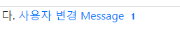
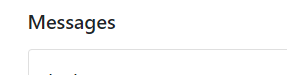
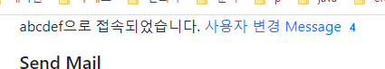

- 참고 github: https://github1s.com/amirine/flask-project/blob/main/app/templates/base.html

### Dynamic badge만들기
1. span badge에 `id`를 부여한다
   - 또한 new_message가 0일 때는 `style="visibility: "`를 visible/hidden을 걸어 안보이게 한다
   ```html
   <a href="{{ url_for('messages') }}">
   Message
   <span id="message_count"
   class="badge"
   style="visibility: visiblehidden ;"
   >   {{ session.new_messages }}</span>
   
   </a>
   ```
   

2. jquery를 통해서, badge의 text/css를 동적으로 주입한다
   - bootstrap4에서 css와 jquery+js를 같이 가져온다.
     - **이 때 `$.ajax()`호출을 위해서는 `slim`버전이면 안된다**
     - 가져온 jquery에서 `slim.`을 제거하고 부트스트랩과의 통합표시인 `integrity`부분도 삭제해준다.
     - bootstrap css는 그대로 두면 된다.
     ```html
     <!-- slim제거 + integrity부분 제거 -->
     <script src="https://cdn.jsdelivr.net/npm/jquery@3.5.1/dist/jquery.min.js" ></script>
     ```
     ```html
     <script src="https://cdn.jsdelivr.net/npm/bootstrap@4.6.2/dist/js/bootstrap.bundle.min.js" integrity="sha384-Fy6S3B9q64WdZWQUiU+q4/2Lc9npb8tCaSX9FK7E8HnRr0Jz8D6OP9dO5Vg3Q9ct" crossorigin="anonymous"></script>
     ```
   - js는 body의 끝부분에  위치시킨다.
   1. **static/js/`notifications.js`**를 생성하고 function을 작성한다
      ```js
      function set_message_count(n) {
          $('#message_count').text(n);
          $('#message_count').css('visibility', n ? 'visible' : 'hidden');
      }
      ```
   2. send_mail.html의 body끝부분에 해당 js를 import한다
      ```html
      <script type="text/javascript" src="{{ url_for('static', filename='js/notifications.js') }}"></script>
      ```
      
3. **name별 notification를 반환해주는 post전용 route를 생성한다**
   - route를 생성하기 전에, 현재유저정보session을 받아 Notification데이터 name상관없이 모두 가져오되
   - **`since`라는 time.time()의 float `timestamp`필드값보다 이후를 가져오게 한다**
   - **내려보낼 땐, 현재 알림의 timestamp를 내려보낼 예정이고, 올라올 땐 `querystring으로 내려보낸 timestamp -> since`로 같이 올라온다**
       - 테스트를 위해 기본갑 since를 0.0을 주고 수행되게 한다 
   ```python
   class Notification(BaseModel):
       __tablename__ = 'notifications'
       # ...
      @classmethod
       def get_list_of(cls, _session, since=0.0):
           return Notification.query.filter(
               Notification.username == _session.get('username'),
               Notification.timestamp > since
           ).order_by(asc(Notification.timestamp)).all()
   ```
   ```python
   Notification.get_list_of({'username':'abcdef'})
   # [<app.models.Notification object at 0x7fe2a4821820>]
   ```
   

4. `/notications` route에서 jsonify로 반환한다
   - payload에 'data'키로 저장했던 것을 빼서 반환한다
      ```python
      @app.route('/notifications')
      def notifications():
          since = request.args.get('since', 0.0, type=float)
          notifications = Notification.query.filter(
              Notification.username == session['username'],
              Notification.created_at > since
          ).order_by(asc(Notification.created_at)).all()
          return jsonify([{
              'name': n.name,
              'data': n.payload['data'],
              'timestamp': n.timestamp
          } for n in notifications])
     ```
   - timestamp는 float로 내려온다.
   ```json
   0	
   data	0
   name	"unread_message_count"
   timestamp	1682479141.596086
   ```
   

5. **이제 반환된 데이터를 dynamic으로 badge에 심어주자.**
    - import 되는 js에서는 jinja변수 url_for()를 작성해도 안 먹힌다 -> **직접 url을 작성해줘야한다**
    ```js
    function set_message_count(n) {
        $('#message_count').text(n);
        $('#message_count').css('visibility', n ? 'visible' : 'hidden');
    }
    
    /* Function updating unread messages count */
    /* $(function(){});은 자동실행되며, 내부에서 10초에 한번씩 자동 호출된다.  */
    $(function () {
        var since = 0; // since 0으로 시작해서 달고갔다가, 응답받은 timestamp에 의해 업뎃
        var url = "/notifications"
        setInterval(function () {
            // $.ajax("{{ url_for('notifications') }}?since=" + since).done(
            $.ajax(url + "?since=" + since).done(
                function (notifications) {
                    for (var i = 0; i < notifications.length; i++) {
                        if (notifications[i].name == 'unread_message_count')
                            set_message_count(notifications[i].data);
                        since = notifications[i].timestamp;
                    }
                }
            );
        }, 10000);
    });
    ```
6. shell에서 Message를 만들면, 10초마다 업뎃으로 알림 메세지가 표기되는지 확인한다.   
   - `Message.create({'username':'abcdef'}, 'body')`
      
   - 메세지를 확인하면, Message가 다시 0이 되어야한다.
      
      
   - **fake session에 `last_message_read_time`를 안넣어주면, 확인된 메세지도 같이 걸린다.**
      ```python
      Message.create({'username':'abcdef'}, 'body')
      Message.create({'username':'abcdef'}, 'body')
      Message.create({'username':'abcdef'}, 'body')
      ```
      
7. message생성테스트를 할 때는 현재 시점 변수last_message_read_time 1개만 뽑은 뒤 재활용한다
    - **만약 매번 datetime.now()를 치면, 그 이후의 메세지만 걸리므로 1개만 뽑힐 것이다.**
    ```python
    from datetime import datetime
    last_message_read_time = datetime.now()
    Message.create({'username':'abcdef', 'last_message_read_time':last_message_read_time}, 'body')
    Message.create({'username':'abcdef', 'last_message_read_time':last_message_read_time}, 'body')
    Message.create({'username':'abcdef', 'last_message_read_time':last_message_read_time}, 'body')
    ```


### 연결누수  해결을 위한 설정
```python
sqlalchemy.exc.TimeoutError: QueuePool limit of size 5 overflow 10 reached, connection timed out, timeout 30.00
```
- https://stackoverflow.com/questions/70625689/how-to-avoid-the-queuepool-limit-error-using-flask-sqlalchemy
1. autocommit=True로 처리한다 ->(X)
2. size=5, 오버플로우10 타임아웃30을 더 짧게 변경해서 문제점을 확인한다. [링크](https://stackoverflow.com/questions/70625689/how-to-avoid-the-queuepool-limit-error-using-flask-sqlalchemy)
   - create_engine( `pool_size=1`, `max_overflow=0`) 
3. 문서에 권장하는 @app.teardown_appcontext를 더한다 [링크](https://stackoverflow.com/questions/24956894/sql-alchemy-queuepool-limit-overflow)
   - **views.py에서는 flask.sesion이 사용되므로 init.py에 걸어줬다.**
       ```python
       # __init__.py
       @app.teardown_appcontext
       def shutdown_session(exception=None):
           session.remove()
       ```
4. [spoqa참고글](https://spoqa.github.io/2018/01/17/connection-pool-of-sqlalchemy.html)