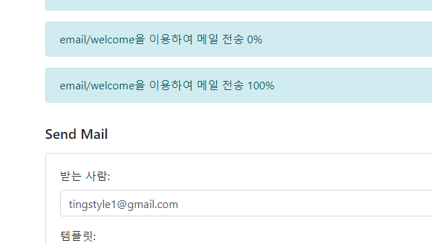
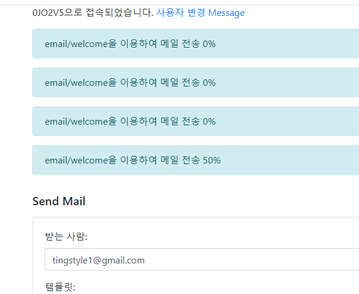
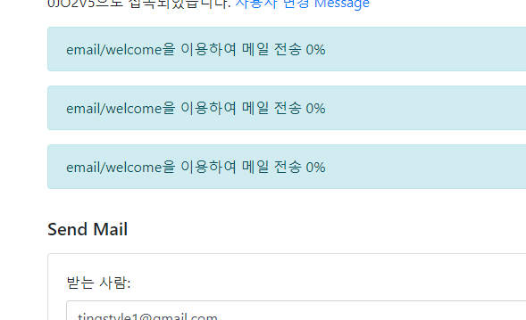
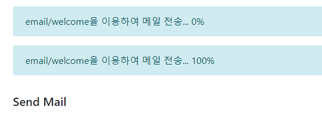
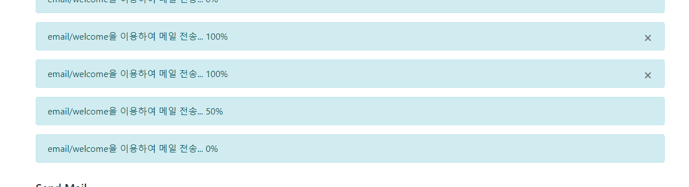

### 접속시 일단 정적으로 진행중인 task뿌리기
1. 정적으로 진행중인 task들을 session에 담아 놓고 뿌려야한다.
   - **정적인 user데이터는 before_request에서 하고 잇음**
   ```python
   @app.before_request
   def before_request():
       # 4. 해당 username의 진행중인 task
       session['tasks_in_progress'] = Task.get_unfinished_list_of(session)
   ```
   - 일단 화면에 나오게 자신의 완료된 task포함 다 뿌릴 수 있게 저장한다
      ```python
   session['tasks_in_progress'] = Task.get_list_of(session)
   ```
   - **하지만 flask session에는 기본적으로 직렬화가 가능한 객체를 넣어줘야한다고 한다.**
      - 개별 들을 바로 session['']에 넣을 수 있었지만, 객체 list는 직렬화를 내부에서 판단한다
   
2. 먼저, Task의 get_progress메서드에서 fetch(self.id, connecttion=r)에서 id는 string으로 들어가야한다
   - 또한 NoSuchJobError도 발생하므로 넣어준다
   ```python
   class Task(BaseModel):
       __tablename__ = 'tasks'
       def get_rq_job(self):
           try:
               rq_job = rq.job.Job.fetch(str(self.id), connection=r)
           except (redis.exceptions.RedisError, rq.exceptions.NoSuchJobError):
           # except redis.exceptions.RedisError:
               return None
           return rq_job
   
       def get_progress(self):
           job = self.get_rq_job()
           return job.meta.get('progress', 0) if job is not None \
               else 100
   
   ```

3. **to_dict구현해서 session에 model객체 넣어주기**
   > Flask의 session은 기본적으로 JSON으로 직렬화되어 저장됩니다. 하지만, JSON 직렬화는 기본적으로 dict 타입만을 직렬화할 수 있습니다. 따라서, Flask의 session에는 dict 타입이 아닌 객체를 저장하기 위해서는 해당 객체를 dict 타입으로 직렬화해주어야 합니다.
   - **이 때, progress도 같이 dict에 넣어서 직렬화되게 한다**
   ```python
    def to_dict(self):
        return {
            'id': self.id,
            'name': self.name,
            'description': self.description,
            'failed': self.failed,
            'status': self.status,
            'log': self.log,
            'result': self.result,
            'username': self.username,
            'progress': self.get_progress(),
        }
   ```
   ```python
   session['tasks_in_progress'] = [ task.to_dict() for task in Task.get_list_of(session)]
   ```

4. send_mail.html에서 뿌려준다
   - flash와 마찬가지로 alert class로 뿌려준다.
   - **message와 달리 실시간변동알 id는 task마다 각각 부여되어야 하므로 `id="{{주어진id}} - progress"`**로 짓는다.
   
   ```html
    <!-- 진행 중인 작업 -->
    
    
    
   
    <div class="alert alert-info mt-3" role="alert">
        {{ task.description }}
        <span id="{{ task.id }}-progress">{{ task.progress }}</span>%
    </div>
    
    
    
   ```
   

5. 이제 진행 중인 테스크만 나타날 수 잇게 한다
   ```python
   session['tasks_in_progress'] = [ task.to_dict() for task in Task.get_unfinished_list_of(session)]
   ```
   - 메일을 보내고, 새로고침을 눌러 50%가 되는지 확인해본다
   
   - 다시 새로고침하면 -> `Notification은 100%`이면서 Task은 `finished`상태라 안보이게 된다.
   


### Dynamic으로 전송받기
1. notifications.js에 `set_task_progress()`를 정의한다
   - **이 때, `progress값` 외 `개별 task_id`받아 -> `개별 id="개별id-progress"`에 접근해야한다 받아야한다**
   ```js
   function set_task_progress(task_id, progress) {
       $('#' + task_id + '-progress').text(progress);
   }
   ```
   

2. **`switch( notifications[i].name ){ case '': xxx;break; }'`를 통해, 기존의 `unread_message_count`와 구분해서 `task_progress`를 처리하게 한다**
   - 기존에는 if로 name을 구분했는데 수정한다
   - since는 공통과정이므로 switch의 아래로 빼준다.
   ```js
    setInterval(function () {
        // $.ajax("{{ url_for('notifications') }}?since=" + since).done(
        $.ajax(url + "?since=" + since).done(
            function (notifications) {
                for (var i = 0; i < notifications.length; i++) {
                    // if (notifications[i].name == 'unread_message_count')
                    switch (notifications[i].name) {
                        case 'unread_message_count':
                            set_message_count(notifications[i].data);
                            break;
                        case 'task_progress':
                            set_task_progress(notifications[i].task_id, notifications[i].progress);
                            break;
                    }
                    since = notifications[i].timestamp;
                }
            }
        );
    }, 10000);
   ```
   
3. **문제는 `/notifications`는 일괄적인 form으로 jsonify해서 보내줘야하기 때문에, Notification의 result를 paylaod에 담을때 `data=`에 고정적으로 담아야한다**
   ```python
   @app.route('/notifications')
   def notifications():
       since = request.args.get('since', 0.0, type=float)
       notifications = Notification.query.filter(
           Notification.username == session['username'],
           Notification.created_at > since
       ).order_by(asc(Notification.created_at)).all()
       return jsonify([{
           'name': n.name,
           'data': n.payload['data'],
           'timestamp': n.timestamp
       } for n in notifications])
   ```
   ```python
    'data': n.payload['data'],
   KeyError: 'data'
   ```
4. **set_task_progress() 내부에서 Notification.create()를 호출하는데, `payload=dict(data=)`를 고정하고 추가적인 데이터들은 data에 dict로 담는다.**
   ```python
   def set_task_progress(progress):
       job = get_current_job()
       if job:
           job.meta['progress'] = progress
           job.save_meta()
   
           task = Task.query.get(job.get_id())
           Notification.create(
               name='task_progress',
               username=task.username,
               payload=dict(data={
                   'task_id': task.id,
                   'progress': progress,
               }),
           )
   ```
5. view에서 응답받은 notification의 데이터는 `.data`를 거쳐서 꺼낸데
   ```js
   case 'task_progress':
          // set_task_progress(notifications[i].task_id, notifications[i].progress);
          set_task_progress(notifications[i].data.task_id, notifications[i].data.progress);
          break;
   ```
   


### 100% 될 때 닫기버튼 띄우기
1. task progress 관련 alert에 닫기버튼을 visibility hidden으로 추가한다
   - **이 때, 닫기버튼도 task_id별로 조정할 수 있도록 id를 준다.**
   ```html
    <div class="alert alert-info fade show mt-3" role="alert">
        {{ task.description }}...
        <span id="{{ task.id }}-progress">{{ task.progress }}</span>%
        <button id="{{ task.id }}-progress-close" type="button" class="close" style="visibility: hidden" data-dismiss="alert" aria-label="Close">
            <span aria-hidden="true">&times;</span>
        </button>
    </div>
   ```
   
2. set_task_progress에서 jquery .css( )로 100이 넘어오면 visible로 바꿔준다.
   ```js
   function set_task_progress(task_id, progress) {
       $('#' + task_id + '-progress').text(progress);
       $('#' + task_id + '-progress-close').css('visibility', progress === 100 ? 'visible' : 'hidden');
   }
   ```
   
### Task의 Notification생성을 Task별로 여러개 생성하기
1. 현재는 여러개의 Task를 생성시, 1개의 Notification 속에 data={task_id, progress} 덮어써서 저장된다.
   - **`name`과 `username`으로 검색되면 기존 것을 삭제하기 때문에 `같은 username으로만 생성하면 task별로 안나눠지고 덮어써서 생성`**

2. set_task_progress() 내부에서 Notification.create()를 호출시 `username` + `_taskid`로 생성하게 한다
   ```python
   def set_task_progress(progress):
       job = get_current_job()
       if job:
           job.meta['progress'] = progress
           job.save_meta()
   
           task = Task.query.get(job.get_id())
           Notification.create(
               name='task_progress',
               # username=task.username,
               username=f'{task.username}_{task.id}',  #taks별로 1개의 username이 아닌 username_task_id로 생성하자
               payload=dict(data={
                   'task_id': task.id,
                   'progress': progress,
               }),
           )
   ```
    
3. view에서 Notification 조회시 `==`가 아닌 `like`로 검색하여 `_개별taskid`도 다 검색되게 한다
   ```python
   @app.route('/notifications')
   def notifications():
       since = request.args.get('since', 0.0, type=float)
       
       notifications = Notification.query.filter(
           # Notification.username == session['username'],
           Notification.username.like(f"{session['username']}%"),
           Notification.created_at > since
       ).order_by(asc(Notification.created_at)).all()
       
       return jsonify([{
           'name': n.name,
           'data': n.payload['data'],
           'timestamp': n.timestamp
       } for n in notifications])
   ```
   
4. 테스트에서 여러개의 task를 queue에 넣고 progress를 잘 찾아오는지 확인한다.
   

5. polling 주기를 10초에서 -> 5초로 변경하자
6. 