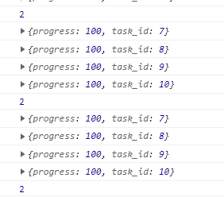
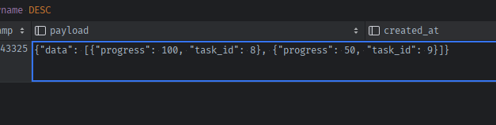
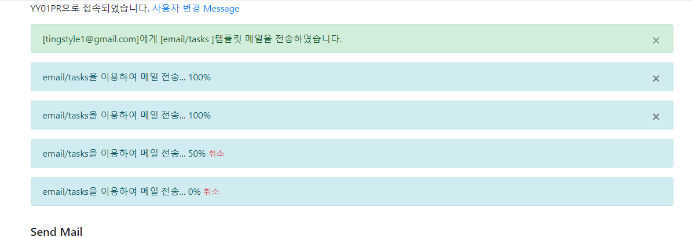

[### username_task_id로 Notification을 여러개 생성시 문제점
- Notification이 Message처럼 삭제후 생성개념이 개별task마다 적용되는 것은 당연히 되어야하는데
- **개별task의 Notification이 계속 조회되어, Task갯수만큼 계속 검색될 것이다.**
    - 한번 생성된 Notifiation은 접속시마다 계속 올라올 것이다. 다만 진행중인 task_id가 아니라서 view에 표시만 안되고 있다.
    - **message도 어차피 매번 1개가 올라오는데, task관련 Notification도 1개만 올라오게 해보자.**
      
    - 
- **Notification을 name별/username별 삭제 후 생성하지말고, `없으면 생성, 있으면 업뎃`으로 변경한 뒤, `task별 payload입력을 update로 주고` view에서는 payload를 순회해서 삽입**
    - 하여 1개의 Notification을 유지하되, 생성시  이미 progress가 100인 task는 del key해주도록 변경해보자.


1. **Notification의 생성시 삭제후 수정 대신 `name/username별 있으면 수정 or  없으면 생성`하게 한다**
```python
class Notification(BaseModel):
    __tablename__ = 'notifications'
    
    @classmethod
    def create(cls, username, name, payload):
        # # 1. 현재사용자(in_session-username)의 알림 중
        # #    - name='unread_message_count' 에 해당하는 카테고리의 알림을 삭제하고
        # Notification.query.filter_by(name=name, username=username).delete()
        # # 2. 알림의 내용인 payload에 현재 새정보를 data key에 담아 저장하여 새 알림으로 대체한다
        # notification = Notification(
        #     name=name,
        #     username=username,
        #     payload=payload
        # )
        # 있으면 payload만 수정, 없으면 생성
        notification = Notification.query.filter_by(name=name, username=username).first()
        if notification:
            return notification.update(payload=payload)
        else:
            notification = Notification(
                name=name,
                username=username,
                payload=payload
            )
        return notification.save()

```
2. 문제는 **입력시에는 `task1개에 대한 dict`만 올것이고, 내부에서는 payload=dict(data=[])의 list로 보관되어야한다**
    - 애초에 .create()시 내부적으로 dict(data=  `data`  )형식으로 인자로 온 data를 받아서 알아서 payload형식으로 변환 저장되게 변경하자.
    - 생성 부분만 수정 -> Message.create()에서도 수정
    ```python
    class Notification(BaseModel):
        __tablename__ = 'notifications'
        @classmethod
        def create(cls, username, name, data):
    
            # 있으면 payload만 수정, 없으면 생성
            notification = Notification.query.filter_by(name=name, username=username).first()
            if notification:
                return notification.update(payload=data)
            else:
                ## 생성
                # 1) 내부적으로 payload를 dict(data=)에 넣어서 생성하게 하기
                # - message -> int로 들어어오면 -> dict(data= int ) 형식으로 집어넣기
                # - task_progress -> dict로 들어오면 dict(data= [  ])에 집어넣기
                if name == 'unread_message_count':
                    payload = dict(data=data)
                elif name == 'task_progress':
                    payload = dict(data=[data])
                    
                notification = Notification(
                    name=name,
                    username=username,
                    payload=payload
                )
            return notification.save()
    ```
    ```python
    class Message(BaseModel):
    __tablename__ = 'messages'
    @classmethod
    def create(cls, _session, body):
        # 1. 알림처리보다 먼저, 현재 Message를 생성하여, -> 알림의 payload에 반영되게 한다.
        message = cls(recipient=_session.get('username'), body=body)
        message.save()
    
        # 2. 알림을 현재model에 맞는 name + 맞는 payload로 생성한다.
        n = Notification.create(
            username=_session.get('username'),
            name='unread_message_count',
            # payload=dict(data=cls.new_messages_of(_session)),
            data=cls.new_messages_of(_session)
        )
    
        return message
    ```
   
3. 이제 set_task_progress에서 Notification.create()호출시, **`payload=dict(data=)`에 1개의 task_id/progress dict를 넣는게 아니라 list로 애초에 생성한다**
    - **기존에 username=task.username+ _task_id를 다시 username=username으로 복구한다.**
    ```python
    def set_task_progress(progress):
        job = get_current_job()
        if job:
            job.meta['progress'] = progress
            job.save_meta()
    
            task = Task.query.get(job.get_id())
            Notification.create(
                name='task_progress',
                username=task.username,
                payload=dict(data=[
                    {
                        'task_id': task.id,
                        'progress': progress,
                    }
                ])
            )
    ```
3. 문제는 있으면 payload를 업데이트 하는게 아니라, 덮어쓰기 한다는 점이다.
   - **`수정`시 notification의 `name이 task_progress에 한해서만` 덮어쓰기가 아니라 `data=[{}]`에 이미 task_id가 있으면 거기에 덮어쓰게 하고, `없으면 append`해야한다**
   - **그러기 위해선, create시 `payload=`전체가 아니라 `data=`만 받아서 내부에서 payload로 만들고, 검사한다**
    ```python
    @classmethod
    def create(cls, username, name, data):
        # 1. name별 username별 이미 Notification이 있으면 payload를 수정, 없으면 새로 생성한다.
        notification = Notification.query.filter_by(name=name, username=username).first()
        if notification:
            ## 수정시(아마도 set_task_progress)
        else:
            ## 생성
            if name == 'unread_message_count':
                payload = dict(data=data)
            elif name == 'task_progress':
                payload = dict(data=[data])

            notification = Notification(
                name=name,
                username=username,
                payload=payload
            )
            return notification.save()
    ```

4. **payload['data']가 list이며, 그것을 업뎃하고 싶을 땐, 미리 변수로 빼놓고 업뎃시킨 list로 재할당하여 업뎃해야한다.**
    ```python
    @classmethod
    def create(cls, username, name, data):
        # 1. name별 username별 이미 Notification이 있으면 payload를 수정, 없으면 새로 생성한다.
        notification = Notification.query.filter_by(name=name, username=username).first()
        if notification:
            ## 수정
            # - message는 payload['data']를 덮어쓰기만 하면 되지만
            # - task는  payload['data']는 list이며, list 내부 task_dict들을 순회하면서
            #   1) data={'task_id'}와 같은 task_id를 가진 dict가 있으면 => 해당 dict를 덮어쓴다
            #   2) 같은 task_id를 가진 dict가 없다면 => payload['data']라는 list에 append해서 update한다
            ## 수정시 Json필드의 주의사항
            # - 덮어쓸 index를 찾아서, payload['data'][idx] = data 로 집어넣으면  update or commit()시 반영이 안된다 -> 무슨 수를 써도 안됨.
            # => payload라는 dict(json)전체 업뎃이 아닌  payload['data']의 list르 업뎃하는 상황이라면,
            # => 기존의 dict list인 payload['data']을 임시변수에 받아놓고 -> 업뎃한 뒤 -> payload['data]에 재할당 해주자.
            #    notification.payload['data'].append( data )  OR  notification.payload['data'] [idx] = data 는 업뎃이 안된다.
            if name == 'task_progress':
                previous_list = notification.payload['data']
                for idx, task_dict in enumerate(previous_list):
                    if data['task_id'] == task_dict['task_id']:
                        previous_list[idx] = data
                        notification.payload['data'] = previous_list
                    break
                else:
                    previous_list.append(data)
                    notification.payload['data'] = previous_list
                    
                session.commit()
                return notification
                
            # elif name == 'unread_message_count':
            else:
                payload = dict(data=data)
                return notification.update(payload=payload)
        else:
            ## 생성
            # 1) 외부에서 받은 data={}를 내부적으로 payload를 dict(data=)에 넣어서 생성
            # - message -> int로 data가 들어어오면 -> dict(data= int ) 형식으로 집어넣기
            # - task_progress -> dict로 data={'task_id':, 'progress':}가 들어오면 dict(data= [  ])로 list로 감싸서 집어넣기
            if name == 'task_progress':
                payload = dict(data=[data])
            # elif name == 'unread_message_count':
            else:
                payload = dict(data=data)

            notification = Notification(
                name=name,
                username=username,
                payload=payload
            )
            return notification.save()
    ```

5. notifications.js에서 받은 notification의 name이 task_progress인경우, data가 list이므로 순회하면서 alert창을 바꿔준다.
    ```js
    switch (notifications[i].name) {
        case 'unread_message_count':
            set_message_count(notifications[i].data);
            break;
        case 'task_progress':
            // set_task_progress(notifications[i].data.task_id, notifications[i].data.progress);
            // task_progress인 경우, data에는 list(array)가 들어오므로 -> 순회하면서 처리한다
            notifications[i].data.forEach(function(task, index, array) {
              // console.log(task, index, array);
                set_task_progress(task.task_id, task.progress);
            });
            break;
    }
    since = notifications[i].timestamp;
    }
    ```
   

6. 이제 notification은 1개만 생성되며, payload내부에서 task별로 처리된다.
    
    