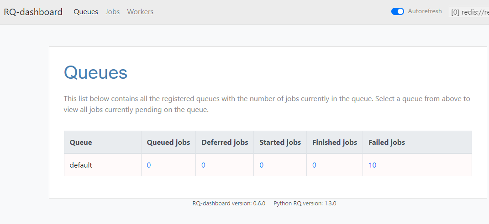

### rq-dashboard 띄우기
- 참고: https://minwook-shin.github.io/python-rq-with-scheduler/

1. docker/rq-dashboard/Dockerfile 생성후 `FROM `에 최신 image반영하기
    ```dockerfile
    FROM eoranged/rq-dashboard:latest
    ```


2. docker-compose.yml에 rq-dashboard 반영하기
    ```dockerfile
      rq_dashboard:
        container_name: rq-dashboard
        build:
          context: .
          dockerfile: docker/rq-dashboard/Dockerfile
        env_file:
          - .env
        environment:
          - RQ_DASHBOARD_REDIS_URL=redis://${REDIS_HOST}:${REDIS_PORT}
        ports:
          - "9181:9181"
        networks:
          - network1
    ```


3. 9181에 접속해서 확인하기
   `http://localhost:9181/`
    


### 로그 반영하기
- class Logger -> 각종 객체로 미리 나열해놓기
    - https://github1s.com/staugur/IncetOps/blob/81d73e45c758d8e16c90d91666b138363553b68c/src/utils/log.py
    - 내 프로젝트 [Config/settings.py](https://github.com/is2js/2022_sqlalchemy/blob/master/src/config/settings.py)
1. `config.py`에 BASE_FOLDER를 기준으로 LOG_FOLDER를 지정한다.
    - BASE_FOLDER는 init.py가 있는 곳으로 미리 잡아놨다.
    - **BASE_FOLDER는 `프로젝트명/app`폴더에 넣고 .parent()를 붙여서 설정하여 `프로젝트/logs`로 지정되게 한다**
    ```python
    import os
    from pathlib import Path
    class Config:
        SECRET_KEY = os.getenv('SECRET_KEY') or 'secret_key'
    
        BASE_FOLDER = Path(__file__).resolve().parent # BASE_FOLDER:  /rq/app
        LOG_FOLDER = BASE_FOLDER.parent.joinpath('logs') # LOG_FOLDER:  /rq + logs
    
    if __name__ == '__main__':
        print(Config.LOG_FOLDER) # C:\Users\cho_desktop\PycharmProjects\rq\logs
    ```
   
2. logs폴더를 gitignore에 추가한다

3. **`utils패키지/loggers.py`를 만든다.**
4. class Logger를 정의한다.
   1. 생성자에 `log_name`을 받아 -> logger의 이름이자, `xxx.log`파일의 제목이 될 것이다.
   2. backup_count를 기본 10개로 잡는다.
   3. 생성자없이 self.`log_dir`, `log_file`, `_levels`, `_log_format`, `_logger`가 자동 생성되며
      - **log_dir의 폴더생성 및 hanlder `TimedRotatingFileHandler`를 지정하여 hanlder객체, setLevel를 _logger에 달아준다.**
      - log_file은 log_dir에 **os.join으로 지정만 하면 만들어질 것이다.**
    ```python
    import os
    import logging
    from logging.handlers import TimedRotatingFileHandler
    
    from app import Config
    
    
    class Logger:
        def __init__(self, log_name, backup_count=10):
            self.log_name = log_name
    
            self.log_dir = Config.LOG_FOLDER
            self.log_file = os.path.join(self.log_dir, f'{self.log_name}.log')
    
            self._levels = {
                "DEBUG": logging.DEBUG,
                "INFO": logging.INFO,
                "WARNING": logging.WARNING,
                "ERROR": logging.ERROR,
                "CRITICAL": logging.CRITICAL,
            }
    
            self._log_format = '%Y-%m-%d %H:%M:%S'
    
            # 폴더 만들기 -> 여러 경로의 폴더를 이어서 만들 땐, os.makedirs( , exist_ok=True)로 한다
            if not os.path.exists(self.log_dir):
                os.makedirs(self.log_dir, exist_ok=True)
    
            # formatter
            formatter = logging.Formatter(
                '[ %(levelname)s ] %(asctime)s %(filename)s:%(lineno)d %(message)s',
                datefmt=self._log_format
            )
    
            # handler with formatter
            handler = TimedRotatingFileHandler(
                filename=self.log_file,
                backupCount=backup_count,
                when="midnight",  # 12시마다 잘라서, 10개 반복
            )
            handler.suffix = "%Y%m%d"
            handler.setFormatter(formatter)
            handler.level = 1
    
            # logger with handler + levels
            self._logger = logging.getLogger(self.log_name)
            self._logger.addHandler(handler)
            self._logger.setLevel(self._levels.get("INFO"))
    
        @property
        def getLogger(self):
            return self._logger
    ```
   

4. 윈도우 환경이라서, `from app.config import Config`시 rq때문에 main으로 실행시키면 안된다.
    ```python
    from .utils.log import Logger
    sys_logger = Logger("sys").getLogger
    task_logger = Logger("task").getLogger
    
    sys_logger.info("sys hello info")
    sys_logger.debug("sys hello debug")
    sys_logger.error("sys hello error")
    sys_logger.warning("sys hello warning")
    
    task_logger.info("task hello info")
    task_logger.debug("task hello debug")
    task_logger.error("task hello error")
    task_logger.warning("task hello warning")
    ```
    - 임시로 init.py에서 실행시켜본다.
    - **logger 이름에 따라 파일이 생성된다.**
    

5. **이제 loggers.py 맨 아래 `사용한 각각의 name별 logger`를 생성해놓고, utils/init.py에 .import해놓자**
    ```python
    class Logger:
        def __init__(self, log_name, backup_count=10):
        @property
        def getLogger(self):
            return self._logger
    
    
    logger = Logger("sys").getLogger
    task_logger = Logger("task").getLogger
    ```
    ```python
    from .loggers import logger, task_logger
    ```