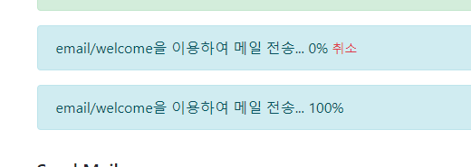
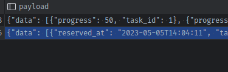

### Task 모델 변경하기
- 참고: https://github1s.com/staugur/IncetOps/blob/81d73e45c758d8e16c90d91666b138363553b68c/misc/incetops.sql#L39-L63
- 
1. 일단 status에 `reserved` 상태를 추가해야할 것이다.
   - enqueue_task 래핑메서드에선 `queued`를 status로 메겼지만, 
   - **추가될 schedule_task 래핑메서드에선 `reserved`로 시작하게 한다**
2. nullable로 작업수행예정시간 `reserved_at` 칼럼을 추가하자.
   ```python
   class Task(BaseModel):
       __tablename__ = 'tasks'
   
       statuses = ['queued', 'running', 'canceled', 'finished', 'reserved']
   
       # ...
   
       # timer의 수행시간
       scheduled_at = db.Column(db.DateTime, nullable=True)
   
    @classmethod
    def create(cls, _session, name, description, status='queued'):

        task = cls(name=name, description=description, username=_session.get('username'), status=status)
        return task.save()
   
   @classmethod
   def get_reserved_list_of(cls, _session, limit=None):
       query = cls.query.filter(
           cls.username == _session.get('username'),
           cls.status == 'reserved'
       ).order_by(asc(cls.scheduled_at))

       if limit:
           query = query.limit(limit)

       return query.all()
   
   def to_dict(self):
    return {
        'reserved_at': self.reserved_at
    }
   ```
   

### wraaping전에 scheduled_time 검증 추가하기
- 내부에 raise ValueError('텍스트')로 내서 -> 외부의 try except에서 지정해서 flash로 반환한다
   ```python
     try:
         is_scheduled = request.form.get('is_scheduled')
         if not is_scheduled:
             s = TaskService()
             s.enqueue_task(send_async_mail, email_data, description=f'{template_name}을 이용하여 메일 전송')
             flash(f'[{recipient}]에게 [{template_name} ]템플릿 메일을 전송하였습니다.', 'success')
         else:
             # high queue를 사용
             s = TaskService(queue_name='high')
             try:
                 scheduled_time_str = request.form.get('scheduled_time')
                 scheduled_time = datetime.strptime(scheduled_time_str, '%Y-%m-%d %H:%M:%S')
                 scheduled_time = scheduled_time + timedelta(minutes=2)
                 # scheduled_timestamp = scheduled_time.timestamp()
             except Exception as e:
                 s.logger.debug(f'시간 형식이 올바르지 않습니다.')
                 raise ValueError(f'시간 형식이 올바르지 않습니다.')
   
             # 시간 검증하기 ( 예약시간은, 등록시점보다 3분 보다 더 뒤에)
             if scheduled_time - datetime.now() < timedelta(minutes=1):
                 s.logger.debug(f'현재보다 {1}분이내의 예약은 불가능합니다.')
                 raise ValueError(f'현재보다 {1}분이내의 예약은 불가능합니다.')
             job = s.asyncQueue.enqueue_at(
                 scheduled_time,  # datetime
                 print,  # func
                 "abcdef",  # func - args
                 # description='asdf',  # func - kwargs
             )
             # s.logger.info(f"job in ScheduledJobRegistry(queue=queue): {job in registry}")
             s.logger.debug(f"job.to_dict(): {job.to_dict()}")
             s.logger.debug(f"job in s.asyncQueue.scheduled_job_registry : {job in s.asyncQueue.scheduled_job_registry}")
   
             flash(f'[{recipient}]에게 [{template_name} ]템플릿 메일 전송을 예약({scheduled_time_str})하였습니다.', 'success')
   
     except ValueError as e:
         flash(f'{str(e)}', 'danger')
   
     except Exception:
         flash(f'[{recipient}]에게 [{template_name} ]템플릿 메일을 전송을 실패하였습니다.', 'danger')
   
     return redirect(url_for('send_mail'))
   ```


### 검증을 포함 DB와 연계되는 래핑메서드 reserve_task 만들기
1. views.py상에서 전체 코드를 method로 묶고, parameter 추출하기
   - datetime은 이미 변경되고 나서 들어오며, 시간 검증만 method내부에서 하기
   - enqueue_task 참고하기
   - print 대신 `task_func` 등으로 반영되게 하기
   - **task_func용 args는 함수인자에서 `*args`로 받고, 내부에서 `args`로 입력해주기**
   - 추가로 받을 kwargs(description=,timeout=)은 미리 주고, 나머지 키워드는 `**kwargs`로 받고, 내부에서 `kwargs(dict) or **kwargs 그대로 키워드 입력`으로 메서드 인자로 사용
   ```python
   def reserve_task(
           s, scheduled_time, task_func, *args,
           description=None, timeout=None,
           **kwargs
   ):
       if scheduled_time - datetime.now() < timedelta(minutes=1):
           s.logger.debug(f'현재보다 {1}분이내의 예약은 불가능합니다.')
           raise ValueError(f'현재보다 {1}분이내의 예약은 불가능합니다.')
   
       if not description:
           s.logger.debug(f'Description required to start background job')
           raise ValueError('Description required to start background job')
   
       s.logger.info(f'schedule task start...')
       job = s.asyncQueue.enqueue_at(
           scheduled_time,  # datetime
           task_func,  # func
           *args,  # func - args ( not tuple )
           **kwargs, # func - kwargs (not dict)
           timeout=timeout,
           retry=Retry(max=3, interval=5)  # 일시적 네트워크 장애 오류시 5분간격으로 최대 3번 도전
       )
       s.logger.debug(f"job.to_dict(): {job.to_dict()}")
       s.logger.debug(f"job in s.asyncQueue.scheduled_job_registry : {job in s.asyncQueue.scheduled_job_registry}")
      
       s.logger.info(f'reserve task complete...')
   ```
   
2. 해당 메서드를 app/tasks/service.py로 이동(move)
3. def reserve_task를 tab을 눌러 TaskService cls내부 self 메서드로 이동
   - s객체의 파라미터를 `self`로 변경
4. views.py에서 TaskServic의 객체로 s.reserve_task() 호출하도록 하고 테스트
   ```python
   # str -> datetime 변환
   # - 시간을 입력안한 경우의 예외처리는, 여기서 format이 안맞아서 전송 실패한다.
   scheduled_time_str = request.form.get('scheduled_time', None)
   try:
       scheduled_time = datetime.strptime(scheduled_time_str, '%Y-%m-%d %H:%M:%S')
       scheduled_time = scheduled_time + timedelta(minutes=2)
       # scheduled_timestamp = scheduled_time.timestamp()
   except Exception as e:
       logger.debug(f'시간 형식이 올바르지 않습니다.')
       raise ValueError(f'시간 형식이 올바르지 않습니다.')
   # high queue를 사용
   s = TaskService(queue_name='high')
   s.reserve_task(scheduled_time, print, 'abcde', description='설명')
   flash(f'[{recipient}]에게 [{template_name} ]템플릿 메일 전송을 예약({str(scheduled_time)})하였습니다.', 'success')
   ```
   
### enqueue_task와 비교하여 DB반영하기
1. 래핑메서드에서 Task데이터를 생성하면서 description 키워드를 사용하며, 특별히 default status인 queued가 아닌 `scheduled`로 생성한다
   - 또한, 추가적으로 사용되는 `reserved_at`필드로 키워드=None으로 받아주고, 필요시 입력하도록 만든다.
2. enqueue_at시 keyword `job_id=`로 생성된 taskd의 id를 str()으로 바꿔서 `str(task.id)`로 반영한다
   - enqueue_at은 _call과 달리 timeout= 인자를 안받는다. 사용되지 않는 인자를 주면, task_func으로 들어가버려서 오류가 난다.
3. enqueue에 실패할 경우 생성한 task를 완료update하는 try/catch를 입힌다.
4. 생성된 task를 반환한다
   ```python
    @classmethod
    def create(cls, _session, name, description,
               status='queued', reserved_at=None):

        task = cls(name=name, description=description, username=_session.get('username'), status=status, reserved_at=reserved_at)
        return task.save()
   ```
   ```python
    def reserve_task(
            self,
            scheduled_time, task_func, *args,
            description=None, timeout=None,
            **kwargs
    ):
        if scheduled_time - datetime.now() < timedelta(seconds=self.RESERVATION_LIMIT_SECONDS):
            raise ValueError(f'현재보다 {self.RESERVATION_LIMIT_SECONDS}초 이내의 예약은 불가능합니다.')
   
        if not description:
            raise ValueError('Description required to start background job')
   
        # DB 연동
        task = self.model.create(session, name=task_func.__name__, description=description,
                                 status='reserved', reserved_at=scheduled_time)
        self.logger.info(f'schedule task start...')
        try:
            # job = s.asyncQueue.enqueue_in(
            #     timedelta(seconds=1),  # timedelta
            job = self.asyncQueue.enqueue_at(
                scheduled_time,  # datetime
                task_func,  # func
                *args,  # func - args ( not tuple )
                **kwargs,  # func - kwargs (not dict)
                #timeout=timeout if timeout else self.timeout,
                retry=Retry(max=3, interval=5),  # 일시적 네트워크 장애 오류시 5분간격으로 최대 3번 도전
                job_id=str(task.id),  # DB 연동
            )
            # registry = ScheduledJobRegistry(queue=s.asyncQueue)
            # s.logger.info(f"job in ScheduledJobRegistry(queue=queue): {job in registry}")
            self.logger.debug(f"job.to_dict(): {job.to_dict()}")
            self.logger.debug(
                f"job in s.asyncQueue.scheduled_job_registry : {job in self.asyncQueue.scheduled_job_registry}")
            # job = s.asyncQueue.enqueue_at(
            #     scheduled_time,  # datetime
            #     send_async_mail,  # func
            #     email_data,  # func - args
            #     description='asdf',  # func - kwargs
            # )
            #### 테스트를 위해 스케쥴은 다 비우기
            # scheduled_jobs = s.asyncScheduler.get_jobs()
            # for job in scheduled_jobs:
            #     s.asyncScheduler.cancel(job)
            # s.logger.info(f"get_jobs_to_queue: {list(s.asyncScheduler.get_jobs_to_queue())}")
            # s.logger.info(f"job.to_dict(): {job.to_dict()}")
            # s.logger.info(f"list(s.asyncScheduler.get_jobs()): {list(s.asyncScheduler.get_jobs())}")
            # job_id = job.id
            # job = Job.fetch(job_id, connection=s.redis)
        except RedisError as e:
            # 3) enqueue가 실패하면 Task의 failed 칼럼을 True / status를 finished로 채워준다
            self.logger.error(str(e), exc_info=True)
            task.update(
                failed=True,
                status='finished',
                log=f'Could not connect to Redis: ' + str(e)
            )
        except Exception as e:
            self.logger.error(str(e), exc_info=True)
            # 4) enqueue가 Retry실패 등으로 Redis외 에러가 발생해도 DB에 기록
            task.update(
                failed=True,
                status='finished',
                log=f'Error: ' + str(e)
            )
   
        self.logger.info(f'reserve task complete...')
        return task
   ```
   


### notification용 tasks 수집시 scheduled상태도 같이 모집하기
1. before_request에서 
   ```python
   session['tasks_in_progress'] = [task.to_dict() for task in Task.get_unfinished_list_of(session)]
   ```
   
2. 해당 메서드의 필터링을 완료된 상태인 `finished, canceled`가 아닌 것만 골라내자
   ```python
       @classmethod
       def get_unfinished_list_of(cls, _session, limit=None):
           query = cls.query.filter(
               cls.username == _session.get('username'),
               # cls.status != 'finished'
               # cls.status.in_(['queued', 'running'])
               cls.status.notin_(['canceled', 'finished'])
           ).order_by(asc(cls.created_at))
   
           if limit:
               query = query.limit(limit)
   
           return query.all()
   ```
   

### view에서 scheduled의 경우, 다른 색으로 표시 + 남은시간을 위한 filter 등록하기

1. send_mail.html에 task.의 상태에 따라 다른 message를 보여주도록 if문을 건다
   ```html
    <!-- 진행 중인 작업 -->
    
    
    
        
        <div class="alert alert-warning fade show mt-3" role="alert">
            [예약] {{ task.name }} : {{ task.reserved_at.strftime('%Y년%m월%d일 %H시 %M분 %S초')}}
            <a id="{{ task.id }}-progress-cancel" href="{{ url_for('cancel_task', task_id=task.id) }}"
               class="text-danger font-weight-bold"
               style="visibility: visible">
                <small> {{task.reserved_at  }} (예약 취소)</small>
            </a>
        </div>
        
   ```
   

2. 필터에 사용될 유틸로서 **남은시간(예약시간 - 현재시간의 timedelta)를 한글로 표기**하는 util 모듈을 `utils/datetime_converter.py`에 `timedelta_to_remain`만들어 올리기
   ```python
   # app/utils/datetime_converter.py:
   def timedelta_to_remain(td):
       seconds = int(td.total_seconds())
       periods = [
           ('년', 60 * 60 * 24 * 365),
           ('월', 60 * 60 * 24 * 30),
           ('일', 60 * 60 * 24),
           ('시', 60 * 60),
           ('분', 60),
           ('초', 1)
       ]
   
       strings = []
       for period_name, period_seconds in periods:
           if seconds > period_seconds:
               period_value, seconds = divmod(seconds, period_seconds)
               # has_s = 's' if period_value > 1 else ''
               strings.append("%s%s" % (period_value, period_name))
   
       return "".join(strings) + " 남음"
   ```
   ```python
   # app/utils/__init__.py
   #...
   from .datetime_converter import timedelta_to_remain
   ```
   

3. timedelta_to_remain 모듈을 이용해서 datetime -> 현재시간과의 차이 -> string으로 변환해주는 필터ㅣ 만들기
   - `template>filters`에 remain_from_now.py로 만들었다.
   ```python
   # app/templates/filters/remain_from_now.py
   from datetime import datetime
   
   from app.utils import timedelta_to_remain
   
   
   def remain_from_now(_datetime):
       diff_timedelta = _datetime - datetime.now()
       return timedelta_to_remain(diff_timedelta)
   ```
   - app객체에 등록해준다.
   ```python
   # app/__init__.py
   app.jinja_env.filters["remain_from_now"] = remain_from_now
   ```
   

4. jinja템플릿에서 사용해준다.
   ```html
   <small> {{task.reserved_at  | remain_from_now }} (예약 취소)</small>
   ```
   

### reservation 남은시간 실시간 업뎃을 Notification.js 수정
1. send_mail.html에서 남은시간부분만 span으로 감싸고 id를 배정한다
   ```html
   <small>
     <span id="{{ task.id }}-remain">{{task.reserved_at | remain_from_now }}</span> 
     (예약 취소)
   </small>
   ```
   
2. notification.js에서 case를 `task_reserve`를 추가하고, 각 notification마다 남은 reserved_remain을 set하도록 한다
   ```js
   switch (notifications[i].name) {
            case 'unread_message_count':
                set_message_count(notifications[i].data);
                break;
            case 'task_progress':
                // set_task_progress(notifications[i].data.task_id, notifications[i].data.progress);
                // task_progress인 경우, data에는 list(array)가 들어오므로 -> 순회하면서 처리한다
                notifications[i].data.forEach(function(task, index, array) {
                  // console.log(task, index, array);
                    set_task_progress(task.task_id, task.progress);
                });
                break;
            case 'task_reserve':
                notifications[i].data.forEach(function(task, index, array) {
                    set_task_reamin(task.task_id, task.reserved_remain);
                });
                break;
        }
        since = notifications[i].timestamp;
    }
   ```
   ```js
   function set_task_remain(task_id, task_reserved_remain) {
       $('#' + task_id + '-remain').text(task_reserved_remain);
   }
   ```
   
3. 이제 Notification이 `task_reserve`라는 name으로 result에는 `task_remain`(한글: ~남음)으로 내려와야한다
   - **@background_task는 이미 작동하고 난 상태에서 set_task_progress를 계속 해주는 것이 맞다**
   - 그렇다면, running(@background task)이전에 남은시간을 업뎃해주는 처리를 계속해줘야한다?!


4. 일단 @background_task 데코레이터를 타기전에 **먼저 실행될 로직이 필요**하므로 service의 reserve_task에서 Notification을 먼저 만든다?
   - **남은시간을 기록하면, 남은시간을 꼐속 업뎃해줘야한다.**
   - **`예약시간을 기록`해서 내려보내줄때 남은시간을 계산해서 내려보내줘야한다.**
   - **datetime을 Json필드에 기록할 땐 `.isoformat()`으로 기록하고, 꺼낼 땐 `.fromisoformat()`으로 꺼내자?!**
   ```python
     # DB 연동
     task = self.model.create(session, name=task_func.__name__, description=description,
                              status='reserved', reserved_at=scheduled_time)
     self.logger.info(f'schedule task start...')
     try:
         # job = s.asyncQueue.enqueue_in(
         #     timedelta(seconds=1),  # timedelta
         job = self.asyncQueue.enqueue_at(
             scheduled_time,  # datetime
             task_func,  # func
             *args,  # func - args ( not tuple )
             **kwargs,  # func - kwargs (not dict)
             # timeout=timeout if timeout else self.timeout, # enquque_call에만 사용됨. 여기서 사용하면 task_func의 키워드인자로 인식되어버린다.
             retry=Retry(max=3, interval=5),  # 일시적 네트워크 장애 오류시 5분간격으로 최대 3번 도전
             job_id=str(task.id),  # DB 연동
         )
         self.logger.debug(f"job.to_dict(): {job.to_dict()}")
         self.logger.debug(
             f"job in s.asyncQueue.scheduled_job_registry : {job in self.asyncQueue.scheduled_job_registry}")
   
      #### 예약 전송 Notification 생성
         # - @background_task에서의 생성은 running부터 시작되는 것
         Notification.create(
             username=session.get('username'),
             name='task_reserve',
             data={
                 'task_id': task.id,
                 'reserved_at': scheduled_time.isoformat()
             }
         )
   ```
   
   

5. Notificaton.create()에서 task_progress와 같이 if 로 처리해준다.
   ```python
    @classmethod
    def create(cls, username, name, data):
        # 1. name별 username별 이미 Notification이 있으면 payload를 수정, 없으면 새로 생성한다.
        notification = Notification.query.filter_by(name=name, username=username).first()
        if notification:
            # if name == 'task_progress' :
            if name in ['task_progress', 'task_reserve']:
                previous_list = notification.payload['data']
                #...
            else:
                payload = dict(data=data)
                return notification.update(payload=payload)
         ## 생성
         # if name == 'task_progress':
         if name in ['task_progress', 'task_reserve']:
             payload = dict(data=[data])
   ```
   

6. **Noitification요청이 올 때마다, `예약시간 -> 현재시간과 비교해서 남은시간`으로 변환 하여 내려보내줘야한다.**
   - 현재는 **views.py의 notifications route에서 직접 변환하여 jsonify(list)로 보내는 중이므로**
   - **BaseModel에 `to_dict`를 정의해서 datetime.isoformat을 처리한다.**
   - **이 때, payload 속 `data=에 담긴  list를 가변변수`로 빼온 뒤, 1개씩 처리해서 `isoformat -> datetime -> str남음`으로 처뢰되도록 한다**
   ```python
       def to_dict(self):
           data = dict()
   
           for col in self.__table__.columns:
               _key = col.name
               _value = getattr(self, _key)
   
               # {"data": [{"progress": 100, "task_id": 34}, {"progress": 100, "task_id": 35}, {"progress": 100, "task_id": 36}, {"progress": 100, "task_id": 37}, {"progress": 100, "task_id": 38}, {"progress": 100, "task_id": 39}, {"progress": 100, "task_id": 40}, {"progress": 100, "task_id": 41}, {"progress": 100, "task_id": 43}, {"progress": 100, "task_id": 42}, {"progress": 100, "task_id": 44}, {"progress": 100, "task_id": 45}, {"progress": 100, "task_id": 46}, {"progress": 100, "task_id": 47}, {"progress": 100, "task_id": 48}, {"progress": 100, "task_id": 49}]}
               if _key == 'payload':
                   # 내부의 list를 가변변수로 받아 수정한 list를 재할당 예정.
                   data_list = _value['data']
                   for i, d in enumerate(data_list):
                       # {"progress": 100, "task_id": 34} or {"reserved_at": "2023-05-05T18:52:03", "task_id": 33}
                       task_notification = dict()
                       for k, v in d.items():
                           # reserved_at의 isoformat datetime인 경우, 'xx 남음'으로 변경
                           if k == 'reserved_at':
                               task_notification[k] = remain_from_now(datetime.fromisoformat(v))
                           else:
                               task_notification[k] = v
                       data_list[i] = task_notification
                   # 'payload' 대신 'data' key에 넣음
                   # _value['data'] = data_list
   
                   # payload['data'] -> data['data']로 변경 for Notification
                   data['data'] = data_list
                   continue
   
               # 나머지 들은 그대로 할당
               data[_key] = _value
   
           return data
   ``` 
7. 기존의 직접 serialize해주던 것을 to_dict를 써서 반환
   ```python
   @app.route('/notifications')
   def notifications():
       since = request.args.get('since', 0.0, type=float)
   
       notifications = Notification.query.filter(
           # Notification.username == session['username'],
           Notification.username.like(f"{session['username']}%"),
           Notification.created_at > since
       ).order_by(asc(Notification.created_at)).all()
   
       # return jsonify([{
       #     'name': n.name,
       #     'data': n.payload['data'],
       #     'timestamp': n.timestamp
       # } for n in notifications])
       return jsonify([n.to_dict() for n in notifications])
   ```
   

### 예약취소는 기존 cancel_task와는 다르다.
- 예약을 취소했더니 `rq.exceptions.InvalidJobOperation: Job is not currently executing`가 떴다.
- `send_stop_job_command(self.redis, rq_job.get_id())`는 **예약취소는 안된다.**


1. view에서 예약취소의 url_for링크를 cancel_task대신 cancel_reserve로 변경한다
   ```html
   <a id="{{ task.id }}-progress-cancel" href="{{ url_for('cancel_reserve', task_id=task.id) }}"
   ```
   

2. view에서 TaskService의 `cancel_reserve`메서드를 호출한다
   - **이 때, 전용queue를 사용해서 처리되도록 하자. queue안에서 예약된 작업인지 확인한다.**
   ```python
   @app.route('/task_reserve/<task_id>')
   def task_reserve(task_id):
       s = TaskService('high')
       task = s.cancel_reserve(task_id)
   
       if task:
           flash(f'예약 Task#{task.id} {task.name}가 취소되었습니다.', 'success')
       else:
           flash(f'예약 Task의 취소에 실패했습니다.', 'danger')
   
       # 나중에는 직접으로 돌아가도록 수정
       return redirect(url_for('send_mail'))
   ```
   

3. **예약 레지스트리에 들어있는지 확인한 뒤, 통과되면 job.cancel() + delete()을 쳐보자**
   ```python
    def cancel_reserve(self, task_id):
        rq_job = rq.job.Job.fetch(str(task_id), connection=self.redis)
   
   
        # self.logger.debug(f"취소 전 예약작업 여부: {rq_job in registry}")
        # 취소 전 예약작업 여부: True
   
        # 예약된 작업인지 확인 -> 예약작업 속에 없으면 return False
        registry = ScheduledJobRegistry(queue=self.asyncQueue)
        if rq_job not in registry:
            return False
   
        rq_job.cancel()
        rq_job.delete()
   
        # self.logger.debug(f"취소 후 예약작업 여부: {rq_job in registry}")
        # 취소 후 예약작업 여부: False
   
        task = self.model.query.get(int(task_id))
        task.update(
            failed=True,
            status='canceled',  # finished가 아닌 canceled로 저장
        )
        return task
   ```
   

4. view에서도 `' 남음'`의 남은시간 없을 때, 취소가 될 수 있게끔 수정한다
   ```js
   function set_task_remain(task_id, task_reserved_at) {
       $('#' + task_id + '-remain').text(task_reserved_at);
       $('#' + task_id + '-reserve-close').css('visibility', task_reserved_at === ' 남음' ? 'visible' : 'hidden');
       $('#' + task_id + '-reserve-cancel').css('visibility', task_reserved_at === ' 남음' ? 'hidden' : 'visible');
   }
   ```
   ```html
   <div class="alert alert-warning fade show mt-3" role="alert">
      [예약] {{ task.name }} : {{ task.reserved_at.strftime('%Y년%m월%d일 %H시 %M분 %S초')}}
      <button id="{{ task.id }}-reserve-close" type="button" class="close" style="visibility: hidden"
              data-dismiss="alert" aria-label="Close">
          <span aria-hidden="true">&times;</span>
      </button>
      <a id="{{ task.id }}-reserve-cancel" href="{{ url_for('cancel_reserve', task_id=task.id) }}"
         class="text-danger font-weight-bold"
         style="visibility: visible">
          <small>
              <span id="{{ task.id }}-remain">{{task.reserved_at | remain_from_now }}</span>
              (예약 취소)
          </small>
      </a>
   </div>
   ```