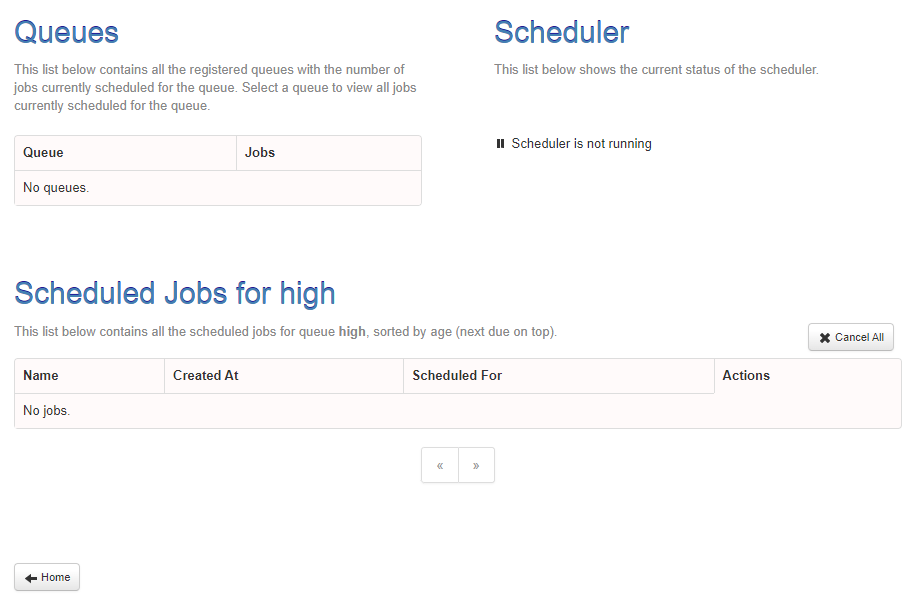
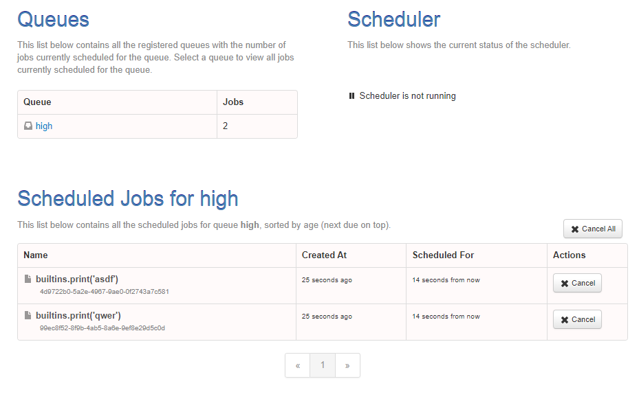

- 참고: email scheduler관련 : https://github1s.com/skulltech/validate-email-bulk/blob/master/app.py
- 타임존 정리: https://spoqa.github.io/2019/02/15/python-timezone.html
### rq-scheduler-dashboard 설치 및 flask bp에 통합
- 참고: https://github1s.com/staugur/IncetOps/blob/81d73e45c758d8e16c90d91666b138363553b68c/src/main.py
1. `rq-scheduler-dashboard` 설치
2. init.py에 import 후 bp로 등록
   ```python
   import rq_scheduler_dashboard
   
   # dashboard
   app.register_blueprint(rq_scheduler_dashboard.blueprint, url_prefix="/rqschedulerdashboard")
   ```
3. `pip freeze` 후 다시 docker 다시 빌드
   - `pip freeze > .\requirements.txt`
   - `docker-compose build --no-cache app` 해도 현재 container 삭제하고 실행해야함.
   - `http://localhost:8000/rqschedulerdashboard` 접속
   
   


4. 마찬가지로 `rq-dashboard`도 설치 > freee > build > 재실행 한뒤, `/rqdashboard`에 접소한다

5. **docker-compose의 rq-dashboard를 내리자.**

### Test를 위한 main을 가진 scheduler.py 및 규칙
- **main을 가진  실행파일은 manage.py와 같은 위치에 생성하여 app import가 가능하게 해야한다.**

1. **rqscheduler는 docker conatiner로 띄워져있으면 된다. `일은 rqworker에서 받아`서 한다**
   - **docker-compose에서 `rqscheduler -i `옵션을 준다면 Scheduler(interval=)은 줄 필요 없다**
     - 같은 프로세스에서 실행(scheduler.run())하지 않는다면, 객체생성시 interval은 필요 없을 듯. 
2. **scheduled_time에는 반드시 `utc`로 들어가야한다**
   - **`now()대신 utcnow()`를 넣으면 바로 실행되며,**
   - **특정시간을 원한다면, `datetimexxxx. astimezone(utc)`에 pytz의 utc객체를 같이 활용한다**
   - datetime.now().replace(tzinfo=utc)는 적용안된다.
3. scheduler는 schedule()시 queue_name을 정해도 `객체 생성시 queue=를 지정`한 것에 할당된다.
    ```python
    from datetime import datetime
    
    import redis
    from rq import Queue
    from rq_scheduler import Scheduler
    
    
    conn = redis.from_url("redis://redis:6379")
    high_queue = Queue('high', connection=conn)
    scheduler = Scheduler(queue=high_queue, connection=conn)
    
    
    
    def main():
        prev_jobs = scheduler.get_jobs()
        for j in prev_jobs:
            scheduler.cancel(j)
    
        job = scheduler.schedule(
            scheduled_time=datetime.utcnow(),
            # scheduled_time=datetime.now().astimezone(utc),
            func=print,
            args=['abc'],
            interval=1,
            repeat=5,
        )
    
        print(f"get_jobs: {prev_jobs}")
        print(f"job.to_dict(): {job.to_dict()}")
        print(f"list(self.asyncScheduler.get_jobs(with_times=True)) : {list(scheduler.get_jobs(with_times=True))}")
    
    
    if __name__ == '__main__':
        main()
    ```
    - test는 terminal에서 `python schduler.py`로 한다.

4. `app/utils/datetime_converter.py`에 `datetime_to_utc`모듈 생성하여 일반 datetime을 utc 적용**
   ```python
   def datetime_to_utc(_datetime: datetime):
       if not isinstance(_datetime, datetime):
           raise ValueError('datetime을 입력해주세요')
   
       return _datetime.astimezone(utc)
   ```
   ```python
   from datetime import datetime
   #...
   from app.utils import datetime_to_utc
   #...
   
   def main():
       #...
       job = scheduler.schedule(
           scheduled_time=datetime_to_utc(datetime.now()),
   ```
      
5. repeat가 없으면 interval간격으로 무한 반복이다.
   - **1개의 scheduler객체**는 1번 정의되면, 다음번엔 덮어써버린다.
   - repeat없이 2개의 schedule을 동시에 등록해서 dashboard에서 확인해보자.
   ```python
    job = scheduler.schedule(
        scheduled_time=datetime_to_utc(datetime.now() - timedelta(seconds=30)),
        # scheduled_time=datetime.now().astimezone(utc),
        func=print,
        args=['asdf'],
        interval=1,
        # repeat=5,
    )
    job2 = scheduler.schedule(
        scheduled_time=datetime_to_utc(datetime.now() - timedelta(seconds=30)),
        # scheduled_time=datetime.now().astimezone(utc),
        func=print,
        args=['qwer'],
        interval=1,
        # repeat=5,
    )
   ```
   


6. **정해진 시간을 지정할 때 사용할 `.cron()`에는 string으로 작성하되 `use_local_timezone=True`옵션을 넣어줘야한다.**
   - **옵션을 안주면 `서버에는 utc로 변환`되어 전달되며, cron식을 utc변환할 방법은 옵션을 주는 방법밖이다.**
   - 참고: https://crontab.guru/
   ```python
    cron = scheduler.cron(
        "33 23 * * *",
        print,
        args=['cron'],
        use_local_timezone=True
    )
   ```
   
### SchedulerService로 반영하기
#### DB 연동 없이 .schedule()메서드 / .cron()메서드 구현
1. 기본 queue_name을 default가 아닌 `low`로 하기
2. TaseBase에 있던 asyncScheduler를 삭제하고 SchedulerService에서만 생성하기
3. TaskBase에 생성한 logger = task_logger를 삭제한 뒤 , **각 Service마다 `task_logger`, `schedule_logger`를 따로 생성**
   ```python
   class SchedulerService(TaskBase):
       """
       """
   
       def __init__(self, queue_name='low'):
           super().__init__(queue_name=queue_name)
           self.asyncScheduler = Scheduler(queue=self.asyncQueue, connection=self.redis, interval=5)
           self.logger = schedule_logger
   ```
4. scheduled_time이 더 과거걸로 들어가도, 밀려서 실행된다.
5. 여러개의 scheduler을 하고 싶다면, **미리 한번에 다 같이 등록하고 실행시켜야한다.**
   - db용 description 키우드외 `interval=`만 필수 인자로 확인한다. `repeat는 None으로 주면 무한반복`
   ```python
    def schedule(
            self,
            scheduled_time: datetime,
            task_func,
            *args,
            description=None,  # timeout=None,
            interval=None,
            repeat=None,
            **kwargs
    ):
        # for test
        scheduled_jobs = self.asyncScheduler.get_jobs()
        for job in scheduled_jobs:
            self.asyncScheduler.cancel(job)

        if not interval:
            raise ValueError('interval(반복주기)가 없을 수 없습니다.')

        if not description:
            raise ValueError('Description required to start background job')

        self.logger.info(f'schedule task start...')

        job = self.asyncScheduler.schedule(
            scheduled_time=datetime_to_utc(scheduled_time),
            # scheduled_time=datetime.now().astimezone(utc),
            func=task_func,
            args=args,
            kwargs=kwargs,
            interval=interval,
            repeat=repeat,
            # id=
        )
        self.logger.debug(f"job.to_dict(): {job.to_dict()}")
        self.logger.debug(
            f"list(self.asyncScheduler.get_jobs(with_times=True)) : {list(self.asyncScheduler.get_jobs(with_times=True))}")

        self.logger.info(f'schedule task complete...')
   ```
   

6. flask shell에서 테스트한다
   ```python
   SchedulerService().schedule(datetime.now(), print, 'abc', interval=1, repeat=3, description='test')
   ```
   

7. cron 메서드는 interval과 repeat를 빼고 정의한다.
   ```python
    def cron(
               self,
               cron_string,
               task_func,
               *args,
               description=None,  # timeout=None,
               **kwargs
       ):
           # for test
           scheduled_jobs = self.asyncScheduler.get_jobs()
           for job in scheduled_jobs:
               self.asyncScheduler.cancel(job)
   
           if not description:
               raise ValueError('Description required to start background job')
   
           # DB 연동
           # task = self.model.create(session, name=task_func.__name__, description=description,
           #                          status='reserved', reserved_at=scheduled_time)
           self.logger.info(f'schedule task start...')
           # try:
   
           job = self.asyncScheduler.cron(
               cron_string,
               # scheduled_time=datetime.now().astimezone(utc),
               func=task_func,
               args=args,
               kwargs=kwargs,
               # id=,
               use_local_timezone=True
           )
           self.logger.debug(f"job.to_dict(): {job.to_dict()}")
           self.logger.debug(
               f"list(self.asyncScheduler.get_jobs(with_times=True)) : {list(self.asyncScheduler.get_jobs(with_times=True))}")
   
           self.logger.info(f'schedule task complete...')
   ```
   - test
      ```python
      SchedulerService().cron("* * * * *", print, 'abc', description='test')
      ```
     

### interval/timeout을 timedelta입력 가능하도록 + interval x 2 = result_ttl로 다음 주기전까지만 결과보관
- timedelta -> total_seconds로 변환 및 result_ttl 처리: https://github1s.com/Nasajon/nsDashboard/blob/67610397bb76f4a1e7428b90fe03ce79a4e11c0c/redash/tasks/schedule.py#L38-L45
- 상수로 처리: https://github1s.com/mdheller/pybossa/blob/8dcbc9a24340c905c4c4a547cc9781257b2e8518/pybossa/core.py#L748-L750
1. .schedule()에 `interval=`로 `timedelta`가 들어오면, 초로 변환하여 interval 재할당한 뒤, 해당 interval * 2 를 result_ttl(결과 보관 시간) 변수를 만들고 메서드에 준다
   ```python
    def schedule(
            self,
            scheduled_time: datetime,
            task_func,
            *args,
            description=None,  # timeout=None,
            interval=None,
            repeat=None,
            **kwargs
    ):
        # for test
        scheduled_jobs = self.asyncScheduler.get_jobs()
        for job in scheduled_jobs:
            self.asyncScheduler.cancel(job)

        if not interval:
            raise ValueError('interval(반복주기)가 없을 수 없습니다.')

        # timedelta -> seconds로 변환 interval -> *2로 result ttl 보관
        if isinstance(interval, timedelta):
            interval = int(interval.total_seconds())
        result_ttl = interval * 2
        
        #...
        job = self.asyncScheduler.schedule(
            scheduled_time=datetime_to_utc(scheduled_time),
            func=task_func,
            args=args,
            interval=interval,
            result_ttl=result_ttl,
   ``` 
   
2. flask shell에서 테스트 -> interval에 timedelta를 준다
   ```python
   SchedulerService().schedule(datetime.now(), print, 'abc', interval=timedelta(minutes=1), repeat=3, description='test')
   ```
   
3. cron메서드에는 result_ttl을 3600 한시간으로 준다
   ```python
   job = self.asyncScheduler.cron(
               cron_string, # 나중에는 utc버전으로 바뀌는 듯?
               func=task_func,
               args=args,
               kwargs=kwargs,
               result_ttl=3600,
               # id=,
               use_local_timezone=True
           )
   ```
   
4. timeout도 변환가능하도록 수정 -> 메서드에 인자추가 -> scheduler의 메서드에서도 추가
   ```python
    def schedule(
            self,
            scheduled_time: datetime,
            task_func,
            *args,
            description=None,  # timeout=None,
            interval=None,
            repeat=None,
            timeout=None,
            **kwargs,
    ):
        # ...
        # timeout 변환
        if isinstance(timeout, timedelta):
            timeout = int(timeout.total_seconds())
        # ...
   ```
   
### 개별 task_func들을 외부에서 dict_list로 받아 한번에 처리하더라
- 참고
  - pybossa: https://github1s.com/mdheller/pybossa/blob/8dcbc9a24340c905c4c4a547cc9781257b2e8518/pybossa/core.py
  - nsDashboard: https://github1s.com/Nasajon/nsDashboard/blob/67610397bb76f4a1e7428b90fe03ce79a4e11c0c/redash/tasks/schedule.py#L55
  - freedomap: https://github1s.com/AndrewLester/freedomap/blob/8cb2142f8a46d800fad25fb22e01f5b5a164ce96/app/app.py#L23
1. tasks/init.py에 `def init_app(app)`을 구현하여 app/init.py에서 `import tasks` + `tasks.init_app(app)`을 사용할 수 있게 한다
   ```python
   # app/tasks/__init__.py
   def init_app(app):
       scheduler_service = SchedulerService()
       scheduler_service.schedule(
           datetime.now(),
           print,
           'scheduler work...',
           description='test',
           interval=timedelta(minutes=1),
           #repeat=10,
       )
   ```
2. app/init.py에서 task모듈을 import한 뒤 `task.init_app(app)`을 해준다.
   ```python
   # scehduler task
   from app import tasks
   tasks.init_app(app)
   ```
   - worker에서는 scheduler가 작동하게 된다.
   ```shell
   16:45:01 low: builtins.print('scheduler work...') (a6fed94a-b6e8-4de1-8d2c-60ded3f73c43)
   2023-05-07T07:45:01.721725828Z scheduler work...
   2023-05-07T07:45:01.722780000Z 16:45:01 low: Job OK (a6fed94a-b6e8-4de1-8d2c-60ded3f73c43)
   2023-05-07T07:45:01.722887689Z 16:45:01 Result is kept for 120 seconds
   ```
   


2. tasks.init_app에서는 schedule작업들을 한번에 .scheduler에 넣기 위해 job dict list로 정의한다
   - **job_dict list를 순회하며 1개씩 dict로 인자를 전달하려면 `service.scheduler( **job_dict )`를 전달해야해서 `args를 입력못한다`.**
      - **외부에서 `a, b 의 args입력` -> 내부 `parameter를 **args`로 받기 -> 내부 `args를 list로 취급하여 묶어서 전달`이 불가능**
   - 애초에 args도 keyword로 받아서 넘겨주도록 변경한다.

   ```python
    def schedule(
            self,
            scheduled_time: datetime,
            task_func,
            # *args,
            args=None,
            description=None,  # timeout=None,
            interval=None,
            repeat=None,
            timeout=None,
            # **kwargs,
            kwargs=None,
    ):
        # ... 
        job = self.asyncScheduler.schedule(
            datetime_to_utc(scheduled_time), # scheduled_time=datetime.now().astimezone(utc),
            task_func,
            # args=args,
            args=args,
            # kwargs=kwargs,
            kwargs=kwargs,
            interval=interval,
            result_ttl=result_ttl,
            repeat=repeat,
            timeout=timeout,
            # id=
        )
   ```
   - **외부에서는 필요한 keyword로 뭉친 dict들을 1개씩 순회하며 넣어준다.**
   ```python
   def init_app(app):
       schedule_jobs = [
           dict(
               scheduled_time=datetime.now(),
               task_func=print, args=['scheduler work...1'], kwargs={}, 
               description='test',
               interval=timedelta(seconds=30), #repeat=4,
               timeout=timedelta(minutes=10),
           ),
           dict(
               scheduled_time=datetime.now(),
               task_func=print, args=['scheduler work...2'], kwargs={},
               description='test',
               interval=timedelta(seconds=30),# repeat=5,
               timeout=timedelta(minutes=10),
           ),
       ]
   
       scheduler_service = SchedulerService()
       for job in schedule_jobs:
           scheduler_service.schedule(
               **job
           )
   ```
   

### 이미 수행중인 task_func+args+kwargs가 있을 때, cancel + delete하고 재시작하기
- 참고
  - pybossa : https://github1s.com/mdheller/pybossa/blob/8dcbc9a24340c905c4c4a547cc9781257b2e8518/pybossa/jobs.py#L52
  - nsDashboard: https://github1s.com/Nasajon/nsDashboard/blob/67610397bb76f4a1e7428b90fe03ce79a4e11c0c/redash/tasks/schedule.py

1. ScehdulerService에서 박힌 asyncScheduler에서 `.get_jobs()`후 새로운 job_dict마다 이미 존재하는지 체크해주는 메서드 **`.exists(job_dict)`를 구현한다**
   - **.get_jobs()를 순회하면서 특정 task_func을 확인하는 방법은 `job.description`내부에 task_func.__name__이 포함되어있는지이다.**
   - 또한 같은 task_func이라도 **args, kwargs가 다르면 다른 schedule로 취급**한다
   - 발견되면, log를 찍고, 발견된 job객체를 return하여 cancel될 수 있게 한다
   ```python
   class SchedulerService(TaskBase):
       def __init__(self, queue_name='low'):
           super().__init__(queue_name=queue_name)
           self.asyncScheduler = Scheduler(queue=self.asyncQueue, connection=self.redis)
           self.logger = schedule_logger
   
       def exists(self, job_dict):
           scheduled_jobs = self.asyncScheduler.get_jobs()  # generator -> 순회하기 전에 쓰면 안됌.
   
           for scheduled_job in scheduled_jobs:
               scheduled_func_name = scheduled_job.description
               # job_dict['task_func'].__name__ >> print
               # scheduled_job.description >> builtins.print('scheduler work...1')
               scheduled_args = scheduled_job.args
               scheduled_kwargs = scheduled_job.kwargs
               if job_dict['task_func'].__name__ in scheduled_func_name and \
                       job_dict['args'] == scheduled_args and \
                       job_dict['kwargs'] == scheduled_kwargs:
   
                   self.logger.info(
                       f"{scheduled_func_name} with {scheduled_args} {scheduled_kwargs} is already scheduled.")
   
                   return scheduled_job
   
           return False
   ```
2. **.exists( job_dict )를 사용하여 cancel후 schedule 등록**
   - **이 때, 내부에서 Redis에러가 날 수 있으니, 외부에서 try/catch로 잡아주기?!** 이러면 에러가 발생해도 로그만 찍고, flask가 에러 처리하게 된다?!
   ```python
   def init_app(app):
       schedule_jobs = [
           dict(
               scheduled_time=datetime.now(),
               task_func=print, args=['scheduler work...1'], kwargs={},
               description='test',
               interval=timedelta(seconds=30), # repeat=4,
               timeout=timedelta(minutes=10),
           ),
           dict(
               scheduled_time=datetime.now(),
               task_func=print, args=['scheduler work...2'], kwargs={},
               description='test',
               interval=timedelta(seconds=30),# repeat=5,
               timeout=timedelta(minutes=10),
           ),
       ]
   
       try:
           scheduler_service = SchedulerService()
   
               for job in schedule_jobs:
                  try:
                      # 이미 존재하는 작업인지 확인하고, 존재하는 job이면 cancel+delete까지 해주기
                      existed_schedule = scheduler_service.exists_in_redis(job)
                      if existed_schedule:
                          scheduler_service.cancel_schedule(existed_schedule)
          
                      scheduler_service.schedule(
                          **job
                      )
          
                  except Exception as e:
                      logger.error(f'Schedule register Error: {str(e)}')
                      continue

   
       except Exception as e:
           logger.error(f'Schedule register Error: {str(e)}')
   ```
### cron도 schedule처럼 job_dict로 처리되게 하기
1. .cron()메서드도 args입력을 모두 keyword로 대체하여 정의한다
   ```python
    def cron(
            self,
            cron_string,
            task_func,
            # *args,
            args=None,
            description=None,
            timeout=None,
            result_ttl=3600,
            # **kwargs
            kwargs=None
    ):
       # ...
       job = self.asyncScheduler.cron(
            cron_string,  # 나중에는 utc버전으로 바뀌는 듯?
            func=task_func,
            args=args,
            kwargs=kwargs,
            result_ttl=result_ttl,
            timeout=timeout,
            # id=,
            use_local_timezone=True
        )
   ```
2. **`cron_jobs`라는 dict_list를 만든 뒤, `scheduled_time=` keyword가 있으면 .schedule(), `cron_string=` keyword가 있으면 `scheduler.cron()`을 호출한다**
   ```python
   def init_app(app):
       # ...
       cron_jobs = [
           dict(
               cron_string="33 23 * * *",
               task_func=print, args=['cron job 1'], kwargs={},
               description='test',
               timeout=timedelta(minutes=10),
           ),
       ]
   
   
       scheduler_service = SchedulerService()
       for job in schedule_jobs + cron_jobs:
           try:
               # 이미 존재하는 작업인지 확인하고, 존재하는 job이면 cancel+delete까지 해주기
               existed_schedule = scheduler_service.exists_in_redis(job)
               if existed_schedule:
                   scheduler_service.cancel_schedule(existed_schedule)
   
                   if 'scheduled_time' in job:
                       scheduler_service.schedule(
                               **job
                           )
                       elif 'cron_string' in job:
                           scheduler_service.cron(
                               **job
                           )
                       else:
                           ...
   
           except Exception as e:
               logger.error(f'Schedule register Error: {str(e)}')
   ```