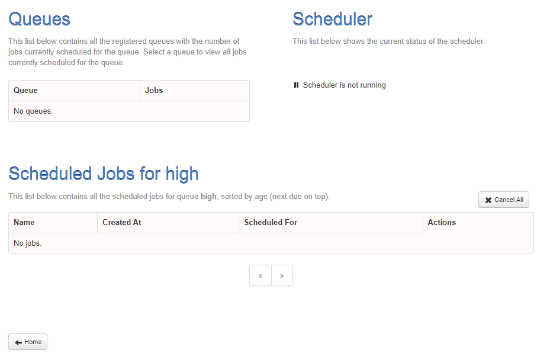
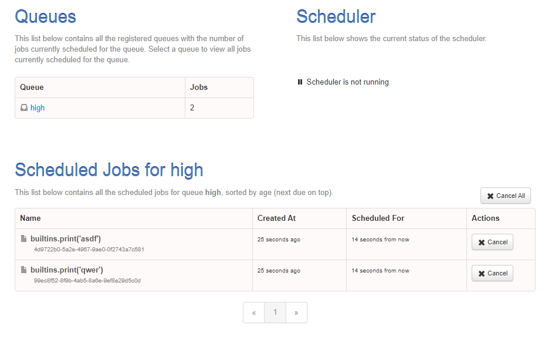

- 참고: email scheduler관련 : https://github1s.com/skulltech/validate-email-bulk/blob/master/app.py
- 타임존 정리: https://spoqa.github.io/2019/02/15/python-timezone.html
### rq-scheduler-dashboard 설치 및 flask bp에 통합
- 참고: https://github1s.com/staugur/IncetOps/blob/81d73e45c758d8e16c90d91666b138363553b68c/src/main.py
1. `rq-scheduler-dashboard` 설치
2. init.py에 import 후 bp로 등록
   ```python
   import rq_scheduler_dashboard
   
   # dashboard
   app.register_blueprint(rq_scheduler_dashboard.blueprint, url_prefix="/rqschedulerdashboard")
   ```
3. `pip freeze` 후 다시 docker 다시 빌드
   - `pip freeze > .\requirements.txt`
   - `docker-compose build --no-cache app` 해도 현재 container 삭제하고 실행해야함.
   - `http://localhost:8000/rqschedulerdashboard` 접속
   
   


4. 마찬가지로 `rq-dashboard`도 설치 > freee > build > 재실행 한뒤, `/rqdashboard`에 접소한다

5. **docker-compose의 rq-dashboard를 내리자.**
### Test를 위한 main을 가진 scheduler.py 및 규칙
- **main을 가진  실행파일은 manage.py와 같은 위치에 생성하여 app import가 가능하게 해야한다.**

1. **rqscheduler는 docker conatiner로 띄워져있으면 된다. `일은 rqworker에서 받아`서 한다**
   - **docker-compose에서 `rqscheduler -i `옵션을 준다면 Scheduler(interval=)은 줄 필요 없다**
     - 같은 프로세스에서 실행(scheduler.run())하지 않는다면, 객체생성시 interval은 필요 없을 듯. 
2. **scheduled_time에는 반드시 `utc`로 들어가야한다**
   - **`now()대신 utcnow()`를 넣으면 바로 실행되며,**
   - **특정시간을 원한다면, `datetimexxxx. astimezone(utc)`에 pytz의 utc객체를 같이 활용한다**
   - datetime.now().replace(tzinfo=utc)는 적용안된다.
3. scheduler는 schedule()시 queue_name을 정해도 `객체 생성시 queue=를 지정`한 것에 할당된다.
    ```python
    from datetime import datetime
    
    import redis
    from rq import Queue
    from rq_scheduler import Scheduler
    
    
    conn = redis.from_url("redis://redis:6379")
    high_queue = Queue('high', connection=conn)
    scheduler = Scheduler(queue=high_queue, connection=conn)
    
    
    
    def main():
        prev_jobs = scheduler.get_jobs()
        for j in prev_jobs:
            scheduler.cancel(j)
    
        job = scheduler.schedule(
            scheduled_time=datetime.utcnow(),
            # scheduled_time=datetime.now().astimezone(utc),
            func=print,
            args=['abc'],
            interval=1,
            repeat=5,
        )
    
        print(f"get_jobs: {prev_jobs}")
        print(f"job.to_dict(): {job.to_dict()}")
        print(f"list(self.asyncScheduler.get_jobs(with_times=True)) : {list(scheduler.get_jobs(with_times=True))}")
    
    
    if __name__ == '__main__':
        main()
    ```
    - test는 terminal에서 `python schduler.py`로 한다.

4. `app/utils/datetime_converter.py`에 `datetime_to_utc`모듈 생성하여 일반 datetime을 utc 적용**
   ```python
   def datetime_to_utc(_datetime: datetime):
       if not isinstance(_datetime, datetime):
           raise ValueError('datetime을 입력해주세요')
   
       return _datetime.astimezone(utc)
   ```
   ```python
   from datetime import datetime
   #...
   from app.utils import datetime_to_utc
   #...
   
   def main():
       #...
       job = scheduler.schedule(
           scheduled_time=datetime_to_utc(datetime.now()),
   ```
      
5. repeat가 없으면 interval간격으로 무한 반복이다.
   - **1개의 scheduler객체**는 1번 정의되면, 다음번엔 덮어써버린다.
   - repeat없이 2개의 schedule을 동시에 등록해서 dashboard에서 확인해보자.
   ```python
    job = scheduler.schedule(
        scheduled_time=datetime_to_utc(datetime.now() - timedelta(seconds=30)),
        # scheduled_time=datetime.now().astimezone(utc),
        func=print,
        args=['asdf'],
        interval=1,
        # repeat=5,
    )
    job2 = scheduler.schedule(
        scheduled_time=datetime_to_utc(datetime.now() - timedelta(seconds=30)),
        # scheduled_time=datetime.now().astimezone(utc),
        func=print,
        args=['qwer'],
        interval=1,
        # repeat=5,
    )
   ```
   

### SchedulerService로 반영하기
1. 기본 queue_name을 default가 아닌 `low`로 하기
2. TaseBase에 있던 asyncScheduler를 삭제하고 SchedulerService에서만 생성하기
3. TaskBase에 생성한 logger = task_logger를 삭제한 뒤 , **각 Service마다 `task_logger`, `schedule_logger`를 따로 생성**
   ```python
   class SchedulerService(TaskBase):
       """
       """
   
       def __init__(self, queue_name='low'):
           super().__init__(queue_name=queue_name)
           self.asyncScheduler = Scheduler(queue=self.asyncQueue, connection=self.redis, interval=5)
           self.logger = schedule_logger
   ```
4. scheduled_time이 더 과거걸로 들어가도, 밀려서 실행된다.
5. 여러개의 scheduler을 하고 싶다면, **미리 한번에 다 같이 등록하고 실행시켜야한다.**
   - interval만 필수 인자로 확인한다.
   - 
   

