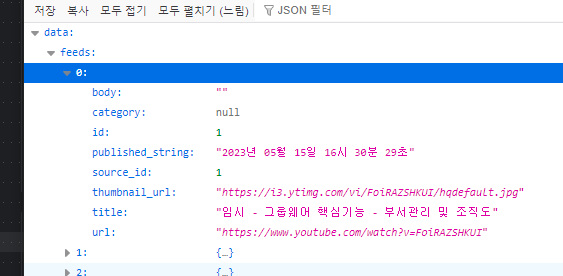

### views패키지 생성
1. 기존 route방식의 view는 `app/views.py`에 main_bp가 작성되어잇었는데 
2. views패키지 생성 + init.py
3. 기존 views.py -> `main_bp.py`로 이름 변경
4. views/init.py에 `from .main import main_bp`로 이동시킨다.

### cls 기반 view 세팅

#### rss bp 생성
1. views/`rss_bp`.py 생성
2. cls 기반 view를 만들 `views/base_view.py`생성
    ```python
    from flask import jsonify
    from flask_apispec.views import MethodResource
    class BaseView(MethodResource):
    
        @classmethod
        def register(cls, blueprint, docs, url, view_cls_name_lower):
            # 2. 해당url + name으로 bp에 view를 등록한다.
            blueprint.add_url_rule(url, view_func=cls.as_view(view_cls_name_lower))
            # 3. 공통 에러핸들링 422에러를 bp에 등록한다
            blueprint.register_error_handler(422, cls.handle_error)
            # 4. 해당bp이름으로 docs에 view class(기존 route view func)을 등록한다
            docs.register(cls, blueprint=blueprint.name)
    
        @staticmethod
        def handle_error(err):
            headers = err.data.get('headers', None)
            messages = err.data.get('messages', ['Invalid request'])
            if headers:
                return jsonify({'message': messages}), 400, headers
            else:
                return jsonify({'message': messages}), 400
    ```
    
3. flask-apispec 설치 및 image 재 생성
    - `pip install flask-apispec`
    - `pip freeze > .\requirements.txt`
    - `docker-compose build --no-cache app`
    - 컨테이너 삭제 후 재실행

4. extensions.py에 apispec객체 생성후 -> create_app에서 초기화(bp등록보다 아래에서 docs초기화)
```python
# app/extentions.py
docs = FlaskApiSpec()
```
```python
# app/__init__.py
def create_app():
    # ...
    
    # apispec  초기화
    # - docs객체에 route정보들 다 입력된 상태에서 init
    docs.init_app(app)
    app.config.update({
        'APISPEC_SPEC': APISpec(
            title='chat',  # [swagger-ui] 제목
            version='v1',  # [swagger-ui] 버전
            openapi_version='2.0',  # swagger 자체 버전
            plugins=[MarshmallowPlugin()]
        ),
        'APISPEC_SWAGGER_URL': '/swagger/'  # swagger 자체 정보 url
    })
```

5. rss_bp.py에서 `rss_bp`객체 생성하고, init.py에 올리기
    ```python
    from flask import Blueprint
    
    rss_bp = Blueprint('rss', __name__, url_prefix='/rss')
    
    ```
    ```python
    from .main_bp import main_bp
    from .rss_bp import rss_bp
    ```
6. create_app에서 bp 등록
    ```python
    def create_app():
        from app.views import main_bp, rss_bp
        app.register_blueprint(main_bp)
        app.register_blueprint(rss_bp)
    ```
7. BaseView기반으로  view 작성 후 bp에 view 등록
    ```python
    class FeedListView(BaseView):
        def get(self):
            return 'feed list'
   
    @rss_bp.errorhandler(422)
    def error_handler(err):
        headers = err.data.get('headers', None)
        messages = err.data.get('messages', ['Invalid request'])
    
        logger.warning(f'Invalid input params: {messages}')
    
        if headers:
            return jsonify({'message': messages}), 400, headers
        else:
            return jsonify({'message': messages}), 400
    
    
    
    FeedListView.register(rss_bp, docs, '/feeds', 'feedlistview')
    ```
   

#### FeedList에 대한 응답구조 schema 작성
1. 우리는 front로 `resultCode`, `message`, `data`의 json을 응답할 것이고
    - `data`는 object구조로서 {"id":1} {"feeds": []} 와 같은 객체의 이름을 달고 내려갈 것이다.
    - **그렇다면, result_code, message는 공통 ResopnseSchema가 되고, 각 응답에 따라 `data`는 객체 or 객체list 등이 반환되는 `fields.Dict`로 개별 구현될 것이다.**
    ```python
    from marshmallow import Schema, fields
    
    
    class ResponseSchema(Schema):
        result_code = fields.String(required=True, data_key='resultCode')
        message = fields.String(required=True)
    ```
   

2. data필드를 Dict형으로 하되, Feed 객체 list를 반환하도록 작성하는데, `FeedSchema`가 있어야 many=True로 반환된다.
    - 또한 data안에 들어갈 key는 `data_key`로 주면 된다.
    ```python
    class FeedListResponseSchema(ResponseSchema):
        data = fields.Dict(
            values=fields.Nested(FeedSchema(), many=True, data_key="feeds")
        )
    ```
   
3. Feed모델을 보고 모델 스키마를 작성한다
    - request시 오지 않고, 응답으로만 나가는 것들 == `자동 배정 + default= + relationship필드`들은 `dump_only=True`옵션을 준다
         - id, create_at, updated_at, published, 
    - 생성시 필요한 데이터들은 `required=True`로 준다
    - **fk를 쓸지, relationship을 쓸지 선택한다**
        - relationship을 쓴다면 Nested로 줘야하며, dump_only=True로서 입력시 객체를 받진 않을것이다??
        ```python
        class UserSchema(Schema):
            # ...
            videos = fields.Nested(VideoSchema, many=True, dump_only=True)
        ```
        - fk를 쓴다면 Integer로 줘야하는데, **부모가 user일 경우 request가 아닌 token -> user_id를 추출하므로 dump_only로 줘야한다**
            - 부모 fk_id가 token개념이 아닐 때는, required=True로서 request로 넘어오게 해야한다. 
        ```python
        @videos.route('/tutorials', methods=['POST'])
        @jwt_required()
        @use_kwargs(VideoSchema, location='form')
        @marshal_with(VideoSchema)
        def update_list(**kwargs):
            files = request.files.getlist('media[]')
            # 파일이 없으면 No Content를 의미하는 204를 반환해준다.
            if not files:
                return '', 204
            try:
                user_id = get_jwt_identity()
                new_one = Video(user_id=user_id, **kwargs)
                new_one.save()
        
        class VideoSchema(Schema):
            # id와 fk는 payload에서 받지않고, token/url_path로부터 받을 것이므로, 역직렬화(view->back)에서는 안받도록 해준다.
            id = fields.Integer(dump_only=True)
            user_id = fields.Integer(dump_only=True)
        ```
    ```python
    class FeedListView(BaseView):
        @marshal_with(FeedListResponseSchema)
        def get(self):
            try:
                feeds = []
                for service in get_current_services():
                    feeds += service.get_feeds()
    
                response = {
                    'result_code': 'S-1',
                    'message': '채팅방 조회 성공',
                    'data': {'feeds': feeds},
                }
                
                return response
            except Exception as e:
                return {'result_code': 400, 'message': str(e)}
    ```
   
    

4. list응답은 `@pre_dump`로 count도 같이 넘겨줄 수 있다.
    - 'data'의 'feeds'를 len으로 세서 같이 넘겨준다
    ```python
    class FeedListResponseSchema(ResponseSchema):
        data = fields.Dict(
            values=fields.Nested(FeedSchema(), many=True, data_key="feeds")
        )
    
        count = fields.Integer()
    
        @pre_dump
        def compute_count(self, data, **kwargs):
            data['count'] = len(data['data']['feeds'])
            return data
    ```
   
    ```json
    count	15
    data	{…}
    message	"채팅방 조회 성공"
    resultCode	"S-1"
    ```