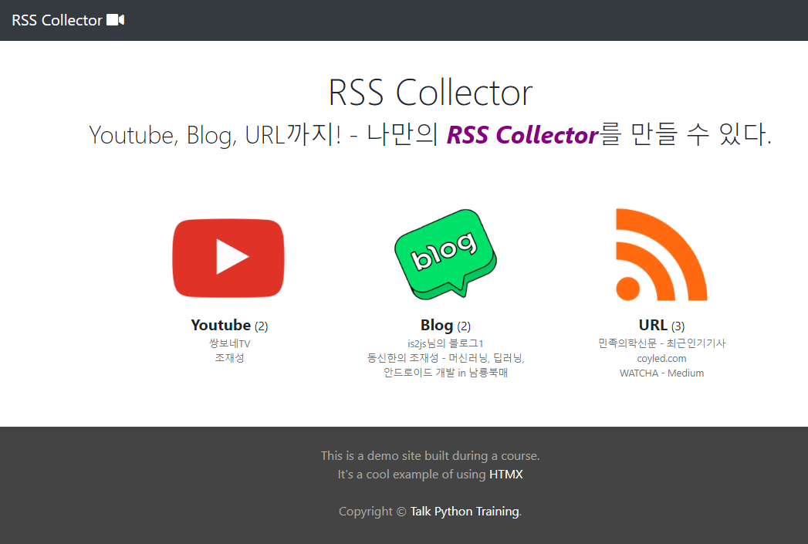

### 초기 파일
- https://github1s.com/SamEdwardes/htmx-python-course/blob/main/code/ch6_active_search/ch6_final_video_collector/templates/videos/category.html#L43-L54

1. templates
    - shared/_layout.html: 
    - index.html (특정카테고리에서의 video들) -> categories.html
    - partials 전부
2. static: 
   - 전부
   - img -> images폴더로 이동시켜서 사용
   - web에서 Youtube, Blog, URL.png를 구해서 ppx로 150px맞춰서 `static/image/source_categories`에 저장
3. render_partial가능하게 하기
    - `jinja-partials` 설치
    - app초기화
    ```python
    def create_app():
        app = Flask(__name__)
        app.config.from_object(Config)
        jinja_partials.register_extensions(app)
    ```
    - pip freeze + docker 재빌드 후 실행


### 일단 jinja render route로 반복뿌려주기
1. view에서 3개씩 그룹을 내가 직접 만들기 위해 `utils/grouped.py`를 정의한다.
    ```python
    import itertools
    
    
    def grouped(iterable, n, strict=False, fill_value=None):
        if strict and len(iterable) % n != 0:
            raise ValueError('그룹별 갯수가 정확하지 않습니다.')
    
        # 1) zip에 iter()로 만든 것을 그룹내갯수만큼 zip 집어넣으면, 1개씩 빠져서 조합되어
        #    group이 형성된다. 그 갯수만큼 list로 복사한 뒤, -> zip()괄호안에 *args로 풀어준다.
        #    -> 왜냐면 zip은 콤마로 그 인자들을 받는 메서드이므로
        args = [iter(iterable)] * n
        # 2) 나누어떨어지는 경우, zip에다가 iter를 그룹화갯수만큼 comma로 연결한다.
        if strict:
            return zip(*args)
        # 3) 나누어떨어지지 않는 경우 .itertools.zip_longest에 넣어준다.
        else:
            return itertools.zip_longest(*args, fillvalue=fill_value)
    ```
   
2. `rss/main` url에 `categories.html`을 타겟팅하면서, 데이터를 가져온 뒤, list(grouped())를 통해 rows로 반환한다
    ```python
    @rss_bp.route('/main')
    def get_categories():
        try:
            categories_with_count_and_names = SourceCategory.get_list_with_count_and_source_names()
            print(categories_with_count_and_names)
            rows = list(grouped(categories_with_count_and_names, 3))
            return render_template('/rss/categories.html', rows=rows)
        except Exception as e:
            logger.error(f'{str(e)}', exc_info=True)
            abort(422)
    ```
   
3. categories.html에서는 `rows -> row 로 순회하면서 -> category객체, count, 딸린 source_name concat`한 것을 사용한다
    ```html
    
    
    
        <div class="hero">
            <div class="hero-inner">
                <h1>RSS Collector</h1>
                <h2>Youtube, Blog, URL까지! - 나만의 <span class="yahoo">RSS Collector</span>를 만들 수 있다.</h2>
            </div>
    
        </div>
    
    
        <div class="container categories">
            
                <div class="row">
                    <div class="col-md-1"></div>
                    
                        <div class="col-md-3 category">
                            <a href="{{ source_category.url }}">
                                </a>
                            <div>
                                <span class="title">{{ source_category.name }}</span> ({{ count }})
                                <div class="text-muted small">{{ names | safe }}</div>
                            </div>
                        </div>
                    
                </div>
            
        </div>
    
    
    ```
   

### SourceCategory의 관계자식 Source 집계정보 같이얻기 + 관계필터링
1. 조회함수를 @classmethod로 만든다. 이 때, **`관계필터링용 outerjoin + filter`처럼 `관계자식집계용` outerjoin + filter + `with_entities(cls, )` + `group_by`까지 한다**
    - **with_entities는 group_by된 것에 `cls`로 부모주인공객체  + `func.집계함수( 자식Class)`로 집계값을 동시에 나타낼 수 있는 `select`절이다.**
        - 일단 outerjoin으로 부모당 자식들을 붙혀놓고
        - group_by(cls.id)로 부모의 id로 집계를 만들어놓고
        - **select대신 with_entities(cls, )로 `자신의객체` + `자식들 집계`를 선택한다**
        - 이 때, sqlite에서는 listagg나 array_agg함수를 지원하지 않기 떄문에, name list를 template용 `</br>`태그로 `group_concat`해서 모은다
    ```python
    class SourceCategory(BaseModel):
        @classmethod
        def get_list_with_source_count_and_names(cls):
            get_list_with_count_and_source_names = cls.query \
                .outerjoin(cls.sources) \
                .with_entities(cls, func.count(Source.id), func.group_concat(Source.target_name, '</br>')) \
                .group_by(cls.id) \
                .all()
            # #  [(<SourceCategory object at 0x7f3250a74f40>, 2, '쌍보네TV</br>조재성'), (<SourceCategory object at 0x7f3250a74b80>, 2, '동신한의</br>is2js의블로그')]
            return get_list_with_count_and_source_names
    ```
    
2. 이제 join된 Source에 대해 SourceConfig로 필터링을 만들어야한다
    - filter_clause가 길어질 것 같으니 clsmethod로 `source_config_filter`로 뺀다
    ```python
    @classmethod
    def get_list_with_source_count_and_names(cls):
        get_list_with_count_and_source_names = cls.query \
            .outerjoin(cls.sources) \
            .filter(cls.source_config_filter()) \
            .with_entities(cls, func.count(Source.id), func.group_concat(Source.target_name, '</br>')) \
            .group_by(cls.id) \
            .all()
        return get_list_with_count_and_source_names
    ```
    - **Source.name에 따라 다른 필터를 적용하기 위해 case()를 쓰며, 튜플로 `(조건절, 반환필터)`형식으로 만든다.**
    - 이 때, 관계모델은 `관계필드.mapper.class_`로 뽑아내면 된다.
    ```python
    @classmethod
    def source_config_filter(cls):
        _Source = cls.sources.mapper.class_

        from app.rss_sources import SourceConfig

        target_filter = case(
            (
                cls.name == "Youtube",
                or_(_Source.target_url.contains(target_id) for target_id in SourceConfig.youtube_target_ids if
                    target_id)
            ),
            (
                cls.name == "Blog",
                or_(*[_Source.target_url.contains(target_id) for target_id, category in
                      SourceConfig.tistory_target_id_and_categories + SourceConfig.naver_target_id_and_categories
                      if target_id])),
            (
                cls.name == "URL",
                or_(*[_Source.name.__eq__(target_name) for target_url, target_name in SourceConfig.url_and_names if
                      target_name])),
            else_=None
        )

        return target_filter
    ```
    