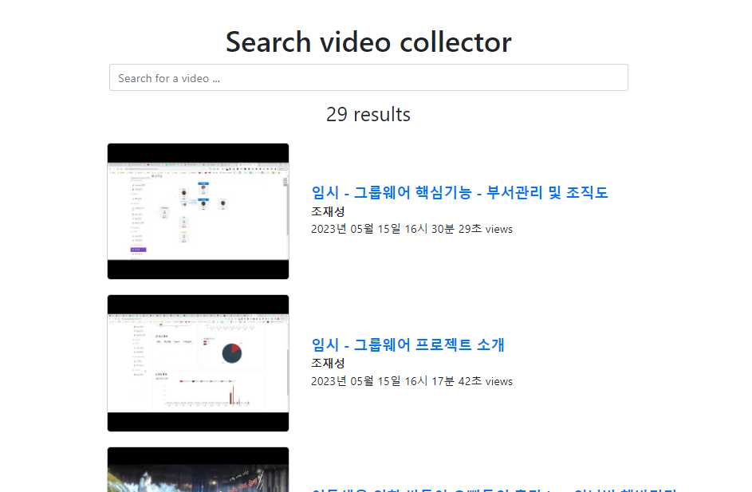

### 초기 파일
- https://github1s.com/SamEdwardes/htmx-python-course/blob/main/code/ch6_active_search/ch6_final_video_collector/templates/videos/category.html#L43-L54

1. templates
    - search.html -> feeds.html
    - partials/search_result.html -> 일단 화면에서 다 뿌리기
    - shared/partials/_video_image.html -> 일단 화면에서 다 뿌리기

### feeds.html 필터링없이 모든 feed 반환하기
1. 전체 feed에 대한 route를 작성한다
    ```python
    @rss_bp.route('/categories/all')
    def get_all_feeds():
        service_list = get_current_services()
        feeds = []
        for service in service_list:
            feeds += service.get_feeds()
        return render_template('/rss/feeds.html', feeds=feeds)
    ```
2. `partials/search_result.html`에서 개별 item뿌리는 것을 `feeds.html`로 옮겨놓는다.
    - img태그가 가운데 정렬되도록 `text-center`를 준다
    - img태그 자체는 **높이 고정해놓고 자유롭게 처리되도록 `img-fluid`를 준다**
    - text들이 수직가운데정렬되도록 `my-auto`를 준다
    - title크기를 h5 + bold로 준다
    ```html
    
    
    
        <div class="search-inputs">
            <h1>Search video collector</h1>
            <input
                    name="search_text"
                    placeholder="Search for a video ..."
                    class="form-control"
                    type="text"
                    value="{{ search_text or '' }}"
                    hx-get="/videos/search"
                    hx-trigger="keyup changed delay:250ms"
                    hx-target="#search-results"
                    hx-push-url="true">
    
        </div>
    
        <div class="videos search-results" id="search-results">
            <div class="search-result-count">{{ feeds | length }} results</div>
            <div class="container">
                
                    
                    <div class="row search-result-row">
                        <div class="col-md-2"></div>
                        <div class="video search-result col-md-3 text-center">
                            <a href="{{ feed.url }}">
                                
                            </a>
                        </div>
                        <div class="video search-result col-md-6 my-auto">
                                <div><a href="{{ feed.url }}" class="h5 font-weight-bold">{{ feed.title }}</a></div>
                                <div><span class="author">{{ feed.source.target_name }}</span></div>
                                <div>{{ feed.published_string }} views</div>
                        </div>
                        <div class="col-md-1"></div>
                    </div>
                    
                
            </div>
    
        </div>
    
    
    
    Search @ Video Collector
    ```
    


### categories -> 클릭시 특정카테고리의 feed들 다 나타나도록
1. category_name을 받아서 feed를 가져오도록  route를 만든다.
    - categories.html속 category.name을 소문자로 만들어 받을 예정이다.
    - 그거에 따른 service를 가지고 와서 get_feed해서 `만들어놨떤 /rss/feeds.html`과 같이 보내면 된다.
    ```python
    @rss_bp.route('/categories/<category_name>')
    def get_feeds(category_name):
        # service_list = get_current_services()
        if category_name == 'youtube':
            service = YoutubeService()
        elif category_name == 'blog':
            service = BlogService()
        elif category_name == 'url':
            service = URLService()
        else:
            raise ValueError(f'Invalid category name : {category_name}')
    
        feeds = service.get_feeds()
    
        return render_template('/rss/feeds.html', feeds=feeds)
    ```
    - 추가로 현재 넘어온 카테고리도 뿌려주기 위해 context dict에 묶은 뒤, dict unpacking해서 사용한다
    ```python
    # feeds = service.get_feeds()
    context = {
        'feeds' : service.get_feeds(),
        'category' : category_name
    }
    # return render_template('/rss/feeds.html', feeds=feeds)
    return render_template('/rss/feeds.html', **context)
    ```
   

2. categories.html에서 클릭시, `소문자`로 해당 카테고리 링크를 건다
    ```html
    <a href="{{url_for('rss.get_feeds', category_name=source_category.name.lower())}}">
    ```
3. feeds.html에서 feeds와 category를 활용해서 뿌린다
    ```html
    
    
    
        <div class="search-inputs">
            <h1>{{category}} collection</h1>
            <input
                    name="search_text"
                    placeholder="Search for a video ..."
                    class="form-control"
                    type="text"
                    value="{{ search_text or '' }}"
                    hx-get="/videos/search"
                    hx-trigger="keyup changed delay:250ms"
                    hx-target="#search-results"
                    hx-push-url="true">
    
        </div>
    
        <div class="videos search-results" id="search-results">
            <div class="search-result-count">{{ feeds | length }} results</div>
            <div class="container">
                
                    
                    <div class="row search-result-row">
                        <div class="col-md-2"></div>
                        <div class="video search-result col-md-3 text-center">
                            <a href="{{ feed.url }}">
                                
                            </a>
                        </div>
                        <div class="video search-result col-md-6 my-auto">
                                <div><a href="{{ feed.url }}" class="h5 font-weight-bold">{{ feed.title }}</a></div>
                                <div><span class="author">{{ feed.source.target_name }}</span></div>
                                <div>{{ feed.published_string }} views</div>
                        </div>
                        <div class="col-md-1"></div>
                    </div>
                    
                
            </div>
    
        </div>
    
    
    
    Search @ Video Collector
    ```