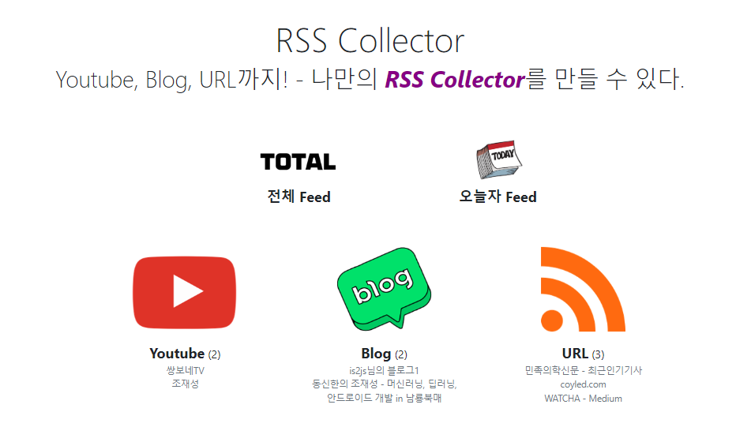

### render_template 응답 대신 json 데이터를 응답하는 route를 만든다.
1. cbv로서 CategoryFeedListView를 만든다.
    - path방식으로 `category_name`이 전해진다면 **location없이 def get(self, `category_name`)으로 바로 받는다.**
        - form -> @use_kwargs(, location='form')
        - querystring(쿼리파라미터) -> @use_kwargs(, location='query')
        - **url path(url경로) -> no @use_kwargs**
    - 맨처음 전체 Feed를 반환하는 FeedListView의 FeedListResponseSchema를 재활용한다
        - 추가로 count필드외 category필드를 같이 전해줘서 view에서 현재카테고리를 나타낼 수 잇게 한다
    ```python
    class CategoryFeedListView(BaseView):
        # path 파라미터는 @use_kwargs사용없이 인자로 바로 받는다.
        @marshal_with(FeedListResponseSchema)
        def get(self, category_name):
            try:
                if category_name == 'youtube':
                    service = YoutubeService()
                elif category_name == 'blog':
                    service = BlogService()
                elif category_name == 'url':
                    service = URLService()
                else:
                    raise ValueError(f'Invalid category name : {category_name}')
                response = {
                    'result_code': 'S-1',
                    'message': f'{category_name}의 피드들 조회 성공',
                    'data': {
                        'feeds': service.get_feeds(),
                    },
                    'category': category_name
                }
    
                return response
            except Exception as e:
                return {'result_code': 400, 'message': str(e)}
    
    
    CategoryFeedListView.register(rss_bp, docs, '/category/<category_name>', 'categoryfeedlistview')
    ```
    ```python
    class FeedListResponseSchema(ResponseSchema):
        data = fields.Dict(
            values=fields.Nested(FeedSchema(), many=True, data_key="feeds")
        )
    
        count = fields.Integer(dump_only=True)
        
        category = fields.Str(dump_only=True)
    
        @pre_dump
        def compute_count(self, data, **kwargs):
            data['count'] = len(data['data']['feeds'])
            return data
    ```
   
### 템플릿 feeds.html에서 데이터가 반복되는 부분을 추출한다.
1. **개별 feed 템플릿으로 분리해야, 1~N개를 추가할 수 있기 때문에, 개별feed별로 묶는다?!**
    - 일단 개별feed부분을 paritals에 feed.html로 분리하고 `render_partial + feed.html + feed=feed`로 대체한다
    ```html
    <div class="videos search-results" id="search-results">
        <div class="search-result-count">{{ feeds | length }} results</div>
        <div class="container">
            
                
                    {{  render_partial('rss/partials/feed.html', feed=feed) }}
                
            
        </div>
    </div>
    ```
   

2. request용 fetchGet, fetchPost를 body아래부분에서 script로 가져오고, 테스트용 load버튼을 만들어 호출해본다
    - ``를 이용해야한다
    ```html
    
    <script>
        function fetchPost(url, data) {
            return fetch(url, {
                method: "POST",
                headers: {
                    "Content-Type": "application/json",
                    "Accept": "application/json"
                },
                body: JSON.stringify(data),
            })
                .then(response => response.json())
        }
    
        function fetchGet(url, data) {
            let query = Object.keys(data)
                .map(k => encodeURIComponent(k) + '=' + encodeURIComponent(data[k]))
                .join('&');
    
            return fetch(url + "?" + query, {
                method: "GET",
                headers: {
                    "Content-Type": "application/json",
                    "Accept": "application/json"
                }
            })
                .then(response => response.json())
        }
    </script>
    
    ```
   

3. test용 load버튼을 만든다
    ```html
    <button onclick="Feed__loadMore();"> 로드</button>
    ```
   
4. `Feed__loadMore()`를 자바스크립트로 작성한다
    - 일단 모든 feed를 가져다주는 `/rss/feeds`로 get요청을 보내고 log로 찍어본다.
    ```js
    <script>
        function Feed__loadMore() {
            fetchGet("/rss/feeds", {}).then(body => {
                console.log(body);
            })
        }
    </script>
    ```
    ```js
    {count: 29, data: {…}, message: '피드 조회 성공', resultCode: 'S-1'}
    ```
   
5. 받은 body데이터에서 필요한 데이터만 뽑아서 `Feed__draw()`메서드를 작성한다.
    - 이 때, body.count, body.feeds를 쓸 것이므로 `Feed__drawCount()`와 `Feed_drawFeeds()`2개를 작성한다
    ```js
    <script>
        function Feed__loadMore() {
            fetchGet("/rss/feeds", {}).then(body => {
                // console.log(body);
                Feed__drawCount(body.count);
                Feed__drawFeeds(body.feeds);
            })
        }
    </script>
    ```
   

6. 그전에 feed를 하나씩 그려서 붙일 `부모 element`, count를 심을 `count element`를 찾아놓는다.
    - 각각 class에 특정한 이름을 줘서 `전역변수로 미리 찾아놓는다.`
    - count용 div -> `feed__count-span`
        - 이 때, 다른 문자열 말고 숫자부분만 div로 만든다.
    ```html
    <div class="search-result-count">
        <span class="feed__count-span">{{ feeds | length }}</span> 
        results
    </div>
    ```
    - feeds용 div -> `feed__feeds-box`
    ```js
    <script>
        function Feed__loadMore() {
            fetchGet("/rss/feeds", {}).then(body => {
                // console.log(body);
                Feed__drawCount(body.count);
                Feed__drawFeeds(body.feeds);
            })
        }
        
        const Feed__elCountSpan = document.querySelector('.feed__count-span');
        const Feed__elFeedsBox = document.querySelector('.feed__feeds-box');
        
    </script>
    ```
   
7. count요소에 `.textContent = `로 삽입한다
    ```js
    const Feed__elCountSpan = document.querySelector('.feed__count-span');
    ///
    function Feed__drawCount(count) {
        Feed__elCountSpan.textContent = count;
    }
    ```
   
8. **Feed_drawFeeds()에서 render_partials를 쓸려고 했는데 `js내에서는 사용 불가`이다. 넘길 데이터 js object를 받지도 못한다.**
    - 백틱으로 개별feed부분을 직접 작성하고 `el.insertAdjacentHTML()`로 역순으로 삽입되게 한다.
    - **나중에 벡엔드에서는 정순으로 넘어와야, front역순삽입이 최근순으로 된다.**
    ```js
    function Feed__drawFeeds(feeds) {
        feeds.forEach((feed) => {
            Feed__elFeedsBox.insertAdjacentHTML(
                "afterBegin",
                `<div class="row search-result-row">
                    <div class="col-md-2"></div>
                    <div class="video search-result col-md-3 text-center">
                        <a href="${feed.url}">
                            
                        </a>
                    </div>
                    <div class="video search-result col-md-6 my-auto">
                        <div><a href="${ feed.url }" class="h5 font-weight-bold">${ feed.title }</a></div>
                        <div><span class="author">${ feed.source.target_name }</span></div>
                        <div>${ feed.published_string }</div>
                    </div>
                    <div class="col-md-1"></div>
                </div>
    `
            );
        });
    }
    ```
   
9. **service들에서 joinedload로 데이터를 가진체로 넘어오고 있으니 `Schema`를 Nested로 작성해서 다 포함되게 한다**
    ```python
    class FeedSchema(Schema):
        #...
        source = fields.Nested(SourceSchema())
    ```
    ```python
    class SourceCategorySchema(Schema):
        """
        id = db.Column(db.Integer, primary_key=True)
        name = db.Column(db.Text, nullable=False, unique=True, index=True)
        """
        id = fields.Integer(dump_only=True)
        name = fields.String(required=True)
    
    
    class SourceSchema(Schema):
        """
        id = db.Column(db.Integer, primary_key=True)
        name = db.Column(db.Text, nullable=False)  # 사용자입력 NAME ex> Tistory, Naver, 유튜브, 왓챠
        url = db.Column(db.Text, nullable=False)
        target_name = db.Column(db.Text, nullable=False)  # RSS타겟 NAME ex> xxx님의 blog, 쌍보네TV
        target_url = db.Column(db.Text, nullable=False, index=True, unique=True)
    
        source_category_id = db.Column(db.Integer, db.ForeignKey('sourcecategory.id', ondelete="CASCADE"))
        source_category = relationship('SourceCategory', foreign_keys=[source_category_id], back_populates='sources',
                                       uselist=False)
    
        feeds = relationship('Feed', back_populates='source', cascade='all, delete-orphan')
        """
        id = fields.Integer(dump_only=True)
        name = fields.String(required=True)
        url = fields.String(required=True)
        target_name = fields.String(required=True)
        target_url = fields.String(required=True)
        thumbnail_url = fields.String()
    
        source_category = fields.Nested(SourceCategorySchema())
    ```
    - 여기까지 하면 load버튼 클릭시 추가적으로 잘 넘어온다.

10. Schema에서 front용으로 data_key 지정해주고 -> 백틱안에서 바꾸기
    ```python
    class SourceSchema(Schema):
        target_name = fields.String(required=True, data_key='targetName')
        target_url = fields.String(required=True, data_key='targetUrl')
        thumbnail_url = fields.String(data_key='thumbnailUrl')
        source_category = fields.Nested(SourceCategorySchema(), data_key='sourceCategory')
    
    class FeedSchema(Schema):
        thumbnail_url = fields.String(data_key='thumbnailUrl')
        published_string = fields.String(dump_only=True, data_key='publishedString')
    ```
11. default이미지 경로는 아래와 같이 변경한다.
    - window.location.origin은 현재사이트의 도메인영역만 표시하고 경로는 없는 상태다
    - `/static`부터 시작해서 경로를 잡아주면 된다.
    ```html
    
    ```
    

12. count를 무작정 대입이 아니라, 값이 없으면 0부터, 있으면 누적시키도록 해야한다.
    - **|| 0을 통해 null값이면 0이 되게 한다.**
    - `+`연산자를 앞에 달면 text가 number로 변환된다
    ```js
    function Feed__drawCount(count) {
        // Feed__elCountSpan.textContent = count;
        const currentCount = +Feed__elCountSpan.textContent || 0;
        Feed__elCountSpan.textContent = currentCount + count;
    }
    ```
    

### 로드버튼 대신 jinja 문법 지우고, 시작하면 load하기
1. 로드버튼 + feeds.html에 있는 jinja문법을 주석처리하고 부모elment들만 남겨놓는다
    ```html
    <div class="videos search-results" id="search-results">
        <div class="search-result-count">
            <span class="feed__count-span">
    <!--            {{ feeds | length }}-->
            </span>
            results
        </div>
        <div class="container feed__feeds-box">
    <!--        -->
    <!--            -->
    <!--            {{ render_partial('rss/partials/feed.html', feed=feed) }}-->
    <!--            -->
    <!--        -->
        </div>
    </div>
    ```

2. js스크립트 맨 아래에서 Feed__loadMore();를 호출한다
    ```js
        Feed__loadMore();
    </script>
    ```
   
### 백엔드 serivce조절하기

1. 각 Serivce에서 `.get_feeds()`시 역순으로 반환되어 그대로 뿌려주던 것을 정순으로 반환되도록 한다
    ```python
    class SourceService:
        def _get_feeds(self, source_category_name, target_infos, display_numbers):
            filter_clause = self._create_feed_filter_clause(source_category_name, target_infos)
    
            # front에서 역순으로 insert함
            # .order_by(Feed.published.desc()) \
            feeds = Feed.query \
                .join(Source.feeds) \
                .join(Source.source_category) \
                .options(joinedload(Feed.source).joinedload(Source.source_category)) \
                .filter(filter_clause) \
                .order_by(Feed.published.asc()) \
                .limit(display_numbers) \
                .all()
            return feeds
    ```
   

2. 전체 FeedList 반환 view에서, 각 서비스의 feed들을 통합하고난 뒤에, 다시 한번 정렬해주기
    - **추가로 각 category feed들 조회에서 사용할 category를 all로 반환해줘서 front에서 사용하기**
    - `category : 'All'`을 응답에서 추가한다
    ```python
    class FeedListView(BaseView):
        @marshal_with(FeedListResponseSchema)
        def get(self):
            try:
                feeds = []
                for service in get_current_services():
                    feeds += service.get_feeds()
                
                # 통합feeds를 published 정순으로 정렬
                feeds.sort(key=lambda feed:feed.published)
    
                response = {
                    'result_code': 'S-1',
                    'message': '피드 조회 성공',
                    'data': {'feeds': feeds},
                    'category' : 'All', 
                }
    
                return response
            except Exception as e:
                return {'result_code': 400, 'message': str(e)}
    ```
   
3. feeds.html에서 , category도 cls명 추가 + data받았을 때, count처럼 추가입력하게 한다
    ```html
    <h1>
        <span class="feed__category-span"></span> collection
    </h1>
    ```
    ```js
    <script>
        function Feed__loadMore() {
            fetchGet("/rss/feeds", {}).then(body => {
                // console.log(body);
                Feed__drawCategory(body.category);
                Feed__drawCount(body.count);
                Feed__drawFeeds(body.data.feeds);
            })
        }
       const Feed__elCategorySpan = document.querySelector('.feed__category-span');
        function Feed__drawCategory(category) {
            Feed__elCategorySpan.textContent = category;
        }
    ```
   

### 개별 category별 feeds조회시 feeds.html
1. 이제 개별 feed조회에서는 service로 데이터 feeds를 직접 넘겨주지말고, html + `Feed_load_more`에서 필요한 category만 넘겨주자
    ```python
    @rss_bp.route('/categories/<category_name>')
    def get_feeds(category_name):
        # if category_name == 'youtube':
        #     service = YoutubeService()
        # elif category_name == 'blog':
        #     service = BlogService()
        # elif category_name == 'url':
        #     service = URLService()
        # else:
        #     raise ValueError(f'Invalid category name : {category_name}')
    
        # feeds = service.get_feeds()
        context = {
            # 'feeds' : service.get_feeds(),
            'category' : category_name
        }
        
        return render_template('/rss/feeds.html', **context)
    ```
   

2. feeds.html에서 `category`가 넘어오면, 개별 카테고리 조회 url로 get요청을 보내야한다
    - 그러기 전에 전체조회 view를 `category/all`로 변경한다
    ```python
    FeedListView.register(rss_bp, docs, '/category/all', 'feedlistview')
    CategoryFeedListView.register(rss_bp, docs, '/category/<category_name>', 'categoryfeedlistview')
    ```
    - front에서는, 각 카테고리별에 맞게 `Feed__loadMore`를 요청하도록 변경한다.
        - 인자에 category를 추가해서 jinja로 넘어온 category값을 활용하게 한다
    ```js
    function Feed__loadMore(category) {
        let url = `/rss/category/${category}`;
    
        // fetchGet("/rss/feeds", {}).then(body => {
        fetchGet(url, {}).then(body => {
            Feed__drawCategory(body.category);
            Feed__drawCount(body.count);
            Feed__drawFeeds(body.data.feeds);
        })
    }
    // category가 안넘어오는 전체feed조회에서는 'all'로 들어가서, 전체조회view에 드간다.
    Feed__loadMore(`{{category or 'all'}}`);
    ```
   


### category/all로서 전체를 조회하는 것도 categories.html에 추가하기
- 맨 앞에 추가해준다. 이 때, category라는 class를 달아야 하위 class들도 적용됨.
    ```html
    <div class="row">
        <div class="col-md-3"></div>
        <div class="col-md-3 category">
            <a href="{{url_for('rss.get_feeds', category_name='all')}}">
                
            </a>
            <div>
                <span class="title">전체 Feed</span>
            </div>
        </div>
    </div>
    ```
   


### today처리하기 전에, backend 조회 수정하기
1. 현재 front에서 역순으로 넣기 때문에, backend에선 정순으로 가져오는데 `limit`때문에 앞에ㅓ 10개만 가져오는 상황이다
    - **정순으로 10개만 가져오는 상황 -> `뒤에서 10개만 가져`오는 것으로 백업하고 -> `정순으로 다시 정렬`해야한다**
   ```python
    def _get_feeds(self, source_category_name, target_infos, display_numbers):
        filter_clause = self._create_feed_filter_clause(source_category_name, target_infos)

        feeds = Feed.query \
            .join(Source.feeds) \
            .join(Source.source_category) \
            .options(joinedload(Feed.source).joinedload(Source.source_category)) \
            .filter(filter_clause) \
            .order_by(Feed.published.desc()) \
            .limit(display_numbers) \
            .all()

        # 개별 카테고리별 front에 정순으로 줘야, 역순으로 끼워넣으니, 정순으로 다시 돌리기
        feeds.sort(key=lambda f: f.published)
        
        return feeds
    ```